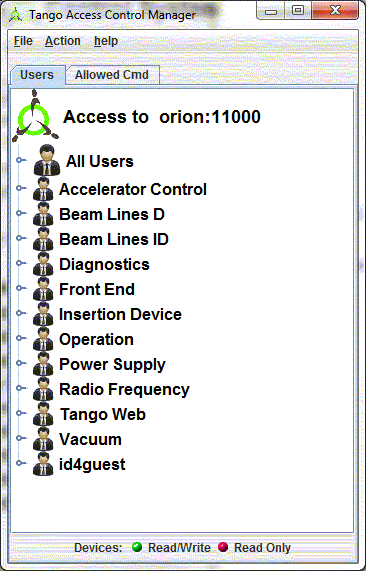
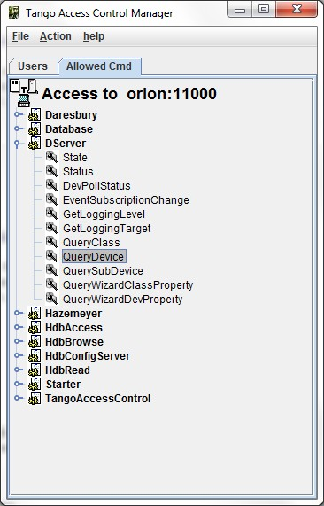

Tango Access Control (TAC) Configuration
----------------------------------------

:audience:`administrators, developers`

TANGO provides an access control (see :ref:`The Tango controlled access system <access_control>`)

TAC Configuration Tool:
~~~~~~~~~~~~~~~~~~~~~~~

Astor provides a tool to configure it.
This tool is reserved to the TANGO administrator and needs a password to be opened.

   |image0|

Configure TAC by IP address and user:
~~~~~~~~~~~~~~~~~~~~~~~~~~~~~~~~~~~~~

User list is displayed in a tree under groups.

To configure you can Add/Remove a user and its group.

And define this user rights.

+---------------------+---------------------------------------------+
| |image1|            | * **All Users:**                            |
|                     |                                             |
|                     |    Have only read access for all devices    |
|                     |                                             |
|                     | * **User opid02**                           |
|                     |                                             |
|                     |   Has write access only for devices         |
|                     |                                             |
|                     |   -  fe/id/2                                |
|                     |   -  id/id/2                                |
|                     |   -  sys/hdb-push/\*                        |
|                     |                                             |
|                     |   and only for clients running on           |
|                     |   machines                                  |
|                     |   with IP address as xxx.yyy.22.\*          |
+---------------------+---------------------------------------------+

Configure TAC for allowed commands:
~~~~~~~~~~~~~~~~~~~~~~~~~~~~~~~~~~~

+---------------------+--------------------------------------+
| |image2|            | The access control allows **Write**  |
|                     | access or **Read Only** access.      |
|                     | The **Read Only** access means:      |
|                     |                                      |
|                     | -  Read only device attributes.      |
|                     | -  Cannot write device attributes.   |
|                     | -  Cannot execute commands (a        |
|                     |    command could be a write action). |
|                     |                                      |
|                     | Some commands could be a simple read |
|                     | action.                              |
|                     | For instance on **Dserver** class,   |
|                     | the command **QueryDevice**          |
|                     | does not write anything and returns  |
|                     | the device list.                     |
|                     | This class is needed to establish a  |
|                     | connection between a client          |
|                     | and a device, and it is useful even  |
|                     | if user is in read only access.      |
|                     | This tool provide a list of allowed  |
|                     | commands for a specified class.      |
|                     | You can add or reove class by a      |
|                     | right click menu.                    |
+---------------------+--------------------------------------+

.. |image1| image:: img/TACusers.gif

