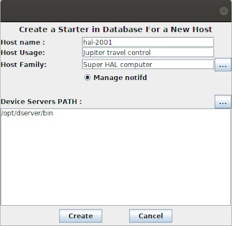

.. _astor_new_host:

Add a new controlled host
-------------------------

:audience:`administrators, developers`

    * Use the :guilabel:`Add a New Host` in :guilabel:`Command` menu.
    * Or clone an existing one using host popup menu. And fill the fields of following window:

    |image0|

    * Click on :guilabel:`Create` button.
    * A new server *Starter* will be created in TANGO database.
    * And the new host will appear in the tree under the specified branch.
    * Start a new remote loggin session to start it from host popup menu
    * Finally start Starter on host.

