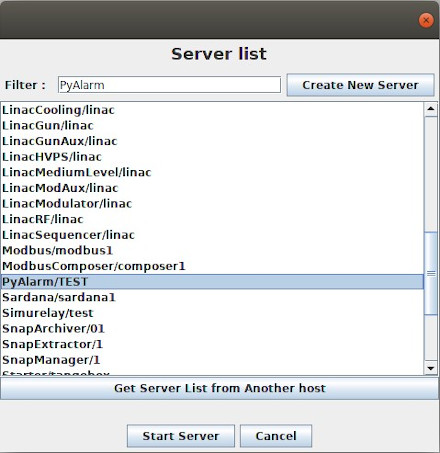
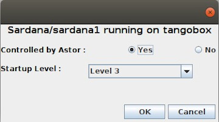

.. _astor_new_server:

Start a new server with Astor
-----------------------------

:audience:`administrators, developers`

If the server is already defined in database
~~~~~~~~~~~~~~~~~~~~~~~~~~~~~~~~~~~~~~~~~~~~

-  Be sure that a :program:`Starter` device server is running on the same host.
   If there is no :program:`Starter` running, start it.
-  On :program:`Astor` main window, click on the host to open :doc:`host window <host_window>`.
   On this window, click on :guilabel:`Start New` button.
-  A window with a list of all servers defined in TANGO database will be
   displayed.

   |image0|

-  Select the expected server and click on **Start server** button.

|

-  And configure **Controlled by Astor** and **Startup Level**.

   |image1|

   
|
   
If the server is NOT already defined in database
~~~~~~~~~~~~~~~~~~~~~~~~~~~~~~~~~~~~~~~~~~~~~~~~

-  You can declare the server in database using
   `Jive <http://www.esrf.eu/computing/cs/tango/tango_doc/tools_doc/jive_doc/index.html>`_.
-  Or click on :guilabel:`Create New Server` button to start the
   :doc:`wizard <new_server_wizard>`.

   
   
|
   
If the server has been started from shell
~~~~~~~~~~~~~~~~~~~~~~~~~~~~~~~~~~~~~~~~~

The default startup level is not set and the server is not controlled
by Astor.

That means that it does not appear in :doc:`host window <host_window>`.

To see it click open **Not Controlled** level.
And change it startup level if needed.

