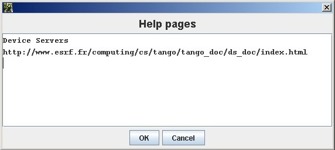

Astor Configuration
-------------------

:audience:`administrators, developers`

Astor can be configured using the following window.
Click on :menuselection:`File --> Ctrl System Preferences` menu to open

+--------------------------------------+--------------------------------------------------------------+
| |image0|                             | -  :ref:`Define control system name <name>`                  |
|                                      | -  :ref:`Define default window sizes <sizes>`                |
|                                      | -  :ref:`Additional java tools. <add_tools>`                 |
|                                      | -  :ref:`Additional html pages. <html_pages>`                |
|                                      | -  :ref:`Multi Tango Host. <known_hosts>`                    |
|                                      | -  :ref:`Host remote loggin command. <remote_logging>`       |
|                                      | -  :ref:`Host remote loggin user. <remote_user>`             |
|                                      | -  :ref:`Jive in READ_ONLY mode. <jive_mode>`                |
|                                      | -  :ref:`Starter starts servers at startup <starter_start>`  |
+--------------------------------------+--------------------------------------------------------------+

.. note::

   To disable the :guilabel:`Preference` menu, start Astor with `-DNO\_PREF=true`.

.. _`name`:

Control system name
~~~~~~~~~~~~~~~~~~~

This name will be displayed on top of Astor main window.

It could be useful when user has to manage several control systems.

.. _`sizes`:

Default window sizes
~~~~~~~~~~~~~~~~~~~~

:guilabel:`Hosts tree Width/Height` defines the preferred size for the tree object in main window.

:guilabel:`Host window Width/Height` defines default maximum size for host window.

If the number of hosts needs a bigger window, scroll bars will be added.

Last Collections
~~~~~~~~~~~~~~~~

Hosts can be distributed in families.

In the tree, the families are sorted by alphabetic order.

The property LastCollections give the possibility put collections (families) at the end of the tree.

It could be useful to put at the end of the tree, families like Not Critical, In Test, ...

.. _`html_pages`:

Additional html pages
~~~~~~~~~~~~~~~~~~~~~

The property :guilabel:`HtmlHelps` give the possibility to add specific html pages.
This is a string array property.

-  The first line is the message displayed in help menu.
-  The second one is the URL address for the specified page.

The following example add a link to the Tango device servers pages:

  |image1|

.. _`add_tools`:

Additional java Tools
~~~~~~~~~~~~~~~~~~~~~

The property *Tools* give the possibility to add java class to tools
menu.
These additional tools could be specific for one control system
This is a string array property.

One tool (java class) is defined by two strings:

-  The first line is the message displayed in tools menu.
-  The second one is the class (and package) to be instancied.

The following example add 3 java tools used on ESRF machine control
system for TACO HDB:

  |image2|

.. topic:: Remarks

    -  The tools java classes need to have a constructor with a *JFrame*
       parameter as parent.
    -  It needs also to not to exit if it has been instancied from a parent
       application.
    -  The tools class or jar file needs to be found in :envvar:`$CLASSPATH` of
       :program:`Astor` startup.

.. _`known_hosts`:

KnownTangoHosts
~~~~~~~~~~~~~~~

This property give a list of :envvar:`TANGO_HOST` to be controlled by Astor.
The :envvar:`TANGO_HOST` can be changed by typing a new name but the specified list will be available in a combo box.

.. _`remote_logging`:

RloginCmd
~~~~~~~~~

This property give the possibility to change the default remote loggin command.
The default command is :command:`telnet` (or :command:`rlogin` if :guilabel:`RloginUser` is defined).

.. _`remote_user`:

RloginUser
~~~~~~~~~~

This property gives the possibility to set the remote loggin to the specified user.

.. _`jive_mode`:

Jive in READ\_ONLY mode
~~~~~~~~~~~~~~~~~~~~~~~

If this property is true the :program:`Jive` application will be instancied in READ_ONLY mode.
If the property is not set or false, :program:`Jive` is in READ_WRITE mode.

.. _`starter_start`:

Starter starts servers at startup
~~~~~~~~~~~~~~~~~~~~~~~~~~~~~~~~~

This boolean property allows the :ref:`Starter<Starter>` to start the device servers when it starts.

If it is false, the starter will not start any server when it will be launched.

It could be useful when a large control system is re-started (e.g. after an electrical power cut)
to do not overload the Tango database.

.. |image0| image:: img/preferences.jpg

.. |image2| image:: img/add-tools.jpg

