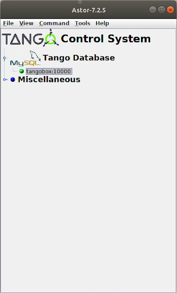
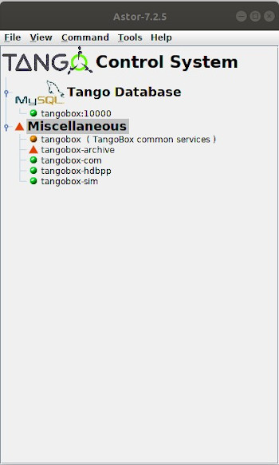
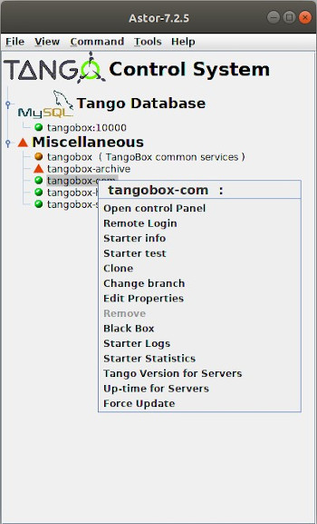

Astor Main Window
-----------------

:audience:`administrators, developers, users`

    * On the main window, the control system is displayed as a tree.
    * Where the root is TANGO, the branch are hosts family and leaf are hosts.
    * The Astor main window is able to give a global status of the control system.

    |image0|

|
|

    * The tree is collapsed, but the node icon display the status of the hosts under.

    |image1|

|
|

    * An individual control on a host could be done by a click on a host.
    * A popup menu will be displayed with a right click on a host.

    |image2|

