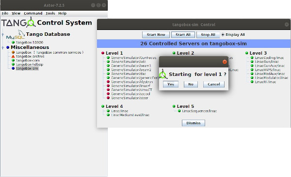

Multi Servers Start/Stop
------------------------

:audience:`administrators, developers, users`

-  You can start or stop:

   -  All servers on a host by clicking on :guilabel:`Start All` or :guilabel:`Stop All`
      button on :doc:`host window <host_window>`.
   -  All servers on all hosts of a hosts family by using popup menu on
      a hosts family.
   -  All servers on all hosts of the control system by using
      :guilabel:`Command` menu in main window.

   The servers will be started in ascending order of startup level and
   stopped in descending order.

   For each level a confirmation dialogbox will be popuped.

   |image0|

