******************
Tango ATK Tutorial
******************

:audience:`developers`, :lang:`java`

This document is a practical guide for Tango ATK programmers and
includes several trails with examples and demonstrations. Most of the
examples and demonstrations are provided as Macromedia Flash documents.

In this document we assume that the reader has a good knowledge of the
Java programming language, and a thorough understanding of
object-oriented programming. Also, it is expected that the reader is
fluent in all aspects regarding Tango devices, attributes, and commands.

Before going through the trails and examples, the Tango ATK architecture
and key concepts are introduced. After this introduction the rest of the
document is organized in a set of trails.

Introduction
============

Tango Application Toolkit also called “ATK” is a client framework for
building applications based on Java Swing in a Tango control system.

Goals of Tango ATK
------------------

The main goals of ATK are the following:

#. Speeding up the development of Tango graphical clients.

#. Standardizing the look and feel of Tango applications.

#. Implementing the core of “any” Tango application.

To achieve the first and the second goals ATK provides several swing
based components to view and/or to interact with Tango device attributes
and Tango device commands and also a complete synoptic viewing system.
To achieve the third goal ATK takes in charge the automatic update of
device data either through Tango events or by polling the device
attributes. ATK takes also in charge the error handling and display. The
ATK swing components are the Java Beans, so they can easily be added to
a Java IDE (like NetBeans) to speed up the development of graphical
control applications.

The Software Architecture of Tango ATK
--------------------------------------

Tango ATK is developed using the
`Model-View-Controller <http://java.sun.com/blueprints/patterns/MVC.html>`__
design pattern also used in the Java Swing package. The Tango basic
objects such as device attributes and device commands provide the model
for the ATK Swing based components called viewers. The models and the
viewers are regrouped in two separate packages respectively ATKCore and
ATKWidget.

|image0|

.. note::

   ATK is based on Swing. Mixing the use of other “non swing” objects such
   as SWT (eclipse) with ATK is not recommended.

.. note::

   ATK hides Tango Java API (TangORB). It is highly recommended not to use
   TangORB methods and objects directly in the application code. Always use
   the interface provided by ATK to access the control system

The key concepts of Tango ATK
-----------------------------

Reminder: the central Tango component is the DEVICE. The Tango control
system can be seen as a collection of devices distributed over the
network. The tango devices provide attributes (for reading and setting
data) and commands.

The central ATK components, to access the Tango control system, are:
attributes and commands and not the devices. Through Tango Java API
(TangORB) the control system is a collection of devices where through
ATK the control system is a collection of attributes and commands.

In addition to ATK attributes and ATK commands ATK provides two
components, which are ATK attribute lists and ATK command lists.

The central ATK components are:

#. ATK Attribute (interface to Tango device attribute),

#. ATK Command (interface to Tango Device command),

#. ATK AttributeList (collection of ATK Attributes)

#. ATK CommandList (collection of ATK Commands).

Tango ATK viewers
-----------------

ATK viewers are provided as Java Beans and as such they can easily be
added in a Java IDE (like NetBeans) to speed up the development of the
graphical applications. This way the programmer can easily build up his
(her) panels, mixing pure Swing objects and Tango ATK viewers.

ATK viewers are provided for different types of Tango Components. They
can be divided into different categories such as: error history window,
error popup window, simple attribute viewers / editors, attribute list
viewers, simple command viewers, command list viewers, …etc.

|image1|

Synoptic drawing and viewing
----------------------------

A synoptic is a drawing in which each object can be linked to a Tango
object. A part of the synoptic drawing can be linked to the state
attribute of a Tango device where another part is associated to a
numerical attribute of another Tango device. The main idea of synoptic
drawing and viewing system is to provide the application designer with a
simple and a flexible way to draw a synoptic and to animate it at
runtime according to the values and states read from the control system.
ATK provides two components for this purpose:

-  A graphical editor called “Jdraw”. This tool is used during the
   design phase to draw and to specify the synoptic. The synoptic is
   saved to a file.

-  A synoptic viewer called “SynopticFileViewer”. This viewer is used in
   the graphical user interface of the application. SynopticFileViewer
   loads and browses the synoptic drawing file and animates its elements
   at runtime according to their state or to their value.

Getting Started
===============

The following short tutorial takes you through some of the basic steps
necessary to develop a Tango Java application based on Tango ATK.

In this tutorial we don’t use any Java IDE features. All the java code
is entered manually using a java source editor. The NetBeans java source
editor is used as any source editor.

Let’s specify the application we want to build in terms of the
`Model-View-Controller <http://java.sun.com/blueprints/patterns/MVC.html>`__
design pattern described before.

Our “Getting Started” application will need to show two tango device
attributes and one tango device command all related to the same device.
The tango device name used in this tutorial is *“jlp/test/1”*. The
application will show the “state” and the “att_spectrum” attributes of
this device and will give access to its “Init” command.

#. The type of the “state” attribute (*jlp/test/1/state*) is “DevState”
   and its format is “Scalar”

#. The type of the “att_spectrum” attribute (*jlp/test/1/att_spectrum*)
   is “DevDouble” and its format is “Spectrum”

#. The “Init” command (*jlp/test/1/Init*) has no input and no output
   argument (input and output argument types are DevVoid)

The ATKCore components are used to create and initialise the “model”
part of the design pattern:

#. One attribute list,

#. Two attributes (*jlp/test/1/state*, *jlp/test/1/att_spectrum*),

#. One command list,

#. One command (*jlp/test/1/Init*).

The ATKWidget components are used to create and initialise the *“view”*
part of the design pattern. These components are the objects adapted to
the type of the tango component we want to visualize. They are also
called **“viewers”** (attribute viewers, command viewers, … etc.).

#. One State viewer (a viewer adapted to the DevState Scalar attributes)

#. One NumberSpectrum viewer (a viewer adapted to any numerical spectrum
   attribute)

#. One VoidVoidCommand viewer (a viewer adapted to the any command with
   no input and no output argument).

The controller part consists of making the relationship between the
*“view”* components and the *“model”* components. Calling the *“setModel”*
method of the view object makes this relationship. For example the call
*“stateViewer.setModel(stateAtt)”* will make the relationship between
these two objects.

Click on the following link to view a Flash demo of how to build the
*“GettingStarted”* application.

`Getting Started (Flash
Demo) <http://www.esrf.fr/computing/cs/tango/tango_doc/atk_tutorial/flash-demos/GettingStarted.htm>`__

The Structure of an ATK application
-----------------------------------

Any ATK application should perform a minimum set of operations. The
following lists this minimum set of operations:

#. Declaration and initialization of ATKCore objects (AttributeLists,
   CommandLists, individual ATKCore attributes and individual ATKCore
   commands).

#. Declaration and instantiation of ATKWidget Error viewers to handle
   errors

#. Connection to attributes and commands by adding them to the
   appropriate list

#. Creation of the specific Attribute and command viewers, and add them
   to a swing window

#. Associate each viewer to an appropriate ATKCore attribute or command

#. Start the refresher thread associated to the attribute list

The following slide show will present in detail the skeleton of an ATK
application :

`ATK application skeleton (Flash Slide
Show) <http://www.esrf.fr/computing/cs/tango/tango_doc/atk_tutorial/flash-demos/AtkSkeleton.htm>`__

Using ATK inside a Java IDE (NetBeans)
--------------------------------------

Several Java IDEs  (Integrated Design Environments) are available on the
market and also as freeware. You can search the Internet to choose the
most appropriate one for your usage. Here you can find some links to
start with: 

`NetBeans (free download) <http://www.netbeans.org/>`__

`Eclipse  (free download) <http://www.eclipse.org/>`__

`Intelligent Idea  (commercial
tool) <http://www.jetbrains.com/idea/>`__

The use of the Java IDEs especially those including a good graphical
user interface builder speed up the development of Tango ATK
applications. From now on all the examples in this tutorial are made
using the NetBeans 5.5 or 6.1, Java IDE. The present section presents
the manner in which the ATK Java Beans can be integrated to the NetBeans
Palette and used to build the user interface of the final ATK
application. 

If you are using another Java IDE please refer to its documentation to
find out how to integrate and use the ATK Java Beans inside the IDE, to
build a graphical user interface. 

Learning NetBeans
~~~~~~~~~~~~~~~~~

You should first download and install the NetBeans IDE from `NetBeans
Web site <http://www.netbeans.org>`__. HIf you have never installed JDK
on your computer or if the JDK on your computer is out of date, you may
consider to install the bundle NetBeans+JDK depending on the version of
NetBeans and JDK you wish to install. For example inside the download
page of NetBeans you can find :

`NetBeans IDE 6.1 with JDK 5.0
Bundle <http://java.sun.com/j2se/1.5.0/download-netbeans.html>`__

This download will install JDK 1.5 and NetBeans 6.1 in a single
operation.

Once the NetBeans is installed you can browse:
`NetBeans Tutorials, Guides, and Articles <http://www.netbeans.org/kb/index.html>`__
which can help you, learn more about NetBeans. 

If you are a beginner with NetBeans we recommend you to go through the
following quick start guides: 

`Guided Video Tour of NetBeans IDE <https://netbeans.org/kb/docs/intro-screencasts.html>`__

Create an ATK Application project in NetBeans
---------------------------------------------

To create and ATK application project, you may go through the following
steps: 

#. Create the NetBeans Java Application Project,

#. Add the Tango and ATK jar files in the project ’s class path,

#. Add several ATK Java Beans (ATK viewers) to the NetBeans palette.

`ATK application project using NetBeans (Flash
Demo) <http://www.esrf.fr/computing/cs/tango/tango_doc/atk_tutorial/flash-demos/NetBeansATK1.htm>`__

First ATK Simple GUI application
--------------------------------

Now we build a simple Tango GUI using ATK viewers, which have been added
to the NetBeans palette. Here are the steps to follow to build this GUI:

#. Create a source package,

#. Create a new Jframe form in this package,

#. Add ATK beans from the palette into the form and place and resize
   them as you wish,

#. Add the necessary source code to create and to initialize the ATKCore
   (model) objects,

#. Associate each viewer with its model,

#. Start the ATK refresher(s),

#. Build and run this GUI.

`First ATK Simple GUI appliction (Flash
Demo) <http://www.esrf.fr/computing/cs/tango/tango_doc/atk_tutorial/flash-demos/NetBeansATK2.htm>`__

ATK Quick Tour
==============

This section includes the first list of tutorials, which give you a
quick tour of the Tango ATK components by guiding you through the
creation of a simple generic application very similar to AtkPanel.
During this quick tour you will learn how to view device state and
status attributes, and how to display a collection of tango scalar
attributes all aligned with each other. You will also use a viewer to
display a collection of tango device commands.

Device state and device status
------------------------------

The state and the status of the device are two attributes of any Tango
device (IDL 3 and above). Atk provides two attribute viewers one called
**StateViewer** and the other **StatusViewer** to display them. These
viewers are included in the **fr.esrf.tangoatk.widget.attribute**
package.

The model for the **StateViewer** is the state attribute
(DevStateScalar) and the model for the **StatusViewer** is any scalar
attribute of type String (StringScalarAttribute).

You can go through the following simple demo to see how to use these two
viewers.

`State and Status viewers (flash
demo) <http://www.esrf.fr/computing/cs/tango/tango_doc/atk_tutorial/flash-demos/StateStatusViewer.htm>`__

Display a list of scalar attributes
-----------------------------------

The ATK attribute list viewers / setters are provided to be able to
display a collection of attributes all aligned together. In fact, the
ATK attribute list viewers handle only scalar attributes. An attribute
list **viewer’s model is an attribute list**. This means the model for
this type of viewers cannot be an individual attribute and should be an
attribute list. The attribute list viewers are all included in the
**fr.esrf.tangoatk.widget.attribute** package.

The ATK list viewers provide the application with three major
advantages:

-  The first advantage is that all the single attribute viewers are
   aligned in a coherent manner inside the attribute list viewer.

-  The second advantage is that the application can be “generic”. An
   application program with no knowledge of the exact names and types of
   the scalar attributes of a particular device, can display all of them
   easily with two lines of code.

-  The third advantage is that the application programmer does not need
   to know which type of attribute viewer is adapted to which type of
   tango attribute. The ATK list viewers automatically select the
   adapted viewer and / or setter for each type of device attribute.

There are three classes for attribute list viewing:

-  **ScalarListViewer**,

-  **NumberScalarListViewer**,

-  **ScalarListSetter**.

The ScalarListViewer and NumberScalarListViewer are almost the same. The
only difference is that the NumberScalarList viewer will display only
the scalar attributes which are numerical where ScalarListViewer will
display also StringScalar attributes, BooleanScalar and EnumScalar
attributes in addition to the numerical scalar attributes.

The attributes, members of the attribute list are displayed vertically.
In each line an individual attribute is displayed in the following
manner:

#. At the left the “label” property of the tango attribute,

#. Next to the label the “read” value of the attribute is displayed
   according to the “format” and the “unit” properties of the tango
   attribute,

#. In the third column the “setpoint” of the tango attribute is
   displayed inside a viewer (mostly called editor), which allows
   setting the attribute value,

#. The last (forth) column is used to display a pushbutton with three
   dots. A click on this pushbutton pops up a window called
   “SimplePropertyFrame”. In this window the user can modify any
   property of the tango attribute such as: label, min alarm, max alarm,
   unit,..etc.

The application programmer can easily hide any three columns among four.
There is always one column, which cannot be hidden.

-  **ScalarListViewer**: three columns, which can be hidden, are
   label, setPoint editor (setter), and property button. The “read”
   value column cannot be hidden. All the attributes, members of the
   Attributelist model should be scalar attributes. All attributes with
   another format (Spectrum) will be ignored.

-  **NumberScalarListViewer**: three columns, which can be hidden,
   are label, setPoint editor (setter), and property button. The “read”
   value column cannot be hidden. All the attributes, members of the
   Attributelist model should be scalar and numerical. All attributes
   with another type (String) and / or format (Spectrum) will be
   ignored.

-  **ScalarListSetter**: three columns, which can be hidden, are
   label, “read” value, and property button. The setPoint editor
   (setter) column cannot be hidden. All the attributes, members of the
   attributeList model must be scalar and writable. The read-only
   attributes members of the attributeList model are ignored

`ScalarListViewers and ScalarListSetters (Flash
Demo) <http://www.esrf.fr/computing/cs/tango/tango_doc/atk_tutorial/flash-demos/AttListViewersAndSetters.htm>`__

View a list of device commands
------------------------------

There is only one class provided for the command list viewing:
 **CommandComboViewer.** This viewer is based on the Swing
“JComboBox”.The user can select any of the commands displayed in the
list and send it to the device. The selection of an item in this list
leads to the execution of the device command.

The viewers studied above (StateViewer, StatusViewer, ScalarListViewer
and CommandComboViewer) can be used to build a generic tango device
panel.

A generic tango device panel
----------------------------

The application we try to build in this tutorial is a generic tango
device panel, which displays all the U **scalar** U attributes (no
spectrum attribute, no image attribute) of a device and gives access to
all commands of the same device. The application is generic because it
has no knowledge of the attribute names and command names of the device.

The device name should be passed as a parameter through the class
constructor so that this panel can be used for any Tango device.

The ATK viewers we will use for this exercise are:

#. **StateViewer** (fr.esrf.tangoatk.widget.attribute.StateViewer),

#. **StatusViewer** (fr.esrf.tangoatk.widget.attribute.StatusViewer),

#. **ScalarListViewer**
   (fr.esrf.tangoatk.widget.attribute.ScalarListViewer),

#. **CommandComboViewer**
   (fr.esrf.tangoatk.widget.command.CommandComboViewer).

The two last viewers are so-called “list viewers”. It means that, their
corresponding model should not be an individual attribute or an
individual command. Their corresponding model should be respectively an
attribute list and a command list.

`Generic single device panel (Flash
demo) <http://www.esrf.fr/computing/cs/tango/tango_doc/atk_tutorial/flash-demos/DevPanel.htm>`__

ATK Guided Tour
===============

In this chapter you will study the essential components of the ATK
starting with the simplest ones used to visualize individual tango
attributes and / or tango commands. The final part of this chapter is
dedicated to the synoptic system provided with ATK. You can study this
chapter in any order.

Scalar attributes
-----------------

A scalar attribute is a Tango attribute whose format is Scalar whatever
the data type of the attribute. In this chapter we will see how to view
and / or set a single scalar attribute. We will also see how to view a
collection of scalar attributes.

One single scalar attribute
~~~~~~~~~~~~~~~~~~~~~~~~~~~

Use a generic scalar attribute viewer (used to view and / or to set)
^^^^^^^^^^^^^^^^^^^^^^^^^^^^^^^^^^^^^^^^^^^^^^^^^^^^^^^^^^^^^^^^^^^^

This solution consists of using the same viewer for any type of scalar
attributes (number, string, boolean). The attributeList viewers such as
ScalarListViewer can be used to view a single scalar attribute. All you
have to do is to build an attributeList in which you add only one single
scalar attribute, which is the one you want to view. Create a
ScalarListViewer and set it’s model to this attributeList with one
single attribute inside. See the code sample below:

.. code-block:: java
    :linenos:

    AttributeList attl = new AttributeList;
    Try
    {
        attl.add(“my/test/device/onescalaratt”);
        ScalarListViewer slv = new ScalarListViewer();
        sv.setModel(attl);
    }
    catch ()
    {

    }

The use of ScalarListViewer even for an individual attribute allows that
the attribute value is displayed and formatted with it’s unit and
eventually accompanied of it’s label, a value setter, and a pushbutton
to access and to edit the other attribute properties.

Moreover the ScalarListViewer automatically uses the appropriate viewer
according to the type of the attribute. For example a
BooleanCheckBoxViewer is used for the Boolean attributes and a
SimpleScalarViewer is used for numerical and string attributes. For this
reason the use of scalarListViewer makes the application code to be
independent of the type of the scalar attribute to be displayed.

The ScalarListViewer is used to display the read value of the attribute
and also to set the attribute if the attribute is writable.

By hiding one or the other part of the scalarListViewer (label, setter,
propertyButton) you can adapt the display to what you really want to
make available to the application’s user. The screen shots below show
the same scalar attribute displayed always with a ScalarListViewer. From
left to right, the propertyButton, the setter and finally the label have
been hidden.

|image2|

Using a specific viewer / setter adapted to the attribute type
^^^^^^^^^^^^^^^^^^^^^^^^^^^^^^^^^^^^^^^^^^^^^^^^^^^^^^^^^^^^^^

The use of specific viewers is dependent on the type of the scalar
attribute to view and or to set. Normally a specific ATK viewer is
designed either to display the read value of the attribute or to set the
setPoint value of a writable attribute. But the specific ATK viewer
generally does not do both of them. As we have seen before the list
viewers (generic attribute viewers) can do both of these two functions
read / write.

The specific viewer to use depends on the data type of the attribute and
the fact that we want to use it for setting the attribute or only to
display the read value. Therefore the source code also depends on the
type of the attribute and the viewer. The code sample below is given for
a NumberScalar attribute displayed by a SimpleScalarViewer. This code
sample can be modified and adapted to other attribute types and viewers
or setters.

.. code-block:: java
    :linenos:

    AttributeList attl = new AttributeList;
    Try
    {
        INumberScalar ins = (InumberScalar) attl.add(“my/test/device/oneNumberScalarAtt”);
        SimpleScalarViewer ssv = new SimpleScalarViewer();
        slv.setModel(ins);
    }
    catch ()
    {

    }

.. note::

   When using individual attribute viewers (instead of attribute
   list viewers) we need to keep a reference to the scalar attribute (“ins”
   in the code sample) and use it to set the model of the scalar attribute
   viewer.

The code sample above has been adapted so that instead of viewing the
read value of the attribute we want to set the setPoint value of it.

.. code-block:: java
    :linenos:

    AttributeList attl = new AttributeList;
    Try
    {
        INumberScalar ins = (InumberScalar) attl.add(“my/test/device/oneNumberScalarAtt”);
        NumberScalarWheelEditor nswe = new NumberScalarWheelEditor();
        nswe.setModel(ins);
    }
    catch ()
    {

    }

NumberScalar attributes
^^^^^^^^^^^^^^^^^^^^^^^

By number scalar attribute we mean any Tango Attribute whose format is
“Scalar” and whose data type is one of the numerical types. No matter if
it’s a DevLong, DevDouble , or whatever numerical type.

There are several viewers, which can be used to display the “read” value
of a Number Scalar attribute. There are also several classes in ATK
provided for setting the value of a number scalar attribute

#. **SimpleScalarViewer** : can be used to display the read value of
   a NumberScalar or a StringScalar attribute. The value of the
   NumberScalar attribute is formatted according to the “format”
   attribute property. The attribute value is displayed followed by it’s
   unit (the attribute property unit). This viewer is actually the one
   used by ScalarListViewer to display the value of any Number or String
   scalar attribute.

#. **NumberScalarViewer** : can be used to display the read value of
   a NumberScalar. This viewer has a different character spacing and
   does not display the unit.This viewer should be used if you wish to
   align vertically the read value of a numberScalar attribute with it’s
   setPoint value displayed with a NumberScalarWheelEditor.

#. **NumberScalarProgressBar** : gives a view of the attribute based
   on a progress bar.

#. **NumberScalarWheelEditor** : displays the setpoint value of a
   NumberScalar and the user can use the top and bottom arrow buttons to
   set the NumberScalar attribute value. The value of the NumberScalar
   attribute is formatted according to the “format” attribute property.
   The unit is not displayed. This component is the default component
   used for setting a NumberScalar attribute in ScalarListViewer.

#. **NumberScalarComboEditor** : allows to set the value of a number
   scalar attribute by selecting the value in a list of predefined
   possible values. The possible values are formatted according to the
   “format” attribute property and the unit property is displayed with
   these values. If a list of predefined possible values are defined for
   the attribute the ScalarListViewer will automatically use this
   component instead of the default one (NumberScalarWheelEditor) to set
   the attribute.

The figure below shows the screen shots of the viewers.

|image3|

The figure below shows the screen shots for the “setter” classes.

|image4|

StringScalar attributes
^^^^^^^^^^^^^^^^^^^^^^^

By string scalar attribute we mean any Tango Attribute whose format is
“Scalar” and whose data type is DevString.

1. The **SimpleScalarViewer** is used to display the value of a
   string scalar attribute. This viewer is the one used by
   ScalarListViewer to display the read value of a string scalar
   attribute.

2. **StringScalarEditor** : displays the set value of a StringScalar
   and the user can type inside the text field to set the value of the
   StringScalar attribute. This component is the default component used
   for setting a StringScalar attribute in ScalarListViewer.

3. **StringScalarComboEditor** : allows to set the value of a
   StringScalar attribute by selecting the value in a list of predefined
   possible values. If a list of predefined possible values are defined
   for the attribute the ScalarListViewer will automatically use this
   component instead of the default one (StringScalarEditor) to set the
   attribute.

The figure below shows the screen shots for the “viewer” and “setter”
components provided for StringScalar attributes.

|image5|

BooleanScalar attributes
^^^^^^^^^^^^^^^^^^^^^^^^

By boolean scalar attribute we mean any Tango Attribute whose format is
“Scalar” and whose data type is DevBoolean.

#. **BooleanScalarCheckBoxViewer** is used to view and to set the
   value of a boolean scalar attribute. In fact the
   BooleanScalarCheckBoxViewer is a mixed component. It’s a viewer and a
   setter. This component is used in ScalarListViewer to display the the
   read value of the Boolean attributes.

#. **SignalScalarLightViewer** is used to display the read value of
   a Boolean Scalar attribute.

#. **BooleanScalarComboEditor** : this component is the default
   component used in ScalarListViewer to set a boolean attribute. This
   component refreshes it’s view according to the change in the
   “setpoint” value of the boolean attribute.

#. **SignalScalarButtonSetter** : this component is a pushbutton
   which is used to set the value of a boolean attribute always to the
   same value. The value (true or false) which is sent to the attribute
   at each click on the pushbutton is defined when the component is
   instantiated.

|image6|

|image7|

EnumScalar attributes
^^^^^^^^^^^^^^^^^^^^^

The Enumerated attributes will be available within the future releases
of Tango but for the time being, Tango does not provide such a feature.

Nevertheless under some conditions ATK provides the possiblity to see
some numeric and scalar attributes as enumerated attributes.

The condition for mumeric scalar attributes to be considered as
enumerated scalar attributes (EnumScalar) is :

-  The attribute data type should be *DevShort*.

-  A property whose name is ” *EnumLabels* should be defined for the
   attribute.

-  Eventually (it is optionnal) another property whose name is
   U *EnumSetExclusion* U can also be defined for the attribute

The first property (*EnumLabels* U) specifies the list of all the
possible values the attribute can have. This list is an ordered list.
Each label in the list correponds to a numeric value. The first label is
always associated to zero (0).

The second property (*EnumSetExclusion*) if specified, gives the list of
labels, which can never be used to set the attribute. The labels
specified by this property are possible values the attribute can have
when we read it but they can not be used as possible set values. If this
property is not specified, all the values / labels specified in
U *EnumLabels* U, can be used to set the attribute value.

In the screen shot below, you can see how a DevShort scalar attribute
(*jlp/test/1/att_six*) can be configured using JIVE such that ATK
considers it as an enumerated attribute :

|image8|

In this example the possible values for *jlp/test/1/att_six* are 0, 1, 2,
and 3 respectively associated to “first val”, “second one”, “third” and
“last”. Note that the value “third”=2 can be read from the attribute but
can never be used to set the attribute.

The **SimpleEnumScalarViewer** is used to display the read value of
a enumerated scalar attribute. This component is used by the
ScalarListViewer to view the enumerated attributes. **Do not forget that
enumerated attribute is an ATK concept and in Tango the real type of the
attribute is DevShort.**

The **SimpleEnumScalarViewer** reads the value of the attribute and
displays the “label” corresponding to the read value. This label is one
of those specified by the property U *EnumLabels* U associated to the
attribute.

The **EnumScalarComboEditor** is used to set an EnumScalar
attribute. This component is used by ScalarListViewer to set the
enumerated attributes. This component displays the setPoint value of the
attribute converting it to a label specified by the attribute property
*UEnumLabelsU*. In the comboBox drop down list all the labels specified
by *EnumLabels* property are displayed, excepted those defined in
*UEnumSetExclusionU* property.

|image9|

The picture above shows at the left side a SimpleEnumScalarViewer and at
the right side an **EnumScalarComboEditor** both associated with the
same attribute *jlp/test/1/att_six*. As you can see the label “third” is
not proposed in the comboBox drop down list for setting since this label
is included in the U *EnumSetExclusion* U property. But if this value
(numerical value = 2) is read on the attribute the
SimpleEnumScalarViewer on the left side will display “third”.

DevState Scalar attributes
^^^^^^^^^^^^^^^^^^^^^^^^^^

By DevState scalar attribute we mean any Tango attribute whose format is
“Scalar” and whose data type is DevState. The
“ `StateViewer <#device-state-and-device-status>`__ ” is one of the
viewers used to view a DevState scalar attribute. The state is converted
to a color by the ATK state viewers. The following color – state
correpondance is used by all the ATK viewers:

+----------------------+--------------+
| **State**            | **Colour**   |
+======================+==============+
| ON, OPEN, EXTRACT    | Green        |
+----------------------+--------------+
| OFF, CLOSE, INSERT   | White        |
+----------------------+--------------+
| MOVING, RUNNING      | Light Blue   |
+----------------------+--------------+
| STANDBY              | Yellow       |
+----------------------+--------------+
| FAULT                | Red          |
+----------------------+--------------+
| INIT                 | Beige        |
+----------------------+--------------+
| ALARM                |              |
+----------------------+--------------+
| DISABLE              | Magenta      |
+----------------------+--------------+
| UNKNOWN              | Grey         |
+----------------------+--------------+

As you can see in the table above the **Open** and **Extract** states
are represented by the **green** color. Green color represents a normal
operational state. But the **Close** and **Insert** states are
represented by the **white** color which means abnormal operational
state. In practice, in some cases the green color should be associated
to “Close” instead of Open, because close state is the normal
operational state of a particular device. The inversion of the colors
can also be acceptable for Extract and Insert states in some cases.

*ATK allows to invert the color correspondance* only for “Open” and
“Close” states and for “Extract” and “Insert” states.

To invert the color correspondance for “Open” and “Close” states *the
attribute property* **OpenCloseInverted** should be set to **True**.

To invert the color correspondance for “Extract” and “Insert” states
*the attribute property* **InsertExtractInverted** should be set to
**True**.

#. **StateViewer** is used to view the read value of a DevState
   Scalar attribute. The state is represented as a colored rectangle
   besides the name or the alias of the Tango Device.

|image10|

ATK does not provide any component for setting a DevStateScalar
attribute.

A Collection of scalar attributes
~~~~~~~~~~~~~~~~~~~~~~~~~~~~~~~~~

AttributeList viewers
^^^^^^^^^^^^^^^^^^^^^

As we have already studied them the attribute list viewers are the
components which use an attribute list as their model (not an individual
attribute). They display only the scalar attributes and ignore the non
scalar attributes contained in the attribute list. They automatically
choose the appropriate viewer depending on the type of the attribute.
ATK proposes 3 attribute list viewers : NumberScalarListViewer,
ScalarListViewer, ScalarListSetter. Please have a look into the section
: `View a list of scalar
attributes <#display-a-list-of-scalar-attributes>`__.

A set of scalar attributes in a table (MultiScalarTableViewer)
^^^^^^^^^^^^^^^^^^^^^^^^^^^^^^^^^^^^^^^^^^^^^^^^^^^^^^^^^^^^^^

The MultiScalarTableViewer is used to view a collection of scalar
attributes inside a table. Each attribute is associated to a cell. The
MultiScalarTableViewer will select the appropriate scalar attribute
viewer according to the type of the attribute (NumberScalar,
StringScalar, BooleanScalar or EnumScalar). The viewer is used inside
the corresponding cell to display the read value of the attribute.

The user can also set the attribute value. To do so, (s)he should double
click inside the cell. This will display a set panel adapted to the type
of the scalar attribute. A double click on a read-only attribute has no
effect.

If the keyboard focus is on the table, when the mouse enters a cell a
tooltip will display the precise tango name of the attribute.

`Using the ATK MultiScalarTableViewer (Flash
demo) <http://www.esrf.fr/computing/cs/tango/tango_doc/atk_tutorial/flash-demos/MultiScalarTableViewer.htm>`__

A set of DevStateScalar attributes (TabbedPaneDevStateScalarViewer)
^^^^^^^^^^^^^^^^^^^^^^^^^^^^^^^^^^^^^^^^^^^^^^^^^^^^^^^^^^^^^^^^^^^

The TabbedPaneDevStateScalarViewer is used to view a collection of state
attributes in the titles of the panes of a tabbedPane. Each state
attribute is added to the viewer by the call to
*addDevStateScalarModel*. This method needs also the index of the tab to
be associated to the state attribute. The screen shot below shows this
viewer :

|image11|

Trend of Scalar attributes
~~~~~~~~~~~~~~~~~~~~~~~~~~

The trend of number scalar attributes
^^^^^^^^^^^^^^^^^^^^^^^^^^^^^^^^^^^^^

The ATK component *Trend* allows the user to follow the evolution of the
value of one or more number scalar attributes during the time. Trend
accepts an attribute list as model. The number scalar members of the
attributeList can be plotted inside a chart during the time. Each
NumberScalar attribute included in the attribute list will be read at
the frequency of the refresh period and displayed as a separated plot.

`Using the ATK Trend (Flash
demo) <http://www.esrf.fr/computing/cs/tango/tango_doc/atk_tutorial/flash-demos/TrendDemo.htm>`__

The trend of boolean scalar attributes
^^^^^^^^^^^^^^^^^^^^^^^^^^^^^^^^^^^^^^

The ATK component *BooleanTrend* allows the user to follow the evolution
of the value of one or more boolean scalar attributes during the time.
BooleanTrend accepts an attribute list as model. The boolean scalar
members of the attributeList can be plotted inside a chart during the
time. Each BooleanScalar attribute included in the attribute list will
be read at the frequency of the refresh period and displayed as a
separated plot.

|image12|

Spectrum attributes
-------------------

A spectrum attribute is a Tango attribute whose format is Spectrum (one
dimensional array) whatever the data type of the attribute. In this
chapter we will see how to view and / or to set a single spectrum
attribute. We will also see how to view a collection of spectrum
attributes.

One single spectrum attribute
~~~~~~~~~~~~~~~~~~~~~~~~~~~~~

NumberSpectrum attributes
^^^^^^^^^^^^^^^^^^^^^^^^^

By number spectrum attribute we mean any Tango Attribute whose format is
“Spectrum” and whose data type is one of the numerical types. No matter
if it’s a DevLong, DevDouble , or whatever numerical type.

The **NumberSpectrumViewer** is used to display the read value of a
number spectrum attribute. This viewer displays the spectrum attribute
as a plot in a chart. The user can display the values inside the
spectrum in a table using the mouse right button menus. You can use this
viewer following the code sample below:

.. code-block:: java
    :linenos:

    AttributeList attl = new AttributeList;
    Try
    {
        INumberSpectrum spect = (InumberSpectrum) attl.add(“my/test/device/onespectrumatt”);
        NumberSpectrumViewer nsv = new NumberSpectrumViewer();
        nsv.setModel(spect);
    }
    catch ()
    {

    }

The following screen shot shows a **numberSpectrumViewer**.

.. note::

   The table on the right, has been displayed using the chart menus
   under the right mouse button.

|image13|

*ATK does not provide any component for setting a NumberSpectrum
attribute.*

StringSpectrum attributes
^^^^^^^^^^^^^^^^^^^^^^^^^

By string spectrum attribute we mean any Tango Attribute whose format is
“Spectrum” and whose data type is DevString.

The **SimpleStringSpectrumViewer** is used to display the value of a
StringSpectrum attribute. The **SimpleStringSpectrumViewer**
displays the spectrum attribute as a scrolled text. Each string element
of the spectrum is displayed in a new line. The code sample is very
similar to the one given in the previous section for the use of
NumberSpectrumViewer. You just need to replace NumberSpectrumViewer by
SimpleStringSpectrumViewer and replace INumberSpectrum by
IStringSpectrum.

|image14|

DevStateSpectrum attributes
^^^^^^^^^^^^^^^^^^^^^^^^^^^

By DevState spectrum attribute we mean any Tango Attribute whose format
is “Spectrum” and whose data type is DevState.

The **DevStateSpectrumViewer** is used to display the value of a
DevState Spectrum attribute. This viewer displays the elements of the
state spectrum attribute vertically. Each elements is displayed in a
line with three different areas: in the left a text label is displayed
with the name of the attribute and the index of the element in the
spectrum, in the middle a colored rectangle displays the state value and
in the right side a text label displays the state value converted to a
string.

|image15|

The label displayed on the left side of each element can be customized.
By default this lable is the attribute name + [ + index + ]. To define
another label for the spectrum elements the tango attribute property
**StateLabels** should be defined. In the example above, this attribute
property has been defined using JIVE :

|image16|

A collection of Spectrum attributes
~~~~~~~~~~~~~~~~~~~~~~~~~~~~~~~~~~~

A set of NumberSpectrum attributes in one single chart
^^^^^^^^^^^^^^^^^^^^^^^^^^^^^^^^^^^^^^^^^^^^^^^^^^^^^^

The MultiNumberSpectrumViewer is used to view a collection of number
spectrum attributes inside a chart. Each number spectrum attribute is
displayed as an individual plot. All plots are displayed inside the
same.

The following code example uses the MultiNumberSpectrumViewer to view 2
NumberSpectrum attributes: "*jlp/test/1/att_spectrum*",
"*jlp/test/2/att_spectrum*”.

.. code-block:: java
    :linenos:

    INumberSpectrum ins;
    AttributeList attl = new AttributeList();
    MultiNumberSpectrumViewer mnsv = new MultiNumberSpectrumViewer();
    Try{
        ins = (INumberSpectrum) attl.add("jlp/test/1/att_spectrum");
        mnsv.addNumberSpectrumModel(ins);
        ins = (INumberSpectrum) attl.add("jlp/test/2/att_spectrum");
        mnsv.addNumberSpectrumModel(ins);

    …. You can continue adding other spectrum attributes

    }catch (Exception ex)
    {
        System.out.println("Cannot connect device");
        ex.printStackTrace();
    }

The following screen shot shows the result of the execution of this code
example:

|image17|

As you can see, this viewer associates each attribute plot to a colour
in the order the attributes have been added by the call to
“addNumberSpectrumModel” method. The user has the possibility to change
the visual aspects (colour, line width, affine transform, marker, …etc.)
of each plot.

Trend of Spectrum attributes
~~~~~~~~~~~~~~~~~~~~~~~~~~~~

The trend of number spectrum attributes
^^^^^^^^^^^^^^^^^^^^^^^^^^^^^^^^^^^^^^^

There are two ATK viewers which allow the user to follow the evolution
of the values of the array elements of a NumberSpectrum attribute.

#. **NumberSpectrumTrendViewer**,

#. **NumberSpectrumItemTrend**.

The first component (NumberSpectrumTrendViewer) will display and follows
the evolution of **ALL** elements of the spectrum.

The second component (NumberSpectrumItemTrend) is more flexible. It can
display the trend of all elements of the spectrum as the first one does.
But you can also specify which elements (items) of the spectrum you want
to see in the trend.

The following code sample illustrates the use of the **NumberSpectrumItemTrend**.

.. code-block:: java
    :linenos:

     NumberSpectrumItemTrend nsit = new NumberSpectrumItemTrend();
     try
     {
        ins = (INumberSpectrum) attList.add("fp/test/1/wave");
        nsit.setPlotAll(false);
        nsit.setModel(ins);
        nsit.plotItem(30, NumberSpectrumItemTrend.AXIS_Y1, "wave[30]");
        nsit.plotItem(1, NumberSpectrumItemTrend.AXIS_Y1, "wave[1]");
     }
     catch (Exception ex)
     {
        System.out.println("caught exception : "+ ex.getMessage());
        System.exit(-1);
     }
         mainFrame = new JFrame();
         mainFrame.setDefaultCloseOperation(JFrame.EXIT_ON_CLOSE);
         mainFrame.getContentPane().add(nsit);

     attList.startRefresher();
     mainFrame.setSize(800,600);
     mainFrame.pack();
     mainFrame.setVisible(true);

     // Test hide and show item!
     for (int i=0; i<10; i++)
     {
         try
         {
             Thread.sleep(5000);
         }
         catch(Exception ex)
         {

         }
         nsit.hideItem(7);
         try
         {
             Thread.sleep(5000);
         }
         catch(Exception ex)
         {

         }
         nsit.showItem(7);
     }
    }
    AttributeList attl = new AttributeList();
    StringImageTableViewer sitv = new StringImageTableViewer();
    Try
    {
       isi = (IStringImage) attl.add("my/test/dev/att_str_image");
       sitv.setAttModel(isi);
    }
    catch (Exception ex)
    {
        System.out.println("Cannot connect device");
        ex.printStackTrace();
    }

The screenShot below show the NumberSpectrumItemTrend used for only two
elements (index 1 and index 30) of a numberSpectrum attribute :

|image18|

Image attributes
----------------

An image attribute is a Tango attribute whose format is Image (2
dimensional array) whatever the data type of the attribute. In this
chapter we will see how to view and / or set a single image attribute.

One single image attribute
~~~~~~~~~~~~~~~~~~~~~~~~~~

NumberImage attributes
^^^^^^^^^^^^^^^^^^^^^^

By number image attribute we mean any Tango Attribute whose format is
“Image” (2 dimensional array) and whose data type is one of the
numerical types. No matter if it’s a DevLong, DevDouble , or whatever
numerical type. All the attributes which are not a video image such as a
2 dimensional array of numeric data, are considered to be NumberImage
attributes.

The **NumberImageViewer** is used to display the value of a 2
dimensional array of numeric data (not a video image). The following
code sample illustrates the use of the NumberImageViewer.

.. code-block:: java
    :linenos:

    INumberImage ini;
    AttributeList attl = new AttributeList();
    NumberImageViewer niv = new NumberImageViewer();
    Try
    {
        ini = (INumberImage) attl.add("jlp/test/1/att_image");
        niv.setModel(ini);
    }
        catch (Exception ex)
        {
            System.out.println("Cannot connect device");
            ex.printStackTrace();
        }

The following screen shot shows the result of the execution of the code
sample above :

|image19|

*ATK does not provide any component for setting a NumberImage attribute.*

RawImage attributes
^^^^^^^^^^^^^^^^^^^

RawImage attributes are used for the images coming from video camera,
CCDs. By convention the Raw Image data (image coming from video camera,
CCDs) should be sent as attributes with format = image and data type =
DevUchar. The RawImage feature is not available for the moment in the
standard ATK. We are waiting for a tango definition of CCD / vidéo
camera images with different formats (jpeg, png, …) in order to
implement RawImages in standard ATK. The ATK RawImage viewer will be
supported when the attribute data type “DevEncoded” will be available in
Tango API.

*ATK does not provide any component for setting a RawImage attribute* .

StringImage attributes
^^^^^^^^^^^^^^^^^^^^^^

By string image attribute we mean any Tango Attribute whose format is
“Image” (2 dimensional array) and whose data type is DevString.

The **StringImageTableViewer** is used to view a StringImage
attribute (a 2 dimensional array of string). Each element of the
attribute array will be displayed in a cell in a swing JTable.

The following code sample illustrates the use of the **StringImageTableViewer**.

.. code-block:: java
    :linenos:

    IStringImage isi;
    AttributeList attl = new AttributeList();
    StringImageTableViewer sitv = new StringImageTableViewer();
    Try
    {
        isi = (IStringImage) attl.add("my/test/dev/att_str_image");
        sitv.setAttModel(isi);
    }
        catch (Exception ex)
        {
            System.out.println("Cannot connect device");
            ex.printStackTrace();
        }

*ATK does not provide any component for setting a StringImage attribute.*

Device Commands
---------------

Display a single tango device command
~~~~~~~~~~~~~~~~~~~~~~~~~~~~~~~~~~~~~

There are several viewers available to represent a Tango device command.
The choice of the viewer depends on the type of the input and output
argument of the command. For example the **VoidVoidCommandViewer**
is used for all commands with no input argument and no output argument.

Commands with no input and no output argument (VoidVoidCommand)
^^^^^^^^^^^^^^^^^^^^^^^^^^^^^^^^^^^^^^^^^^^^^^^^^^^^^^^^^^^^^^^

The commands with no input and no output argument are called VoidVoid
commands in ATK. The following list presents all the command viewers
suitable for VoidVoidCommands:

#. **VoidVoidCommandViewer**: is a sub-classes of swing JButton. The
   label of the Jbutton is the name of the command. A click on a
   VoidVoidCommandViewer will immediately launch the execution of the
   corresponding command on the tango device. When the mouse enters the
   button a tooltip will display the name of the tango device on which
   the command will be executed.

#. **ConfirmCommandViewer**: is also a sub-classes of swing
   JButton.. The difference with previous viewer is that the click on
   the ConfirmCommandViewer button will just popup a confirmation dialog
   window. The device server’s command is executed only if the user
   confirms the dialog window. As for the VoidVoidCommandViewer when the
   mouse enters the button a tooltip will display the name of the tango
   device on which the command will be executed.

|image20|

The code sample below can be used for these two viewers indifferently:

.. code-block:: java
    :linenos:

    ICommand ic;
    CommandList cmdl = new CommandList();
    VoidVoidCommandViewer vvcv = new VoidVoidCommandViewer();
    Try
    {
        ic = (ICommand)cmdl.add("elin/gun/beam/Off");
        vvcv.setAttModel(ic);
    }
        catch (Exception ex)
        {
            System.out.println("Cannot connect device");
            ex.printStackTrace();
        }

Commands with DevBoolean input argument and no output argument (BooleanVoidCommand)
^^^^^^^^^^^^^^^^^^^^^^^^^^^^^^^^^^^^^^^^^^^^^^^^^^^^^^^^^^^^^^^^^^^^^^^^^^^^^^^^^^^

The commands with DevBoolean input argument and no output argument are
called BooleanVoid commands in ATK. The following list presents all the
command viewers suitable for BooleanVoidCommands:

#. **OnOffCheckBoxCommandViewer**: is a sub-classes of swing
   JCheckBox. A click on a OnOffCheckBoxCommandViewer will immediately
   execute the corresponding command on the tango device. The value of
   the input parameter passed to the device command depends on the state
   of the checkBox. If the checkBox is selected the device command is
   called with “true” parameter, otherwise the “false” parameter is sent
   to the command.

#. **OnOffSwitchCommandViewer**: A click on a
   OnOffSwitchCommandViewer will immediately execute the corresponding
   command on the tango device. The value of the input parameter passed
   to the device command depends on the state of the switch. The
   difference with the previous viewer is only in the graphical
   representation.

|image21|

Commands with DevString input argument and no output argument
^^^^^^^^^^^^^^^^^^^^^^^^^^^^^^^^^^^^^^^^^^^^^^^^^^^^^^^^^^^^^

The following list presents all the command viewers suitable for the
commands with DevString input argument and no output argument.

#. **OptionComboCommandViewer**: is a sub-class of Swing JCombobox.
   The limited possibilities for the input strings are displayed in the
   combobox drop down list. A click in this list will launch the
   execution of the Tango device command with the input parameter equal
   to the item selected in the combobox item list.

Commands with any type of input argument and any type of output argument
^^^^^^^^^^^^^^^^^^^^^^^^^^^^^^^^^^^^^^^^^^^^^^^^^^^^^^^^^^^^^^^^^^^^^^^^

The following list presents all the command viewers suitable “any” tango
command

#. **AnyCommandViewer**: is a sub-class of Swing JButton. This
   viewer is convenient for the tango device commands with input
   arguments and / or output arguments of **any type**. A click on the
   button will display a window (see the screen shot below) in which the
   user can enter the input argument, click on execute will execute the
   command with the specified input argument and if there is any output
   argument, it will be displayed in the lower area (scrolled text area)
   of this window.

|image22|

Display a collection of tango device commands
~~~~~~~~~~~~~~~~~~~~~~~~~~~~~~~~~~~~~~~~~~~~~

ATK provides a viewer **CommandComboViewer** to display a collection
of device commands in a Combo drop down list. Each element of this list
acts as a “VoidVoid CommandViewer” if the command has no input and no
output argument. The command list element acts as “AnyCommandViewer” if
the command has an input and / or output argument.

|image23|

The model for this viewer is a CommadList. All the members of the
commandList will be displayed in the comboBox drop down list no matter
what is the type of their input and / or output arguments.

When one of the iterms of the list is selected :

-  If the command has no input argument it is immediately executed.

-  If the command needs an input argument a “anyCommandViewer” window
   will be displayed asking for the argument to be entered.

Error Handling
--------------

All the exceptions thrown by Tango and caught by ATK are transformed
into an ATK error event. Below is a list of some situations in which the
exceptions are caught by ATK and tranformed into an ATK error event :

-  Tango device access timeout during the refreshing of the attributes,

-  Tango device access timeout during the actions like : setting the
   value of an attribute, execution of a command,

-  Exceptions thrown by the device servers because of a non authorized
   action or value setting.

What is important to note is that normally all the exceptions thrown by
the Tango API are caught inside ATK and transformed into error events.
The only exception, which is not transformed to an ATK error, is the
ConnectionException. This exception is thrown by ATK if and only if the
initial connection to the tango device fails. So apart from the
ConnectionException the ATK application programmer does not need to
catch any tango related exception.

|image24|

There are two kinds of errors in ATK. The first type of errors, called
**“Error”**, is produced when the Tango DevFailed Exception occurs
during the *reading* of an attribute or during the *execution* of a
command. The second type of errors, called **“SetError”**, is
produced when the Tango DevFailed Exception occurs during the *setting*
value of an attribute. This is done to be able to make a clear
separation between the errors which happen during the setting of an
attribute and those which happen during the reading of the same
attribute.

In addition to the ATK error events generated, ATK provides two classes
of error viewers : **ErrorHistory** and **ErrorPopup**. They are the
graphical viewer classes which listen to ATK error events and display
the error to the application end user.

How to handle and display errors
~~~~~~~~~~~~~~~~~~~~~~~~~~~~~~~~

The provided error viewer classes can be used to collect and to display
ATK errors generated during the application session. Here are the steps
to perform to handle errors :

*  Create one or more ErrorViewer(s):

    .. code-block:: java
        :linenos:

        ErrorHistory errh = new ErrorHistory();
        ErrorPopup errorpopup = ErrorPopup.getInstance();

*  Add one or more error viewer(s) as error listeners to the empty
   attribute list just after it’s instantiation:

    .. code-block:: java
        :linenos:

        AttributeList attl = new AttributeList();
        attl.addErrorListener(errh);
        attl.addSetErrorListener(errorpopup);
        attl.addSetErrorListener(errh);

*  Add one or more error viewer(s) as error listeners to the empty
   command list just after it’s instantiation:

    .. code-block:: java
        :linenos:

        CommandList cmdl = new CommandList();
        cmdl.addErrorListener(errh);
        cmdl. addErrorListener(errorpopup);

*  Connect to the attributes by adding them to the attribute list:

    .. code-block:: java
        :linenos:

        attl.add(att_one);
        attl.add(att_two);
        …..

*  Connect to the commands by adding them to the command list:

    .. code-block:: java
        :linenos:

        cmdl.add(cmd_one);
        cmdll.add(cmt_two);
        …..

*  Start the attribute list refresher:

    .. code-block:: java
        :linenos:

        attl.startRefresher();
        …..

The error viewers are registered as error listeners of the attribute
list and the command list. This way they will be registered as the error
listeners of all the members added to these lists. It is very important
to *register them as error listeners of the list before the first
adding* of the elements.

Error Viewers
~~~~~~~~~~~~~

There are two error viewer classes provided by ATK : **ErrorHistory**
and **ErrorPopup**. To use them the application programmer should add
them as error listeners to either attribute and command lists or to the
attribute and command entities directly.

ErrorHistory
^^^^^^^^^^^^

The ErrorHistory viewer is used to log all of the errors it receives and
keep the history of all the errors received. It will display the list of
these errors. If the same error occurs repeatedly, to save place in the
window, only the timestamp of the error is changed. This way only the
date and the time of the last time the error occurred is displayed.

The code sample below shows how to use ErrorHistory :

.. code-block:: java
    :linenos:

    ErrorHistory eh = new ErrorHistory();
    AttributeList attl = new AttributeList();
    attl.addErrorListener(eh);
    attl.addSetErrorListener(eh);

The call to **“addErrorListener”** will add the ErrorHistory as a
listener for all errors excepted those happening during the attribute
set value. If we want to log into the ErrorHistory the attribute setting
errors we should call the **“addSetErrrorListener”** in addition to
**“addErrorListener”**.

|image25|

A right click on one of the errors displayed in the list, will display
detailed information about that particular error. “Show Error” will
display on the right panel the Tango error stack.

ErrorPopup
^^^^^^^^^^

The ErrorPopup viewer is a singleton class in ATK. This viewer is a
dialog window which pops up as soon as it receives an error. The error
description is displayed and the user can get the detailed description
of the error. The ErrorPopup window waits for the user click to
disappear.

Normally the ErrorPopup should NOT be used for the errors which occur
during the attribute refreshing. It should be used for errors which
occur rarely like the setting of an attribute or the execution of a
command.

The code sample below shows how to use ErrorPopup:

.. code-block:: java
    :linenos:

    ErrorPopup errpp = ErrorPopup.getInstance();
    AttributeList attl = new AttributeList();
    CommandList cmdl = new CommandList();
    attl.addSetErrorListener(errpp);
    cmdl.addErrorListener(errpp);

.. note::

   The ErrorPopup is only added as “SetErrorListener” to the
   attribute list.

|image26|

Synoptic drawing and programming
--------------------------------

ATK provides a complete synoptic system. As already mentioned in the
introduction, the main idea of the synoptic drawing and viewing system
is to provide the application designer with a simple and a flexible way
to draw a synoptic and to animate it at runtime according to the values
and states read from the control system.

What is a synoptic application?
~~~~~~~~~~~~~~~~~~~~~~~~~~~~~~~

In an application based on a synoptic the user can see a “free style”
drawing, in which different parts can report on the tango device states
and/or the tango attribute values of the control system. We say that the
drawing is “animated” at run-time according to the values / states of
the control system objects.

The following picture is the snapshot of the ESRF Linac control
application based on a synoptic. The synoptic is the drawing in the
center with the background color in blue.

|image27|

As you can see the drawing components in the synoptic have different
colors according to the device state attribute to which they are linked.
For example the drawing component linked to *“elin/gun/aux/State”* is
colored in orange because the value of this state attribute is *Alarm*.
Moreover you can see the red arrow (Beam Stop) on the slider pointing to
the value of the tango attribute *“elin/master/op/SRCT_limit”* which is
92 as it is also represented outside of the synoptic on the top of the
window.

What kind of animations are provided at run-time?
~~~~~~~~~~~~~~~~~~~~~~~~~~~~~~~~~~~~~~~~~~~~~~~~~

The run-time behavior of the synoptic is predefined in ATK and it
depends on the type of the graphic object (free drawing, dynos, sliders,
buttons, …) on one hand and the tango control object to which it is
linked (state attribute, numerical attribute, boolean attribute, tango
command …). The exact run-time behaviour in each case will be discussed
in a further section.

Appendix 1 : attribute viewers / setters
========================================

+----------------------------------+------------------+-------------------------------+---------------------------------------------------------------------------------------------------------------------------------------------------------------+------------------------------------------------------------------------------------------------------------------------------------------+
| **Tango format and data type**   | **View / Set**   | **ATK class used as model**   | **ATK viewer / setter**                                                                                                                                       | **Tutorial section**                                                                                                                     |
+==================================+==================+===============================+===============================================================================================================================================================+==========================================================================================================================================+
| Scalar                           | View and Set     | AttributeList                 | `*ScalarListViewer ScalarListSetter NumberScalarListViewer* <http://www.esrf.fr/computing/cs/tango/tango_doc/atk_tutorial/screenshots/singleAtt-SLV.jpg>`__   | `*Use a generic scalar attribute viewer* <#use-a-generic-scalar-attribute-viewer-used-to-view-and-or-to-set>`__                          |
|                                  |                  |                               |                                                                                                                                                               |                                                                                                                                          |
| Any type                         |                  |                               |                                                                                                                                                               |                                                                                                                                          |
|                                  |                  |                               |                                                                                                                                                               |                                                                                                                                          |
| Single attribute                 |                  |                               |                                                                                                                                                               |                                                                                                                                          |
+----------------------------------+------------------+-------------------------------+---------------------------------------------------------------------------------------------------------------------------------------------------------------+------------------------------------------------------------------------------------------------------------------------------------------+
| Scalar                           | View             | INumberScalar                 | `*SimpleScalarViewer* <http://www.esrf.fr/computing/cs/tango/tango_doc/atk_tutorial/screenshots/simpleScalarViewer.jpg>`__                                    | `*Using specific viewers ...* <#using-a-specific-viewer-setter-adapted-to-the-attribute-type>`__                                         |
|                                  |                  |                               |                                                                                                                                                               |                                                                                                                                          |
| Numeric type                     |                  |                               | `*NumberScalarViewer* <http://www.esrf.fr/computing/cs/tango/tango_doc/atk_tutorial/screenshots/numberScalarViewer.jpg>`__                                    |                                                                                                                                          |
|                                  |                  |                               |                                                                                                                                                               |                                                                                                                                          |
| Single attribute                 |                  |                               | `*NumberScalarProgressBar* <http://www.esrf.fr/computing/cs/tango/tango_doc/atk_tutorial/screenshots/numberScalarPb1.jpg>`__                                  |                                                                                                                                          |
+----------------------------------+------------------+-------------------------------+---------------------------------------------------------------------------------------------------------------------------------------------------------------+------------------------------------------------------------------------------------------------------------------------------------------+
| Scalar                           | View             | IStringScalar                 | `*SimpleScalarViewer* <http://www.esrf.fr/computing/cs/tango/tango_doc/atk_tutorial/screenshots/simpleScalarViewerString.jpg>`__                              | `*Using specific viewers ...* <#using-a-specific-viewer-setter-adapted-to-the-attribute-type>`__                                         |
|                                  |                  |                               |                                                                                                                                                               |                                                                                                                                          |
| DevString                        |                  |                               | `*StatusViewer* <http://www.esrf.fr/computing/cs/tango/tango_doc/atk_tutorial/screenshots/statusViewer.jpg>`__                                                | `*device status* <#device-state-and-device-status>`__                                                                                    |
|                                  |                  |                               |                                                                                                                                                               |                                                                                                                                          |
| single attribute                 |                  |                               |                                                                                                                                                               |                                                                                                                                          |
+----------------------------------+------------------+-------------------------------+---------------------------------------------------------------------------------------------------------------------------------------------------------------+------------------------------------------------------------------------------------------------------------------------------------------+
| Scalar                           | View             | IBooleanScalar                | `*SignalScalarLightViewer* <http://www.esrf.fr/computing/cs/tango/tango_doc/atk_tutorial/screenshots/booleanScalarViewers.jpg>`__                             | `*Using specific viewers ...* <#using-a-specific-viewer-setter-adapted-to-the-attribute-type>`__                                         |
|                                  |                  |                               |                                                                                                                                                               |                                                                                                                                          |
| DevBoolean                       |                  |                               |                                                                                                                                                               |                                                                                                                                          |
|                                  |                  |                               |                                                                                                                                                               |                                                                                                                                          |
| Single attribute                 |                  |                               |                                                                                                                                                               |                                                                                                                                          |
+----------------------------------+------------------+-------------------------------+---------------------------------------------------------------------------------------------------------------------------------------------------------------+------------------------------------------------------------------------------------------------------------------------------------------+
| Scalar                           | View and Set     | IBooleanScalar                | `*BooleanScalarCheckBoxViewer* <http://www.esrf.fr/computing/cs/tango/tango_doc/atk_tutorial/screenshots/booleanScalarViewers.jpg>`__                         | `*Using specific viewers ...* <#using-a-specific-viewer-setter-adapted-to-the-attribute-type>`__                                         |
|                                  |                  |                               |                                                                                                                                                               |                                                                                                                                          |
| DevBoolean                       |                  |                               |                                                                                                                                                               |                                                                                                                                          |
|                                  |                  |                               |                                                                                                                                                               |                                                                                                                                          |
| Single attribute                 |                  |                               |                                                                                                                                                               |                                                                                                                                          |
+----------------------------------+------------------+-------------------------------+---------------------------------------------------------------------------------------------------------------------------------------------------------------+------------------------------------------------------------------------------------------------------------------------------------------+
| Scalar                           | View             | IEnumScalar                   | `*SimpleEnumScalarViewer* <http://www.esrf.fr/computing/cs/tango/tango_doc/atk_tutorial/screenshots/EnumScalarViewerOnly.jpg>`__                              | `*Using specific viewers ...* <#using-a-specific-viewer-setter-adapted-to-the-attribute-type>`__                                         |
|                                  |                  |                               |                                                                                                                                                               |                                                                                                                                          |
| DevShort, DevUshort              |                  |                               |                                                                                                                                                               |                                                                                                                                          |
|                                  |                  |                               |                                                                                                                                                               |                                                                                                                                          |
| Single attribute                 |                  |                               |                                                                                                                                                               |                                                                                                                                          |
+----------------------------------+------------------+-------------------------------+---------------------------------------------------------------------------------------------------------------------------------------------------------------+------------------------------------------------------------------------------------------------------------------------------------------+
| Scalar                           | View             | IDevStateScalar               | `*StateViewer* <http://www.esrf.fr/computing/cs/tango/tango_doc/atk_tutorial/screenshots/stateViewer.jpg>`__                                                  | `*device state* <#device-state-and-device-status>`__                                                                                     |
|                                  |                  |                               |                                                                                                                                                               |                                                                                                                                          |
| DevState                         |                  |                               |                                                                                                                                                               | `*Using specific viewers ...* <#using-a-specific-viewer-setter-adapted-to-the-attribute-type>`__                                         |
|                                  |                  |                               |                                                                                                                                                               |                                                                                                                                          |
| single attribute                 |                  |                               |                                                                                                                                                               |                                                                                                                                          |
+----------------------------------+------------------+-------------------------------+---------------------------------------------------------------------------------------------------------------------------------------------------------------+------------------------------------------------------------------------------------------------------------------------------------------+
| Scalar                           | Set              | INumberScalar                 | `*NumberScalarWheelEditor* <http://www.esrf.fr/computing/cs/tango/tango_doc/atk_tutorial/screenshots/numberScalarWheelEditor.jpg>`__                          | `*Using specific viewers ...* <#using-a-specific-viewer-setter-adapted-to-the-attribute-type>`__                                         |
|                                  |                  |                               |                                                                                                                                                               |                                                                                                                                          |
| Numeric type                     |                  |                               | `*NumberScalarComboEditor* <http://www.esrf.fr/computing/cs/tango/tango_doc/atk_tutorial/screenshots/numberScalarComboEditor.jpg>`__                          |                                                                                                                                          |
|                                  |                  |                               |                                                                                                                                                               |                                                                                                                                          |
| Single attribute                 |                  |                               |                                                                                                                                                               |                                                                                                                                          |
+----------------------------------+------------------+-------------------------------+---------------------------------------------------------------------------------------------------------------------------------------------------------------+------------------------------------------------------------------------------------------------------------------------------------------+
| Scalar                           | Set              | IStringScalar                 | `*StringScalarEditor* <http://www.esrf.fr/computing/cs/tango/tango_doc/atk_tutorial/screenshots/stringScalarEditor.jpg>`__                                    | `*Using specific viewers ...* <#using-a-specific-viewer-setter-adapted-to-the-attribute-type>`__                                         |
|                                  |                  |                               |                                                                                                                                                               |                                                                                                                                          |
| DevString                        |                  |                               | `*StringScalarComboEditor* <http://www.esrf.fr/computing/cs/tango/tango_doc/atk_tutorial/screenshots/stringScalarComboEditor.jpg>`__                          |                                                                                                                                          |
|                                  |                  |                               |                                                                                                                                                               |                                                                                                                                          |
| single attribute                 |                  |                               |                                                                                                                                                               |                                                                                                                                          |
+----------------------------------+------------------+-------------------------------+---------------------------------------------------------------------------------------------------------------------------------------------------------------+------------------------------------------------------------------------------------------------------------------------------------------+
| Scalar                           | Set              | IBooleanScalar                | `*BooleanScalarCheckBoxViewer* <http://www.esrf.fr/computing/cs/tango/tango_doc/atk_tutorial/screenshots/booleanScalarSetters.jpg>`__                         | `*Using specific viewers ...* <#using-a-specific-viewer-setter-adapted-to-the-attribute-type>`__                                         |
|                                  |                  |                               |                                                                                                                                                               |                                                                                                                                          |
| DevBoolean                       |                  |                               | `*BooleanScalarComboEditor* <http://www.esrf.fr/computing/cs/tango/tango_doc/atk_tutorial/screenshots/booleanScalarSetters.jpg>`__                            |                                                                                                                                          |
|                                  |                  |                               |                                                                                                                                                               |                                                                                                                                          |
| Single attribute                 |                  |                               | `*SignalScalarButtonSetter* <http://www.esrf.fr/computing/cs/tango/tango_doc/atk_tutorial/screenshots/booleanScalarSetters.jpg>`__                            |                                                                                                                                          |
+----------------------------------+------------------+-------------------------------+---------------------------------------------------------------------------------------------------------------------------------------------------------------+------------------------------------------------------------------------------------------------------------------------------------------+
| Scalar                           | Set              | IEnumScalar                   | `*EnumScalarComboEditor* <http://www.esrf.fr/computing/cs/tango/tango_doc/atk_tutorial/screenshots/EnumScalarComboEditor.jpg>`__                              | `*Using specific viewers ...* <#using-a-specific-viewer-setter-adapted-to-the-attribute-type>`__                                         |
|                                  |                  |                               |                                                                                                                                                               |                                                                                                                                          |
| DevShort, DevUshort              |                  |                               |                                                                                                                                                               |                                                                                                                                          |
|                                  |                  |                               |                                                                                                                                                               |                                                                                                                                          |
| Single attribute                 |                  |                               |                                                                                                                                                               |                                                                                                                                          |
+----------------------------------+------------------+-------------------------------+---------------------------------------------------------------------------------------------------------------------------------------------------------------+------------------------------------------------------------------------------------------------------------------------------------------+
| Scalar                           | View and Set     | AttributeList                 | `*ScalarListViewer ScalarListSetter NumberScalarListViewer* <http://www.esrf.fr/computing/cs/tango/tango_doc/atk_tutorial/screenshots/AttlViewer1.jpg>`__     | `*AttributeList viewers* <#attributelist-viewers>`__                                                                                     |
|                                  |                  |                               |                                                                                                                                                               |                                                                                                                                          |
| Any type                         |                  |                               |                                                                                                                                                               | `*AttListViewer Flash Demo* <http://www.esrf.fr/computing/cs/tango/tango_doc/atk_tutorial/flash-demos/AttListViewersAndSetters.htm>`__   |
|                                  |                  |                               |                                                                                                                                                               |                                                                                                                                          |
| Collection of attributes         |                  |                               |                                                                                                                                                               |                                                                                                                                          |
+----------------------------------+------------------+-------------------------------+---------------------------------------------------------------------------------------------------------------------------------------------------------------+------------------------------------------------------------------------------------------------------------------------------------------+
| Scalar                           | View             | AttributePolledList           | `*Trend* <http://www.esrf.fr/computing/cs/tango/tango_doc/atk_tutorial/screenshots/Trend.jpg>`__                                                              | `*The trend of numberScalar* <#the-trend-of-number-scalar-attributes>`__                                                                 |
|                                  |                  |                               |                                                                                                                                                               |                                                                                                                                          |
| Numeric type                     |                  |                               |                                                                                                                                                               | `*Trend Flash demo* <http://www.esrf.fr/computing/cs/tango/tango_doc/atk_tutorial/flash-demos/TrendDemo.htm>`__                          |
|                                  |                  |                               |                                                                                                                                                               |                                                                                                                                          |
| Collection of attributes         |                  |                               |                                                                                                                                                               |                                                                                                                                          |
+----------------------------------+------------------+-------------------------------+---------------------------------------------------------------------------------------------------------------------------------------------------------------+------------------------------------------------------------------------------------------------------------------------------------------+
| Scalar                           | View             | AttributePolledList           | `*BooleanTrend* <http://www.esrf.fr/computing/cs/tango/tango_doc/atk_tutorial/screenshots/booleanTrend.jpg>`__                                                | `*The trend of boolean scalar attributes* <#the-trend-of-boolean-scalar-attributes>`__                                                   |
|                                  |                  |                               |                                                                                                                                                               |                                                                                                                                          |
| DevBoolean                       |                  |                               |                                                                                                                                                               |                                                                                                                                          |
|                                  |                  |                               |                                                                                                                                                               |                                                                                                                                          |
| Collection of attributes         |                  |                               |                                                                                                                                                               |                                                                                                                                          |
+----------------------------------+------------------+-------------------------------+---------------------------------------------------------------------------------------------------------------------------------------------------------------+------------------------------------------------------------------------------------------------------------------------------------------+
| Scalar                           | View and Set     | IAttribute                    | `*MultiScalarTableViewer* <http://www.esrf.fr/computing/cs/tango/tango_doc/atk_tutorial/screenshots/MultiScalarTable.jpg>`__                                  | `*A set of scalar att...* <#_A_set_of>`__                                                                                                |
|                                  |                  |                               |                                                                                                                                                               |                                                                                                                                          |
| Any type                         |                  |                               |                                                                                                                                                               | `*Scalar Table Flash demo* <http://www.esrf.fr/computing/cs/tango/tango_doc/atk_tutorial/flash-demos/MultiScalarTableViewer.htm>`__      |
|                                  |                  |                               |                                                                                                                                                               |                                                                                                                                          |
| Collection of attributes         |                  |                               |                                                                                                                                                               |                                                                                                                                          |
+----------------------------------+------------------+-------------------------------+---------------------------------------------------------------------------------------------------------------------------------------------------------------+------------------------------------------------------------------------------------------------------------------------------------------+
| Scalar                           | View             | IDevStateScalar               | `*TabbedPaneDevStateScalarViewer* <http://www.esrf.fr/computing/cs/tango/tango_doc/atk_tutorial/screenshots/tabbedPaneDevStateScalarViewer.jpg>`__            | `*A set of DevStateScalar attrributes* <#a-set-of-devstatescalar-attributes-tabbedpanedevstatescalarviewer>`__                           |
|                                  |                  |                               |                                                                                                                                                               |                                                                                                                                          |
| DevState                         |                  |                               |                                                                                                                                                               |                                                                                                                                          |
|                                  |                  |                               |                                                                                                                                                               |                                                                                                                                          |
| Collection of attributes         |                  |                               |                                                                                                                                                               |                                                                                                                                          |
+----------------------------------+------------------+-------------------------------+---------------------------------------------------------------------------------------------------------------------------------------------------------------+------------------------------------------------------------------------------------------------------------------------------------------+
| Spectrum                         | View             | INumberSpectrum               | `*NumberSpectrumViewer* <http://www.esrf.fr/computing/cs/tango/tango_doc/atk_tutorial/screenshots/NumberSpectrumViewer.jpg>`__                                | `*NumberSpectrum attributes* <#numberspectrum-attributes>`__                                                                             |
|                                  |                  |                               |                                                                                                                                                               |                                                                                                                                          |
| Numeric type                     |                  |                               |                                                                                                                                                               |                                                                                                                                          |
|                                  |                  |                               |                                                                                                                                                               |                                                                                                                                          |
| Single attribute                 |                  |                               |                                                                                                                                                               |                                                                                                                                          |
+----------------------------------+------------------+-------------------------------+---------------------------------------------------------------------------------------------------------------------------------------------------------------+------------------------------------------------------------------------------------------------------------------------------------------+
| Spectrum                         | View             | IStringSpectrum               | `*SimpleStringSpectrumViewer* <http://www.esrf.fr/computing/cs/tango/tango_doc/atk_tutorial/screenshots/SimpleStringSpectrumViewer.jpg>`__                    | `*StringSpectrum attributes* <#stringspectrum-attributes>`__                                                                             |
|                                  |                  |                               |                                                                                                                                                               |                                                                                                                                          |
| DevString                        |                  |                               |                                                                                                                                                               |                                                                                                                                          |
|                                  |                  |                               |                                                                                                                                                               |                                                                                                                                          |
| Single attribute                 |                  |                               |                                                                                                                                                               |                                                                                                                                          |
+----------------------------------+------------------+-------------------------------+---------------------------------------------------------------------------------------------------------------------------------------------------------------+------------------------------------------------------------------------------------------------------------------------------------------+
| Spectrum                         | View             | IDevStateSpectrum             | `*DevStateSpectrumViewer* <http://www.esrf.fr/computing/cs/tango/tango_doc/atk_tutorial/screenshots/DevStateSpectrumViewer.jpg>`__                            | `*DevStateSpectrum attributes* <#devstatespectrum-attributes>`__                                                                         |
|                                  |                  |                               |                                                                                                                                                               |                                                                                                                                          |
| DevState                         |                  |                               |                                                                                                                                                               |                                                                                                                                          |
|                                  |                  |                               |                                                                                                                                                               |                                                                                                                                          |
| Single attribute                 |                  |                               |                                                                                                                                                               |                                                                                                                                          |
+----------------------------------+------------------+-------------------------------+---------------------------------------------------------------------------------------------------------------------------------------------------------------+------------------------------------------------------------------------------------------------------------------------------------------+
| Spectrum                         | View             | INumberSpectrum               | `*MultiNumberSpectrumViewer* <http://www.esrf.fr/computing/cs/tango/tango_doc/atk_tutorial/screenshots/MultiNumberSpectrumViewer.jpg>`__                      | `*A set of NumberSpectrum attributes in a chart* <#a-set-of-numberspectrum-attributes-in-one-single-chart>`__                            |
|                                  |                  |                               |                                                                                                                                                               |                                                                                                                                          |
| Numeric type                     |                  |                               |                                                                                                                                                               |                                                                                                                                          |
|                                  |                  |                               |                                                                                                                                                               |                                                                                                                                          |
| Collection of attributes         |                  |                               |                                                                                                                                                               |                                                                                                                                          |
+----------------------------------+------------------+-------------------------------+---------------------------------------------------------------------------------------------------------------------------------------------------------------+------------------------------------------------------------------------------------------------------------------------------------------+
| Spectrum                         | View             | INumberSpectrum               | `*NumberSpectrumItemTrend* <http://www.esrf.fr/computing/cs/tango/tango_doc/atk_tutorial/screenshots/NumberSpectrumItemTrend.jpg>`__                          | `*Trend of number spectrum attributes* <#the-trend-of-number-spectrum-attributes>`__                                                     |
|                                  |                  |                               |                                                                                                                                                               |                                                                                                                                          |
| Numeric type                     |                  |                               |                                                                                                                                                               |                                                                                                                                          |
|                                  |                  |                               |                                                                                                                                                               |                                                                                                                                          |
| Single attribute                 |                  |                               |                                                                                                                                                               |                                                                                                                                          |
+----------------------------------+------------------+-------------------------------+---------------------------------------------------------------------------------------------------------------------------------------------------------------+------------------------------------------------------------------------------------------------------------------------------------------+
| Image                            | View             | INumberImage                  | `*NumberImageViewer* <http://www.esrf.fr/computing/cs/tango/tango_doc/atk_tutorial/screenshots/NumberImageViewer.jpg>`__                                      | `*NumberImage attributes* <#numberimage-attributes>`__                                                                                   |
|                                  |                  |                               |                                                                                                                                                               |                                                                                                                                          |
| Numeric type                     |                  |                               |                                                                                                                                                               |                                                                                                                                          |
|                                  |                  |                               |                                                                                                                                                               |                                                                                                                                          |
| Single attribute                 |                  |                               |                                                                                                                                                               |                                                                                                                                          |
+----------------------------------+------------------+-------------------------------+---------------------------------------------------------------------------------------------------------------------------------------------------------------+------------------------------------------------------------------------------------------------------------------------------------------+
| Image                            | View             | IStringImage                  | StringImageTableViewer                                                                                                                                        | `*StringImage attributes* <#stringimage-attributes>`__                                                                                   |
|                                  |                  |                               |                                                                                                                                                               |                                                                                                                                          |
| DevString                        |                  |                               |                                                                                                                                                               |                                                                                                                                          |
|                                  |                  |                               |                                                                                                                                                               |                                                                                                                                          |
| Single attribute                 |                  |                               |                                                                                                                                                               |                                                                                                                                          |
+----------------------------------+------------------+-------------------------------+---------------------------------------------------------------------------------------------------------------------------------------------------------------+------------------------------------------------------------------------------------------------------------------------------------------+

Appendix 2 : command viewers
============================

+--------------------------------+--------------------------+-------------------------------+-----------------------------------------------------------------------------------------------------------------------------------+--------------------------------------------------------------------------------------------------------------------------------------------+
| **Input argument data type**   | **Output**               | **ATK class used as model**   | **ATK Command Viewer**                                                                                                            | **Tutorial section**                                                                                                                       |
|                                |                          |                               |                                                                                                                                   |                                                                                                                                            |
|                                | **argument data type**   |                               |                                                                                                                                   |                                                                                                                                            |
+================================+==========================+===============================+===================================================================================================================================+============================================================================================================================================+
| DevVoid                        | DevVoid                  | ICommand                      | `*VoidVoidCommandViewer* <http://www.esrf.fr/computing/cs/tango/tango_doc/atk_tutorial/screenshots/vvCmdViewers.jpg>`__           | `*Commands with no input and no output* <#commands-with-no-input-and-no-output-argument-voidvoidcommand>`__                                |
|                                |                          |                               |                                                                                                                                   |                                                                                                                                            |
| no input                       | no output                |                               | `*ConfirmCommandViewer* <http://www.esrf.fr/computing/cs/tango/tango_doc/atk_tutorial/screenshots/vvCmdViewers.jpg>`__            |                                                                                                                                            |
+--------------------------------+--------------------------+-------------------------------+-----------------------------------------------------------------------------------------------------------------------------------+--------------------------------------------------------------------------------------------------------------------------------------------+
| DevBoolean                     | DevVoid                  | ICommand                      | `*OnOffCheckboxCommandViewer* <http://www.esrf.fr/computing/cs/tango/tango_doc/atk_tutorial/screenshots/onOffCmdViewers.jpg>`__   | `*Commands with DevBoolean input and no output* <#commands-with-devboolean-input-argument-and-no-output-argument-booleanvoidcommand>`__    |
|                                |                          |                               |                                                                                                                                   |                                                                                                                                            |
|                                | no output                |                               | `*OnOffSwitchCommandViewer* <http://www.esrf.fr/computing/cs/tango/tango_doc/atk_tutorial/screenshots/onOffCmdViewers.jpg>`__     |                                                                                                                                            |
+--------------------------------+--------------------------+-------------------------------+-----------------------------------------------------------------------------------------------------------------------------------+--------------------------------------------------------------------------------------------------------------------------------------------+
| DevString                      | DevVoid                  | ICommand                      | OptionComboCommandViewer                                                                                                          | `*Commands with DevString input and no output* <#commands-with-devstring-input-argument-and-no-output-argument>`__                         |
|                                |                          |                               |                                                                                                                                   |                                                                                                                                            |
|                                | no output                |                               |                                                                                                                                   |                                                                                                                                            |
+--------------------------------+--------------------------+-------------------------------+-----------------------------------------------------------------------------------------------------------------------------------+--------------------------------------------------------------------------------------------------------------------------------------------+
| Any Type                       | Any Type                 | ICommand                      | `*AnyCommandViewer* <http://www.esrf.fr/computing/cs/tango/tango_doc/atk_tutorial/screenshots/anyCmdv.jpg>`__                     | `*Commands with any type of input and any type of output* <#commands-with-any-type-of-input-argument-and-any-type-of-output-argument>`__   |
+--------------------------------+--------------------------+-------------------------------+-----------------------------------------------------------------------------------------------------------------------------------+--------------------------------------------------------------------------------------------------------------------------------------------+
| Any Type                       | Any Type                 | *A collection of commads*     | `*CommandComboViewer.jpg* <http://www.esrf.fr/computing/cs/tango/tango_doc/atk_tutorial/screenshots/commandComboViewer.jpg>`__    | `*A collection of commands* <#display-a-collection-of-tango-device-commands>`__                                                            |
|                                |                          |                               |                                                                                                                                   |                                                                                                                                            |
|                                |                          | CommandList                   |                                                                                                                                   |                                                                                                                                            |
+--------------------------------+--------------------------+-------------------------------+-----------------------------------------------------------------------------------------------------------------------------------+--------------------------------------------------------------------------------------------------------------------------------------------+

Appendix 3 : error viewers
==========================

+----------------------------------------------------------+-------------------------+------------------------------------------------------------------------------------------------------------------+--------------------------------------+
| **Type of ATK error**                                    | **ATK method to use**   | **ATK Error Viewer**                                                                                             | **Tutorial section**                 |
+==========================================================+=========================+==================================================================================================================+======================================+
| Attribute read error during the attribute refreshing     | addErrorListener        | `*ErrorHistory* <http://www.esrf.fr/computing/cs/tango/tango_doc/atk_tutorial/screenshots/ErrorHistory.jpg>`__   | `*ErrorHistory* <#errorhistory>`__   |
+----------------------------------------------------------+-------------------------+------------------------------------------------------------------------------------------------------------------+--------------------------------------+
| Attribute setting error during the attribute set value   | addSetErrorListener     | `*ErrorHistory* <http://www.esrf.fr/computing/cs/tango/tango_doc/atk_tutorial/screenshots/ErrorHistory.jpg>`__   | `*ErrorHistory* <#errorhistory>`__   |
|                                                          |                         |                                                                                                                  |                                      |
|                                                          |                         | `*ErrorPopup* <http://www.esrf.fr/computing/cs/tango/tango_doc/atk_tutorial/screenshots/ErrorPopup.jpg>`__       | `*ErrorPopup* <#errorpopup>`__       |
+----------------------------------------------------------+-------------------------+------------------------------------------------------------------------------------------------------------------+--------------------------------------+
| Command execution error                                  | addErrorListener        | `*ErrorHistory* <http://www.esrf.fr/computing/cs/tango/tango_doc/atk_tutorial/screenshots/ErrorHistory.jpg>`__   | `*ErrorHistory* <#errorhistory>`__   |
|                                                          |                         |                                                                                                                  |                                      |
|                                                          |                         | `*ErrorPopup* <http://www.esrf.fr/computing/cs/tango/tango_doc/atk_tutorial/screenshots/ErrorPopup.jpg>`__       | `*ErrorPopup* <#errorpopup>`__       |
+----------------------------------------------------------+-------------------------+------------------------------------------------------------------------------------------------------------------+--------------------------------------+

.. |image0| image:: media/image1.jpeg
   :width: 3.21458in
   :height: 2.85139in
.. |image1| image:: media/image2.jpeg
   :width: 5.64861in
   :height: 4.40486in
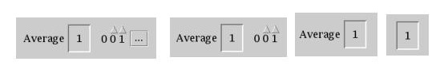
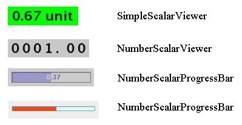
.. |image4| image:: media/image8.jpeg
   :width: 4.58958in
   :height: 2.16042in
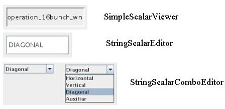
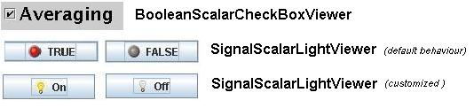
.. |image7| image:: media/image11.jpeg
   :width: 6.63681in
   :height: 2.38125in
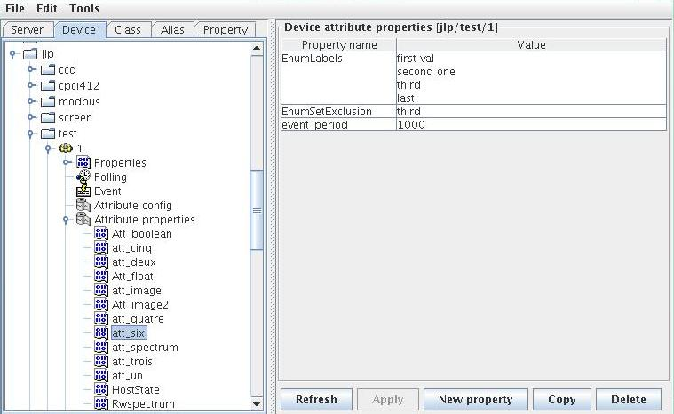
.. |image9| image:: media/image13.jpeg
   :width: 4.89861in
   :height: 1.29167in

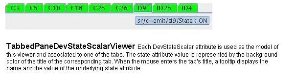
.. |image12| image:: media/image16.jpeg
   :width: 6.13681in
   :height: 3.11319in
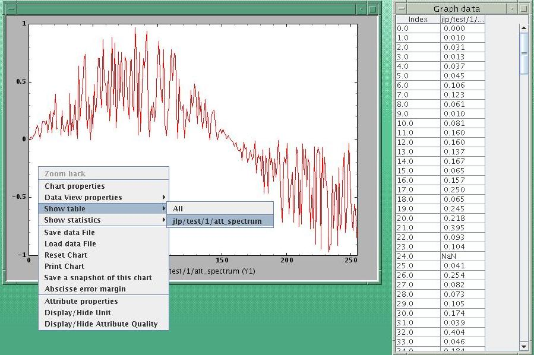
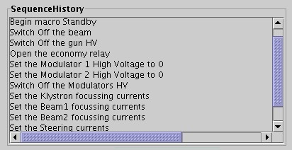
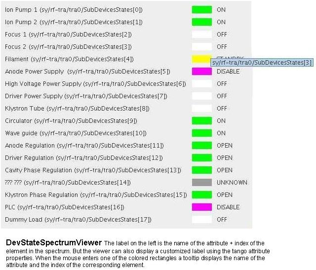
.. |image16| image:: media/image20.jpeg
   :width: 6.94653in
   :height: 3.67847in
.. |image17| image:: media/image21.jpeg
   :width: 5.90486in
   :height: 2.17847in
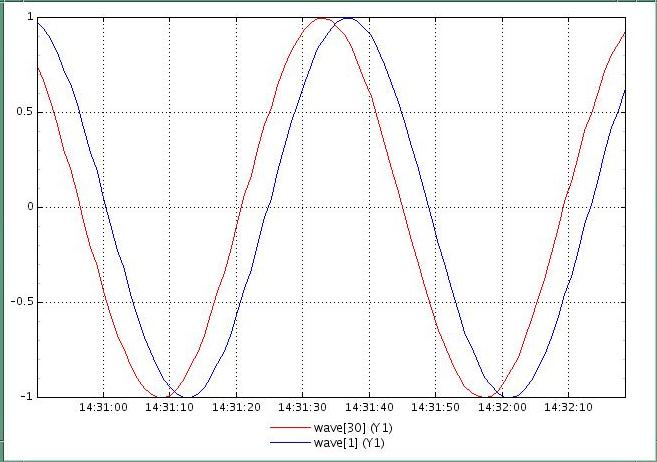
.. |image19| image:: media/image23.jpeg
   :width: 6.29792in
   :height: 5.32153in
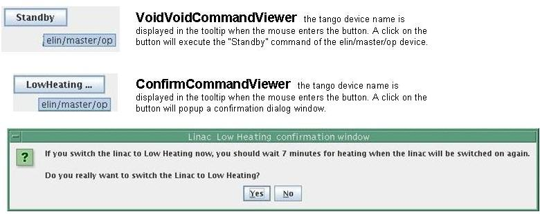
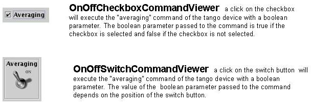
.. |image22| image:: media/image26.jpeg
   :width: 4.83333in
   :height: 2.92847in
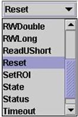
.. |image24| image:: media/image28.jpeg
   :width: 3.06528in
   :height: 5.72639in
.. |image25| image:: media/image29.jpeg
   :width: 6.29167in
   :height: 3.29792in
.. |image26| image:: media/image30.jpeg
   :width: 3.14861in
   :height: 1.26181in
.. |image27| image:: media/image31.jpeg
   :width: 6.29792in
   :height: 3.66042in
