.. _atkpanel_manual:

********
ATKPanel
********

:audience:`all`

.. toctree::
   :maxdepth: 2

   atkpanel

Overview
========

AtkPanel is a generic control panel application. It can be used to control any
Tango device. It supports most of Tango features and data types.
Using AtkPanel you can view and set attribute values, execute commands, test
the device and access diagnostic data.

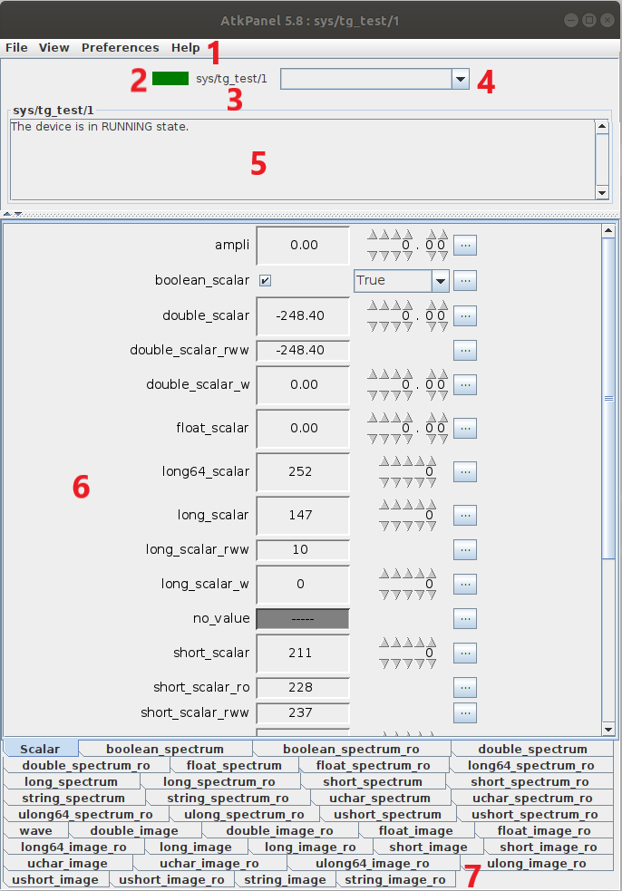

   AtkPanel 5.5 main window

#. Menu bar
#. Device state
#. Device name
#. Commands drop-down
#. Device status
#. Device attributes
#. Attribute switcher

By default AtkPanel opens the scalar attribute view. If your device has
attributes of non-scalar types, they will appear on the attribute switcher on
the bottom of the window.

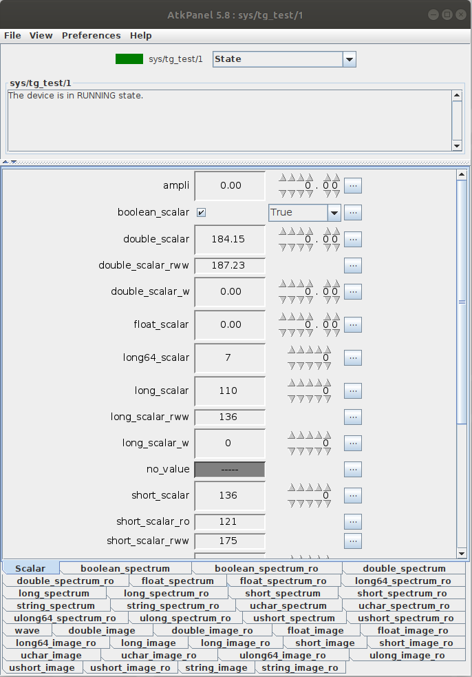

   Scalar attributes view

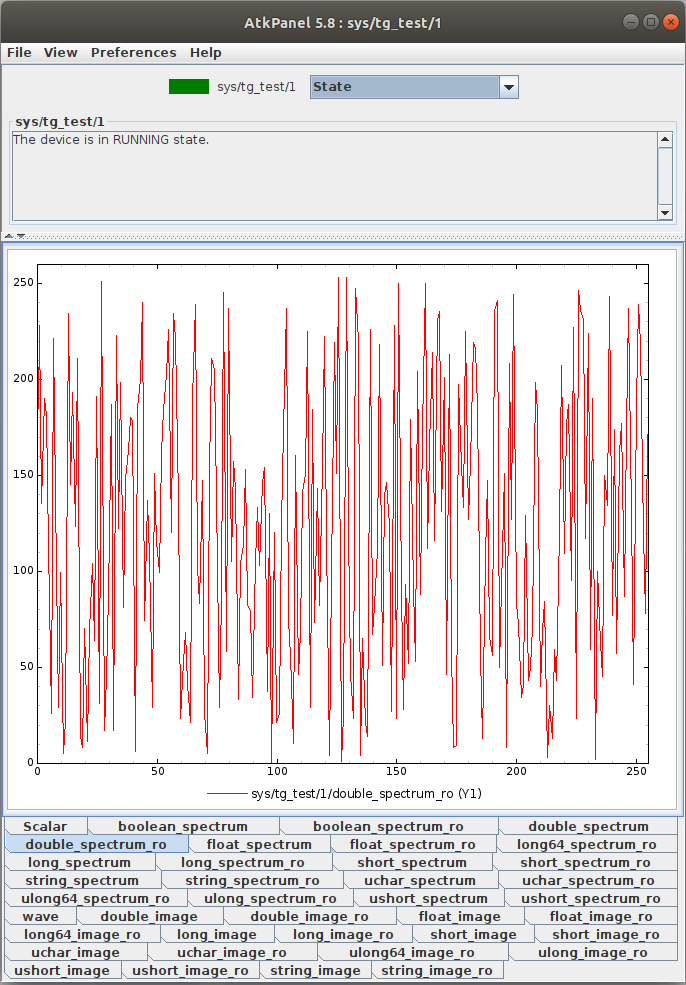

   Double array attribute view

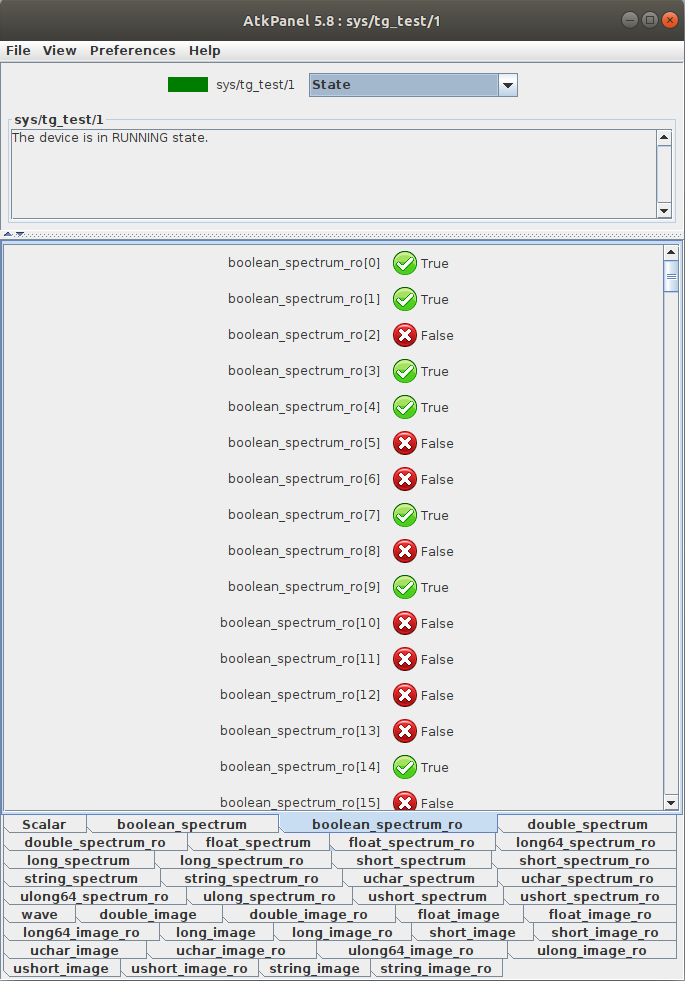

   Boolean array attribute view

.. figure:: atkpanel/image.png
   :alt: Image attribute view

   Image attribute view

You can run a command by selecting the command name from the command drop-down
list.

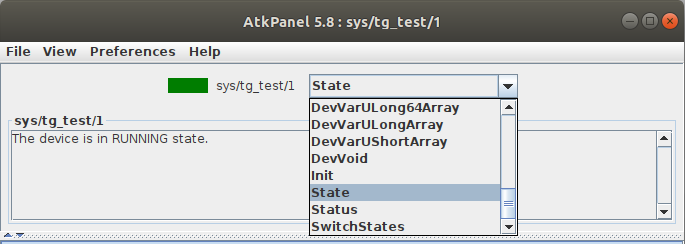

   Command drop-down list

.. _device_testing:

Device testing
==============

By selecting :guilabel:`View > Test device` from the menu you can open the
device testing panel. In this panel you can check how the device is reponding
to different commands and attribute values and how much time the requests take.

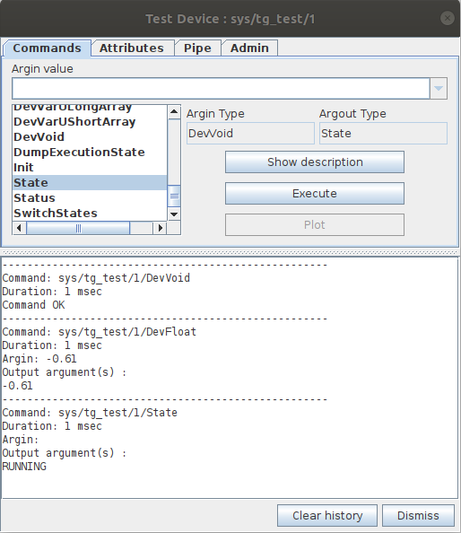

   Test commands view

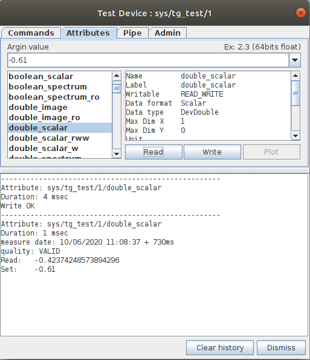

   Test attributes view

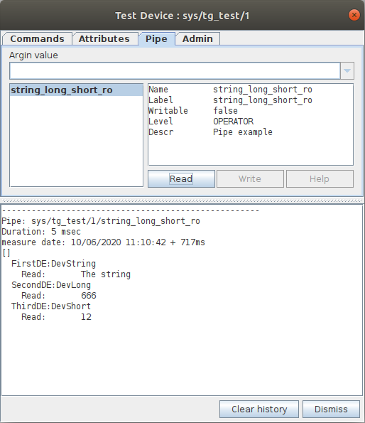

   Test pipes view

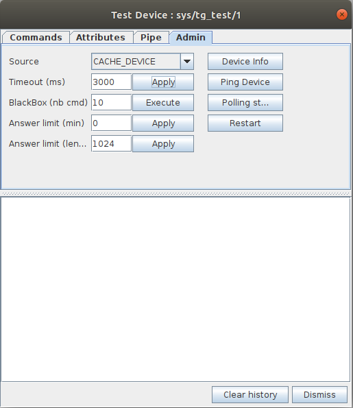

   Test admin view

On the :guilabel:`Admin` tab of :guilabel:`Test Device` window you can set the
device's administrative configuration such as value source, timeout, etc.

Trends
======

By choosing :guilabel:`View > Numeric & State Trend` or
:guilabel:`View > Boolean Trend` you can see the numeric & state or boolean
trend of selected attributes.

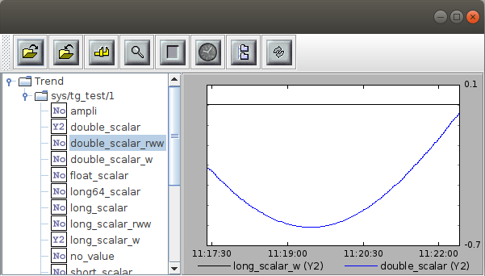

   Numeric & State trend

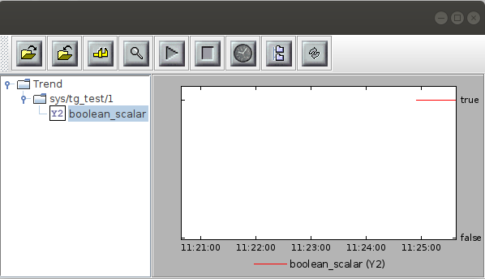

   Boolean trend

You can add attributes to the trend by right-clicking the attribute and
selecting the desired axis. You can plot the data on X and two Y axes.

Error History
=============

The :guilabel:`View > Error history` menu option opens the list of recent Tango
errors that occured with the device.

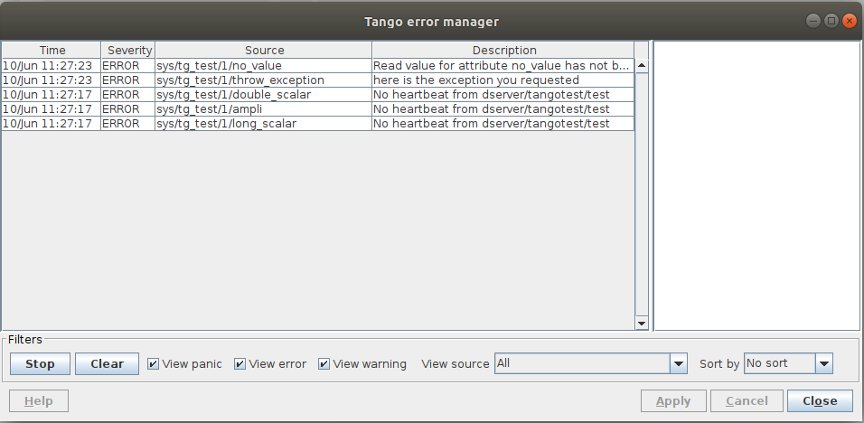

   Error history

Diagnostics
===========

The :guilabel:`View > Diagnostic` menu option provides an overview on device
diagnostic information. You can check the device interface version, events and
polling statistics and command execution counts.

.. figure:: atkpanel/diagnostic-device.png
   :alt: Device diagnostics

   Device diagnostics

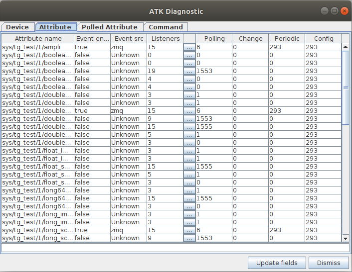

   Attribute diagnostics

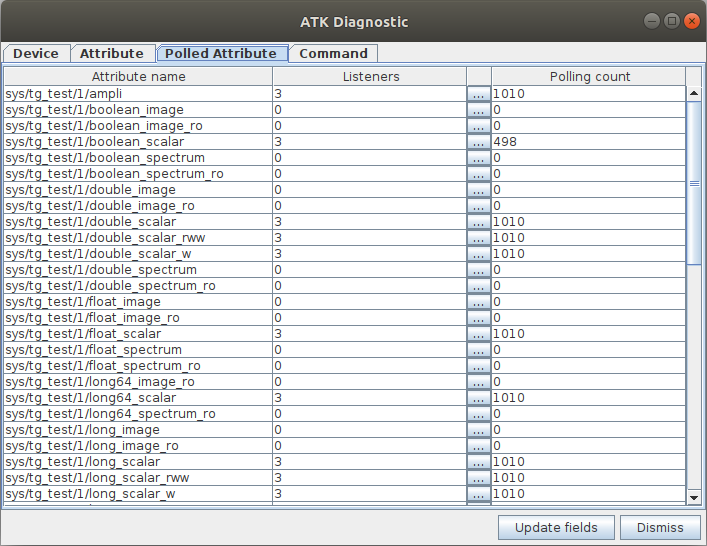

   Polled attribute diagnostics

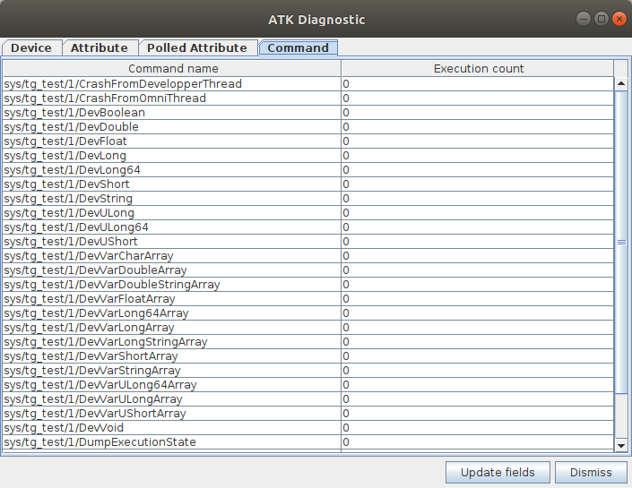

   Command diagnostics

Preferences
===========

From the :guilabel:`Preferences` menu you can tweak AtkPanel refreshing, set
the timeout and switch between :guilabel:`Operator View` and
:guilabel:`Expert View`. In :guilabel:`Expert View` you can see the attributes
that have display level set to :code:`EXPERT`.

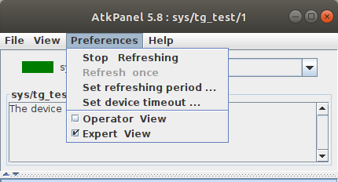

   AtkPanel Preferences
