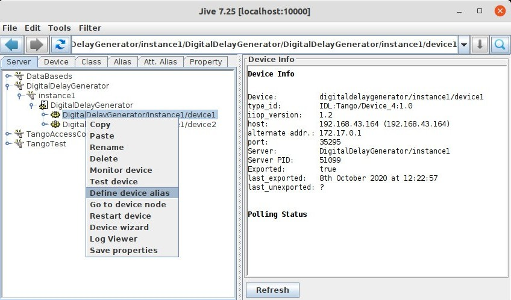

.. |br| raw:: html

    

Device Alias
************

:audience:`users`

How to create a device alias
----------------------------
A device alias can be created from jive by right-clicking on a device node and by selecting "Define device alias" right-click menu item.

