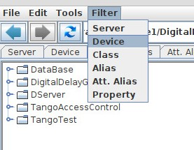
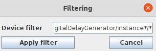
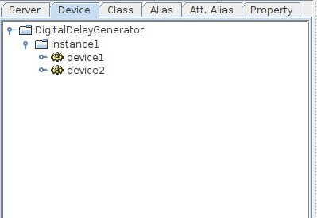

.. |br| raw:: html

    

Filtering the nodes in trees
****************************

:audience:`administrators, developers, users`

It is possible to filter some nodes in selection trees. Select which tree you want to be filtered then enter a filter (using wildcard) in the input dialog.

Then the device tree will be displayed as below:

