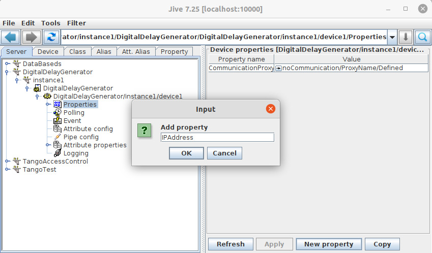
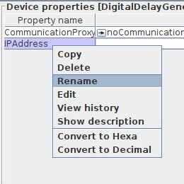
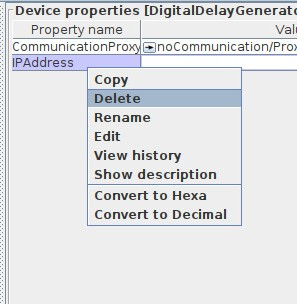
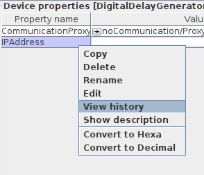

.. |br| raw:: html

    

Manage Properties
*****************

:audience:`administrators, developers`

Creating a Property
===================

Go in the device tree and select the Properties node, then click on the "New property" button. This will prompt an input dialog where you can enter the property name.

.. tip::

   | Since cppTango 9.3.3, you can use the keywords *NaN*, *-NaN*, *inf*, *-inf* and *+inf* when writing double or float
     scalar and array properties from jive to represent *Not A Number* and *infinite* values.
   | This might not work (yet) for a Java device server.
   | It is not case sensitive, so *nan*, *-NAN*, *nAn*, *iNF*, *-Inf* and *+INF* are also supported for instance.
   | A negative *NaN* is extracted as *NaN*.

Rename a Property
=================

Rigth click on the property name in the property table and select "Rename", This will allow you to give a new name to your property.

Delete a Property
=================

You can select "Delete" (right click on the property item) to remove one propery. You can also right click on the device node and select "Delete". This will erase all properties (including attribute properties) for the device. Note that if you want to remove the device itself, you have to remove it from its class in the server definition.

History of a Property
=====================

You can access to the change history of a property by selecting "View History". This opens the history dialog.

.. figure:: property_history_dlg.jpg
   :align:   center

   **Tango Database History dialog**

