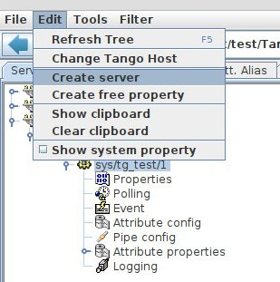
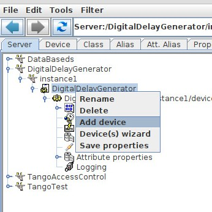
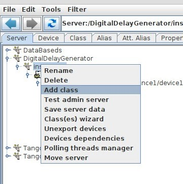
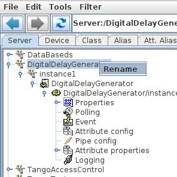
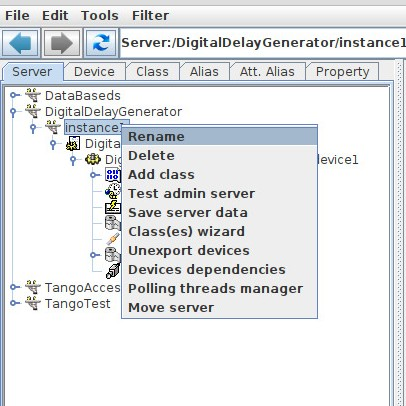
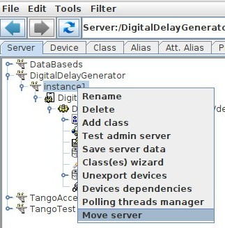

.. |br| raw:: html

    

Manage Servers
**************

:audience:`developers, administrators`

Creating a Tango server
=======================

To Create a server , Open the server creation dialog within the **Edit** menu.

.. figure::  server_dialog.jpg
   :align:   center

- Enter the server name including its instance name:|br|
  Ex: Modbus/tra1 where Modbus is the name of the process (the executable name) and tra1 its instance name.Then you can run your server by launching "Modbus tra1".
- Enter the class name
- Enter all devices of this class
- Click on Register server

Adding or Removing device to/from an existing server
====================================================

Select the class in the server you want to add a device, then right click on it and select "Add a device". This will ask you for a device name.
Select "Delete" if you want to remove the device. Note that when you remove a device all its properties are also removed.

Adding or Removing class to/from an existing server
====================================================

Select the server you want to add a class, then right click on it and select "Add class". This will show you the Create/Edit server window with the server name locked. Enter the class and devices name and click "Register Server".

Renaming a server
=================

This is a global rename of a server (executable name), all instances are affected.

This allows to rename the instance of one specific server.

This allows to rename the server name and instance name of one specific server.

