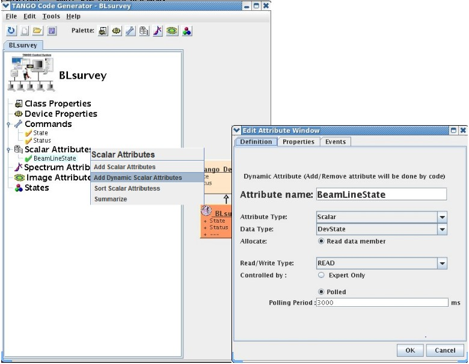

Dynamic Attributes
------------------

:audience:`developers`, :lang:`c++, java, python`

:program:`Pogo` allows you to create and manage dynamic attributes
You can create a dynamic attribute like a static one.

|image0|

An additional file will be generated with dynamic attribute utility methods.

The programmer will be able to add and remove every where in his code.
For instance during a command execution or with an external trig.

:program:`Pogo` will generate a method to add dynamic attribute at server startup.

|image1|

.. |image1| image:: img/DynamicAttr-3.jpg