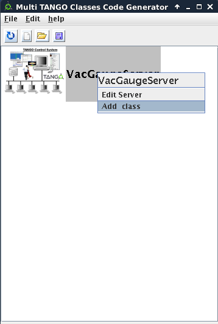

Multiple C++ Classes Manager
----------------------------

:audience:`developers`, :lang:`c++, java, python`

* Since :program:`Pogo-7.2` on **Linux**, :program:`Pogo` allows you to create multiple
       C++ classes server project.
* Use the :guilabel:`tools` menu (or :command:`pogo -multi` shell command) to launch
    the multiple classes GUI.
* Then create a new server project.
* The server name could have the same name of one class in project. But it is not mandatory.

+-----------+-----------+
| |image0|  | |image1|  |
+-----------+-----------+

* Then you can add several classes by selecting :file:`xmi` files.

+----------+------------+
| |image2| | |image3|   |
+----------+------------+

* Now, you can generate code where a class is defined or in an independent one.

* The 4 generated files are:

    -  :file:`VacGaugeServer.multi.xmi`: Multiple classes project file
    -  :file:`MultiClassesFactory.cpp`: Equivalent to the ClassFactory.cpp containing all specified class dependencies
    -  :file:`main.cpp`: The same main.cpp as a single class project
    -  :file:`Makefile.multi`: A Makefile containing all specified class dependencies

.. |image0| image:: img/Multi-creation.png
                    :scale: 85 %
.. |image1| image:: img/Multi-creation-1.png
                    :scale: 85 %

.. |image3| image:: img/Multi-tree.png
                    :scale: 85 %

