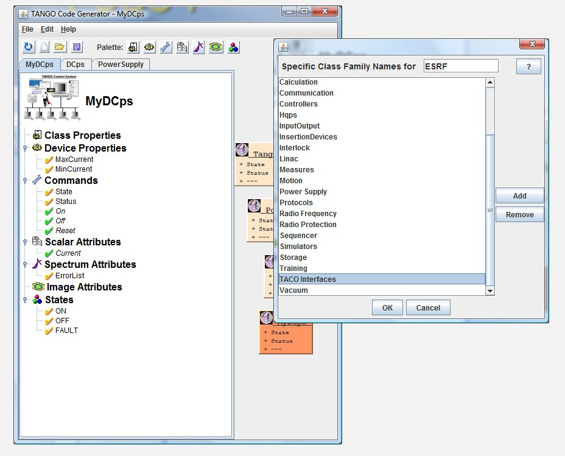

Preferences
-----------

:audience:`developers`, :lang:`c++, java, python`

Programmer Preferences
~~~~~~~~~~~~~~~~~~~~~~

You can customize your application as follow.

|image0|

Institute Preferences
~~~~~~~~~~~~~~~~~~~~~

If you use your own repository with specific class families, manage
the family list as follow.

|image1|

.. |image0| image:: img/Pogo-preferences.jpg

