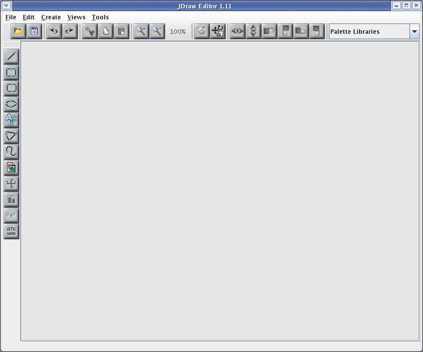
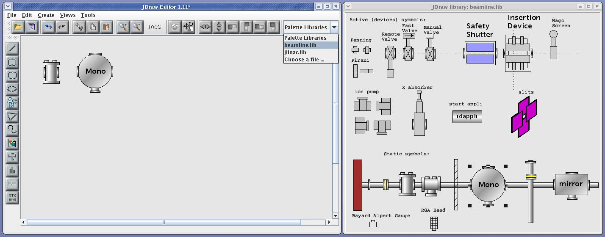
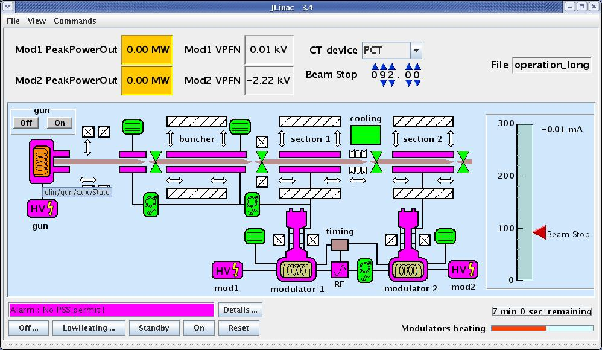

.. _jdraw_manual:

Synoptic and JDraw
==================

:audience:`developers, users`

ATK includes a graphical editor, to design the graphic shape of the
synoptic. The editor is called **Jdraw**. This editor is included in
ATK so you don’t need to download any specific jarfile.

To launch **jdraw** you should start the following class :

**fr.esrf.tangoatk.widget.util.jdraw.JdrawEditorFrame**

Once the jdraw is started you will see the following window :

|image28|

You can now start to draw the synoptic. As in any drawing editor you can
group basic objects (like rectangle, circle, lines, …) to obtain more
elaborated shapes. Once the drawing is done you need to associate parts
of the drawing to a Tango control system object. Click on the following
link to view a Flash demo of how to draw a simple tango synoptic.

`First synoptic (Flash
Demo) <http://www.esrf.fr/computing/cs/tango/tango_doc/atk_tutorial/flash-demos/jdraw.htm>`__

Test the synoptic : “Tango Synoptic view”
~~~~~~~~~~~~~~~~~~~~~~~~~~~~~~~~~~~~~~~~~

As soon as the synoptic is saved in a file, it’s run time behavior can
be tested. Inside Jdraw, select “Tango Synoptic view” from the “Views”
pulldown menu to test the run time behavior of the synoptic.

|image29|

You can also start the same simple synoptic application outside jdraw
editor. This application is called SimpleSynopticAppli and is included
in ATK. You don’t need any specific jarfile to use it.To launch
**SimpleSynopticAppli** you should start the following class :

**fr.esrf.tangoatk.widget.jdraw.SimpleSynopticAppli**

You can pass the absolute path of the synoptic file as the argument to
the SimpleSynopticAppli. In case no argument is passed on the command
line, the application will popup a file selection dialog in order to get
the name of the synoptic file to load.

The following screenshot shows the SimpleSynopticAppli with the synoptic
file loaded.

|image30|

As you can see the rectangle shows the value of fp/test/1/state
attribute. The state attribute value is represented by it’s
corresponding color (blue). Moreover you can see the value of the
*“fp/test/1/double_scalar”* value displayed by the SimpleScalarViewer
inside the synoptic.

If the mouse enters the blue rectangle (while the focus is inside the
synoptic window), a tooltip will display the name of the Tango attribute
associated to the rectangle. The same goes for the region where the
numeric value (177.83) is displayed.

A mouse click inside the blue rectangle will launch an AtkPanel for the
device fp/test/1. The AtkPanel is started by default in read-only mode :
device commands and attribute setters are not displayed.

*Conclusion :*

-  A synoptic drawing can easily be made using the drawing tool Jdraw
   included in ATK.

-  The association between the graphic components inside the drawing and
   the control system Tango objects are made through the name of the
   graphic components.

-  A Simple Synoptic application is provided to test the run-time
   behaviour of the synoptic. It can be started directly from the Jdraw
   editor’s menubar or outside Jdraw.

Jdraw editor
~~~~~~~~~~~~

We will not explain in detail Jdraw editor. In fact, it is a very
intuitive editor and you can just try it to get experience with it.
Neverthelesse there are some Jdraw features which will be described in
this section.

Jdraw libraries
^^^^^^^^^^^^^^^

You can draw your own standrad shapes and save them in a file such that
they can be used in other synoptic files.

#. Draw your standrard / predefined shapes in the Jdraw editor.

#. Save the file by naming it with a **“.lib”** suffix.

#. Move your **“.lib”** file to a well defined location on your disk.

#. Set the “LIBPATH” environment variable to the folder where is located
   your **“.lib”** file.

#. Start the jdraw java machine with “-DLIBPATH=$LIBPATH”.

#. Note on the top right corner the “Palette Libraries” ComboBox. You
   should see inside the drop down list the name of the **“.lib”** file.

When the library name is selected it’s content is displayed in a
separate window. You can simply click one component in the library
window and click the jdraw window to add it into your drawing. See the
screenshot below :

|image31|

ATK Viewers in Jdraw
^^^^^^^^^^^^^^^^^^^^

A small set of ATK viewers are available in Jdraw so that they can be
added inside the synoptic drawing. To add one of them click on “ATK
Swing” button and select an appropriate viewer from the list.When using
the ATK viewers you may need to set some of their “bean properties” to
make them behave as you wish. A subset of the properties of each viewer
is accessible through jdraw. To see and to edit those properties, double
click the atk viewer, then select the “Extension” tab in the property
window. For example in the screen shot below you can see all the bean
properties available in Jdraw for the SimpleScalarViewer.

|image32|

Dynamic Objects (Dynos)
^^^^^^^^^^^^^^^^^^^^^^^

Dynamic Objects also called Dynos in Jdraw are the graphic components
for which the user has defined a dynamic (run-time) behavior.

For example a Dyno can be any graphic component associated to a numeric
tango attribute and for which the user has defined a specific background
color depending on the value of the attribute. You can see how to create
and use the dynos in Jdraw in the following flash demo.

`Dynamic Objects in Jdraw (Flash
Demo) <http://www.esrf.fr/computing/cs/tango/tango_doc/atk_tutorial/flash-demos/jdraw_dyno.htm>`__

Panel class definition
^^^^^^^^^^^^^^^^^^^^^^

In a synoptic application when a graphic component is clicked by the
user, in most cases, we need to launch a specific panel. In Jdraw you
have the possibility to define the name of the class you want to start
when the Jdraw object is clicked. To associated a Jdraw graphic
component to a panel follow the steps below :

#. Double click the Jdraw graphic object to show the **Properties** window

#. Select the **Extension** Tab inside the Properties window

#. Click on the **“New”** button to add a new extension and give it
   the name **“className”**

#. Type in the fully defined class name of the panel you want to show,
   in the value field attached to **className** extension

#. Optionnally click on the **“New”** button to add another
   extension and give it the name **“classParam”**

#. Type in the string which is passed to the constructor of the panel
   class

|image33|

The “panel class” defined with “className” extension :

-  Should be a subclass of JFrame or Jdialog

-  Must have a constructor with a String parameter (even if the
   parameter is ignored)

-  Should not call system.exit() when it’s window is closed

**Conclusion**

-  The specific full qualified panel class name should be specified in
   the **“Extension”** tab of the property window under the name of
   **“className”**.

-  The string parameter which will be passed to the panel class
   constructor can also be defined in the **“Extension”** tab of the
   property window under the name of **“classParam”**.

-  If the **classParam** is not defined the constructor of the class is
   called with the name of the jdraw graphic object which has been
   clicked.

-  If the **className** is not defined and the jdraw graphic object is
   associated to a Tango state attribute, **atkpanel** will be started
   in read only mode.

Include the Synoptic in an ATK application
~~~~~~~~~~~~~~~~~~~~~~~~~~~~~~~~~~~~~~~~~~

Once the synoptic is drawn and well tested, it can be used through the
generic application **SimpleSynopticAppli**. To launch the
**SimpleSynopticAppli** start the following class :

**fr.esrf.tangoatk.widget.jdraw.SimpleSynopticAppli**

In most cases, the synoptic should be integrated inside a specific ATK
application in the middle of other ATK viewers.

|image34|

As you can see in the screen shot the synoptic is only part of the
application’s main window. There are other ATK attribute and command
viewers outside of the synoptic area. Moreover there is also a specific
menu bar with a lot of application specific commands.

SynopticFileViewer
^^^^^^^^^^^^^^^^^^

ATK provides a viewer called **SynopticFileViewer** which belongs to the
package : **fr.esrf.tangoatk.widget.jdraw**. This viewer can be used as
any other ATK viewer. It can be added into any Swing container. It can
also be added to a Java IDE palette (for example Netbeans palette) as a
Java Bean.

Once the SynopticFileViewer is instantiated, the programmer should
specify the synoptic file to be loaded by the viewer. There are two
methods for synoptic file specification :

#. Load the synoptic from a file specified by a path name on the disk,

#. Load the synoptic from an Input Stream Reader.

Load the synoptic from a file
^^^^^^^^^^^^^^^^^^^^^^^^^^^^^

The application programmer will specify the file path name of the
synoptic file to load. The drawback of this option is that the
application programmer must know the absolute path name of the synoptic
file and this path name is constant even if the application is deployed
in different hosts and sites.

The following code sample shows how to use a SynopticFileViewer and
specify the synoptic file to load:

.. code-block:: java
    :linenos:

    SynopticFileViewer  sfv = new SynopticFileViewer();

    sfv.setToolTipMode(TangoSynopticHandler.TOOL_TIP_NAME);
    sfv.setAutoZoom(true);
    Try
    {
        sfv. setJdrawFileName ("/my/root/dir/jdraw_file mySynoptic.jdw ");
    }
    Catch (Exception ex) {}

The call to **“setJdrawFileName”** will load the synoptic file if it
can be found and opened, otherwise an exception is thrown.

Load the synoptic from an Input Stream Reader
^^^^^^^^^^^^^^^^^^^^^^^^^^^^^^^^^^^^^^^^^^^^^

The main advantage of this method is that the synoptic jdraw file can be
included into the application jarfile. An input stream reader is created
through the file resource by the application code. This input stream
reader is passed to the SynopticFileViewer to load the synoptic.

This option allows that the synoptic file is packed inside the
application Jar file and we don’t make any assumption on the exact
physical location of the synoptic file on the disk.The following code
sample shows how to use a SynopticFileViewer and specify the synoptic
file to load:

.. code-block:: java
    :linenos:

    SynopticFileViewer  sfv = new SynopticFileViewer();
    sfv.setToolTipMode(TangoSynopticHandler.TOOL_TIP_NAME);
    sfv.setAutoZoom(true);
    InputStreamReader   inStrReader=null;
    InputStream   jdFileInStream = this.getClass().getResourceAsStream("/mypakcage/file.jdw”);
    if (jdFileInStream!=null)
        inStrReader = new InputStreamReader(jdFileInStream);
    if (inStrReader!=null)
    {
         Try
        {
           sfv .loadSynopticFromStream(inStrReader);
        }
        Catch (Exception ex) {}
    }

The call to **“loadSynopticFromStream”** will load the synoptic from
the input stream if possible. In case of bad format or an empty stream
(no component) an exception is thrown.

Predefined run time behavior
~~~~~~~~~~~~~~~~~~~~~~~~~~~~

The synoptic file is loaded by ATK at run-time. All the run time
animation / behavior is coded inside Atk class which loads the synoptic.
All of the run time behavior is listed in this section.

Attribute
^^^^^^^^^

A Tango state attribute can be associated to any jdraw graphic object.
From a simple drawing to a complex shape made of successive groups. A
tango state attribute can also be associated to a Dyno.

*Associated to a Jdraw Object (not a Dyno)*

ATK will color the object according to the value of the state attribute.
The state/color mapping is the same as the one used in all other parts /
viewers of ATK.

-  If the object is filled : the fill color is changed

-  If the object is not filled : the line color is changed

-  If the object is made of successive groups, the change is made
   recursively in each group util the basic graphic objects are reached.
   In this hierarchy of objects, the graphic objects whose name is
   **“IgnoreRepaint”** do not change their color at all.

*Associated to a Dyno (Dynamic Object)*

As described in the previous section a Dynamic Object (Dyno) has a
specific dynamic behavior which has been defined during the drawing
phase. In order to define your own behavior with a Dyno associated to a
State attribute, you should define the mapping between each different
tango state numeric values and the caracteristique affected by the
value.

It’s important to know that the Dyno will receive at run time a numeric
value associated to the state attribute value. You can find the mapping
between the numeric values and the tango state values in the Tango
documentation_:

*User interaction*

When the **mouse enters** the graphic component associated to the state
attribute, the name of the state attribute is displayed inside a
**tooltip**.

When an object associated to a state attribute is clicked by the user at
run time, ATK tries to popup a panel.

-  If the **“className”** extension is defined, the class is
   instantiated using a constructor with a String parameter.

-  If the **“className”** extension is not defined the AtkPanel in
   read-only mode is instantiated.

-  If the **“classParam”** extension is defined, the string is
   passed as the argument to the constructor of the panel class.

-  If the **“classParam”** extension is not defined, the device name
   behind the state attribute is passed as the argument to the
   constructor of the panel class.

Tango Numeric Attribute
^^^^^^^^^^^^^^^^^^^^^^^

A Tango numeric attribute can be associated to a Dyno (Dynamic Object)
or to an adapted Atk Viewer (for example SimpleScalarViewer).

*Associated to a Dyno (Dynamic Object)*

As described in the previous sections a Dynamic Object (Dyno) has a
specific dynamic behavior which has been defined during the drawing
phase. In order to define your own behavior with a Dyno associated to a
tango numeric attribute, you should define the mapping between different
values of the tango attribute and the caracteristique affected by the
value. You can for example associate “value intervals” to a
caracteristique change. See the `Dynamic Objects in Jdraw (Flash
Demo) <http://www.esrf.fr/computing/cs/tango/tango_doc/atk_tutorial/flash-demos/jdraw_dyno.htm>`__.

It’s important to know that the Dyno will receive at run time the
numeric value of the tango attribute when it changes.

*Associated to an Atk Viewer (for example SimpleScalarViewer)*

The tango attribute will be set as the model of the AtkViewer
(SimpleScalarViewer) and that’s it. All the run-time behavior is defined
by the AtkViewer which is used.

Some of the bean properties of the Atk Viewer are available in the
extension Tab of the Jdraw properties window.

*User interaction*

When the **mouse enters** the graphic component associated to the tango
numeric attribute, the name of the tango attribute is displayed inside a
**tooltip**.

When an object associated to the tango attribute is selected by the user
at run time, ATK tries to popup a panel :

-  If the **“className”** extension is defined, the class is
   instantiated using a constructor with a String parameter.

-  If the **“classParam”** extension is defined, the string is
   passed as the argument to the constructor of the panel class.

-  If the **“classParam”** extension is not defined, the name of the
   Jdraw object (which is the name of the Tango numeric attribute) is
   passed as the argument to the constructor of the panel class.

-  If the **“className”** extension is not defined nothing happens

Tango Boolean Attribute
^^^^^^^^^^^^^^^^^^^^^^^

A Tango boolean attribute can be associated to a Dyno (Dynamic Object)
or to an adapted Atk Viewer (for example BooleanScalarCheckboxViewer).

*Associated to a Dyno (Dynamic Object)*

In order to define your own behavior with a Dyno associated to a tango
boolean attribute, you should define the mapping between the two values
of the boolean attribute (true and false) and the caracteristique
affected by the value. See the `Dynamic Objects in Jdraw (Flash
Demo) <http://www.esrf.fr/computing/cs/tango/tango_doc/atk_tutorial/flash-demos/jdraw_dyno.htm>`__.

It’s important to know that the Dyno will receive at run time the
numeric value for the boolean attribute. It means that if the attribute
value is false, the value 0 is sent to the Dyno and if the attribute
value is true the value 1 is sent to the Dyno.

*Associated to an Atk Viewer (for example BooleanScalarCheckboxViewer)*

The tango attribute will be set as the model of the AtkViewer
(*BooleanScalarCheckboxViewer*). All the run-time behavior is defined by
the AtkViewer which is used.

Some of the bean properties of the Atk Viewer are available in the
extension Tab of the Jdraw properties window.

*User interaction*

When the **mouse enters** the graphic component associated to the tango
numeric attribute, the name of the tango attribute is displayed inside a
**tooltip**.

When an object associated to the tango attribute is selected by the user
at run time, ATK tries to popup a panel :

-  If the **“className”** extension is defined, the class is
   instantiated using a constructor with a String parameter.

-  If the **“classParam”** extension is defined, the string is
   passed as the argument to the constructor of the panel class.

-  If the **“classParam”** extension is not defined, the name of the
   Jdraw object (which is the name of the Tango boolean attribute) is
   passed as the argument to the constructor of the panel class.

-  If the **“className”** extension is not defined nothing happens

Tango DevState Spectrum Attribute
^^^^^^^^^^^^^^^^^^^^^^^^^^^^^^^^^

An element of a Tango DevState spectrum attribute can be associated to
any jdraw graphic object. From a simple drawing to a complex shape made
of successive groups. An element of a Tango DevState spectrum attribute
can also be associated to a Dyno. To assign an element of a DevState
spectrum attribute we use the brakets. So to associate the 10 :sup:`th`
element of the state spectrum attribute sr/rf-tra/tra1/SubDevicesStates,
the name of the graphic component should be
**sr/rf-tra/tra1/SubDevicesStates[9]**.

*Associated to a Jdraw Object (not a Dyno)*

ATK will color the object according to the value of the element
specified in the state spectrum attribute. The state/color mapping is
the same as the one used in all other parts / viewers of ATK.

-  If the object is filled : the fill color is changed according to the
   state value

-  If the object is not filled : the line color is changed according to
   the state value

-  If the object is made of successive groups, the change is made
   recursively in each group util the basic graphic objects are reached.
   In this hierarchy of objects, the graphic objects whose name is
   **“IgnoreRepaint”** do not change their color at all.

*Associated to a Dyno (Dynamic Object)*

As described in the previous sections a Dynamic Object (Dyno) has a
specific dynamic behavior which has been defined during the drawing
phase. In order to define your own behavior with a Dyno associated to an
element of a State spectrum attribute, you should define the mapping
between each different tango state numeric values and the
caracteristique affected by the value.

It’s important to know that the Dyno will receive at run time a numeric
value associated to the state attribute value. You can find the mapping
between the numeric values and the tango state values in the Tango
documentation_:

*User interaction*

When the **mouse enters** the graphic component associated to the state
spectrum attribute, the name of the state spectrum attribute + index of
the element in the spectrum is displayed inside a **tooltip**.

When an object associated to a state attribute is clicked by the user at
run time, ATK tries to popup a panel.

-  If the **“className”** extension is defined, the class is
   instantiated using a constructor with a String parameter.

-  If the **“classParam”** extension is defined, the string is
   passed as the argument to the constructor of the panel class.

-  If the **“classParam”** extension is not defined, the name of the
   Jdraw object (which is the name of the element of a tango DevState
   spectrum attribute) is passed as the argument to the constructor of
   the panel class.

-  If the **“className”** extension is not defined nothing happens

Tango Command
^^^^^^^^^^^^^

A Tango Command can be associated to a Jdraw interactive component or to
an adapted Atk Viewer (for example VoidVoidCommandViewer).

*Associated to a Jdraw interactive component*

When the interactive graphic component is clicked, the tango command is
executed.

*Associated to an Atk Viewer (for example VoidVoidCommandViewer)*

The tango attribute will be set as the model of the AtkViewer
(VoidVoidCommandViewer). All the run-time behavior is defined by the
AtkViewer which is used.

Some of the bean properties of the Atk Viewer are available in the
extension Tab of the Jdraw properties window.

*User interaction*

When the **mouse enters** the graphic component associated to the tango
command, the name of the tango command is displayed inside a
**tooltip**.

When the interactive object associated to the tango command is clicked
by the user at run time, ATK sends the command to the associated Tango
device.

Other types of Tango Attributes
^^^^^^^^^^^^^^^^^^^^^^^^^^^^^^^

Other type of Tango attributes can be associated only to an Atk viewer
avialable in Jdraw editor under the “Atk Swing” button. They cannot be
associated to a Jdraw graphic component. The use of an Atk viewer is
mandatory.

The following tango attributes can be used in Jdraw and associated to
their corresponding Atk viewers as listed below :

-  **String Scalar** attribute should be associated to a
   **SimpleScalarViewer**

-  **Numeric Spectrum** attribute should be associated to a
   **NumberSpectrumViewer**

-  **Numeric Image** attribute should be associated to a
   **NumberImageViewer**

The run time behavior is the one provided by the Atk viewer.

.. |image29| image:: media/image33.jpeg
   :width: 5.52986in
   :height: 4.22639in
.. |image30| image:: media/image34.jpeg
   :width: 3.59514in
   :height: 1.60694in

.. |image32| image:: media/image36.jpeg
   :width: 3.29167in
   :height: 3.18472in
.. |image33| image:: media/image37.jpeg
   :width: 3.29167in
   :height: 3.16042in

.. definitions
  ------------
.. _documentation: http://www.esrf.eu/computing/cs/tango/tango_doc/kernel_doc/tango_java_api/classes/constant-values.html
