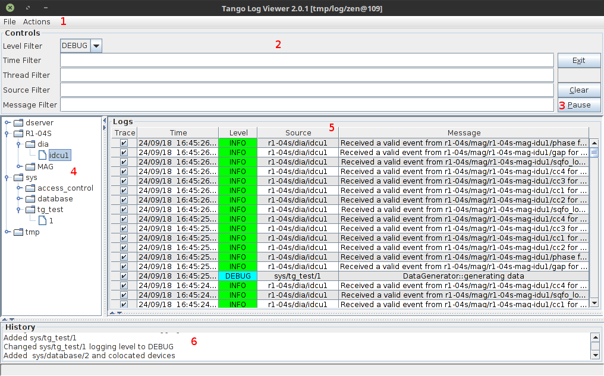
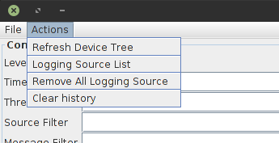

.. _logviewer_manual:

*********
LogViewer
*********

:audience:`all`

.. toctree::
   :maxdepth: 2

   logviewer

Overview
========

LogViewer is an application for displaying logs pushed by the devices to the
Tango logging system. You can fetch logs from different Tango devices and
filter them by several properties to find what you need.

   LogViewer 2.0.1 main window

   | 1 - Menu bar
   | 2 - Filter settings
   | 3 - Clear button - clears the logs window
   | 4 - Pause button
   | 5 - Device tree
   | 6 - Logs
   | 7 - History of actions

Tango Logging
-------------

Tango provides a logging service for devices. It is configured by several
device properties, and support sending logs to various targets, such as files,
log consumer devices or the console. For more information you can check out
:ref:`more details about logging service <the-device-logging>`.

Adding devices
==============

To add logs from device to the viewer you need to right click on the device in
the device tree and click add. Then you need to set which level logs from that
device should be visible. You can do this with :guilabel:`Set Logging Level`
options in the device context menu.

.. figure:: logviewer/add.png
   :alt: Add logs from device

   Add logs from device

Alternatively, you can add device with log level already set with
:guilabel:`Add/Set Logging Level` context menu option.

.. figure:: logviewer/log-level.png
   :alt: Add and set logging level

   Add and set logging level

Add colocated devices
---------------------

The :guilabel:`Add Colocated` option adds all devices, running on the same
device server instance, as logging sources. For example, if you have a
:code:`TangoTest/test` instance with :code:`sys/tg_test/1` and
:code:`sys/tg_test/2` devices, choosing :guilabel:`Add Colocated` on any of
these devices will add both of them. The same applies for
:guilabel:`Remove Colocated` and :guilabel:`Set Logging Level (colocated)`
options.

Actions menu
============

The actions menu provides access to some useful functions:

   Actions menu

* :guilabel:`Refresh Device Tree` - refresh devices
* :guilabel:`Logging Source List` - list all added devices in the history
  window
* :guilabel:`Remove All Logging Source` - remove all devices from source list
* :guilabel:`Clear history` - clear history window

Loading logs from files
=======================

With the :guilabel:`File > Load file` menu option you can load a log file
generated by the devices which logging target is set to file. This allows you
to use the LogViewer features to filter and search through the logs offline.
The log file format is XML.
