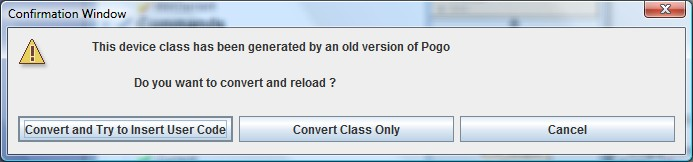

Pogo-6 Compatibility
----------------------

:audience:`developers`, :lang:`c++, java, python`

This application is supposed to be able to re-load a class generated with a :program:`Pogo-6.x` application.
If :program:`Pogo-6.x` can load it, :program:`Pogo` is also able to load it. :guilabel:`Open` the :file:`XXXX.h` file.

**BUT:**

It will try to insert your own code at right place.
Of course all cases cannot be tested:

-  Something could be missing (test your server before other modication)
-  Sometimes it could fail and do not insert part of code.

When it load an old project it will propose:

|image0|

The code insertion is available only for **C++**.
If code insertion fails, or for **Python** and **Java**, generate class only and add your code by copy/paste action.

For C++
+++++++

If insertion works and compilation fails, most of the time it is due to:

-  Declaration duplicated (one by generator, one by code insertion).
-  For writable attribute, in ``write_MyAttribute method``, the
   ``attr.get_write_value()`` method management has changed. It is now returned in a local
   variable. Your old global variable does not exist any more (it is not necessary
   to be global in 99% of cases). It now local and named ``w_val``.
-  Take care in ``dev_state()`` and ``dev_status()`` methods if you
   override the default.

Of course a class generated by this :program:`Pogo` version is not able to be
re-loaded by :program:`Pogo-6.x.x` application.

