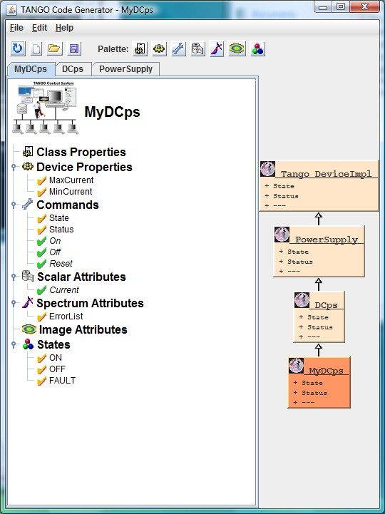
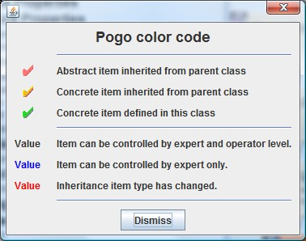

Inheritance Management
----------------------

:audience:`developers`, :lang:`c++, java, python`

* A TANGO device class inherite from a DeviceImpl class. It could also inherite from another TANGO device class.
* To inherite from another TANGO device class, use **Add Inheritance Class** in class creation window.
* Inheritance is not simply used as template.
    That means that :file:`*.h` and :file:`*.cpp` files of inherited class must be in :file:`Makefile`.
* Inheritance could be done from a class containing code and not only from pure abstract class.
* An inheritance diagram is displayed on right side and all classes in this diagram are edited.
* A color code display if items are abstract or concrete.

+----------+----------+
| |image0| | |image1| |
+----------+----------+

