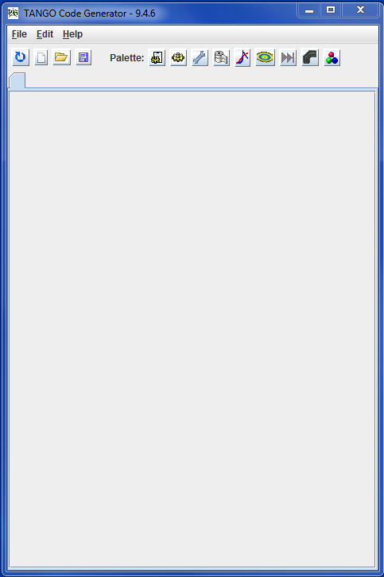
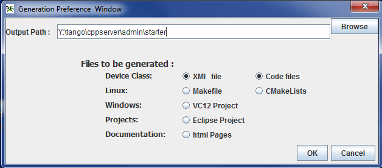
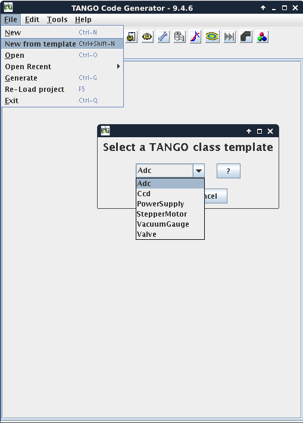

.. Definitions
.. ------------

.. _Jive:   ../jive/index.html

Starting with Pogo
===================

:audience:`beginners, developers`, :lang:`c++, java, python`

TANGO class creation
----------------------
Pogo will start as follow.

|image0|

Then, create a new class using **File/New** menu and add your:
    * Properties
    * Commands
    * Attributes
    * Pipes
    * States

When your class is defined, you can generate code:

|image1|

Select what you want to generate:
        
-  **.xmi** file is the project itself, it will be loaded when you re-open your project with Pogo.
-  Linux **Makefile** or **CMakeList.txt**
-  **VC12** project (Windows project)
-  **pom.xml** (if Java and maven path structure found)
-  **html documentation** : html pages based on information entered during class model creation.

You are now able to compile the generated code and if the server is defined in database (using Jive_) you are also able to run it.

Using templates
----------------

If you define an evironment variable **TEMPLATES_PATH** to a directory containing :file:`xmi` files,
 you will be able to use these  :file:`xmi` files as templates.

 **e.g.: export TEMPLATES_PATH=$TANGO_HOME/templates/pogo**
 |image2|