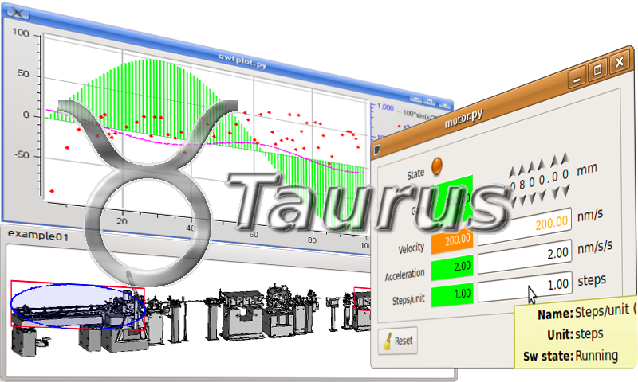

.. _taurus:

|image0|

Taurus (Python GUI library)
===========================

:audience:`developers`, :lang:`python`

Taurus is a Python framework for control and data acquisition CLIs and GUIs in scientific/industrial environments.
It supports multiple control systems or data sources: :term:`Tango Controls`, EPICS, spec...
New control system libraries can be integrated through plugins.

For non-programmers: Taurus allows the creation of fully-featured GUI (with forms, plots, synoptics, etc)
from scratch in a few minutes using a “wizard”, which can also be customized and expanded by drag-and-dropping
elements around at execution time.

For programmers: Taurus gives full control to more advanced users to create and customize CLIs and GUIs
programmatically using Python and a very simple and economical API which abstracts data sources as “models”.

Taurus - based on Python and `PyQt <https://riverbankcomputing.com/software/pyqt/intro>`_
or `PySide <http://pyside.github.io/docs/pyside/>`_.
Widely used by the Python and other communities.

Download taurus `here <https://pypi.python.org/pypi/taurus>`_.
Source code is `here <https://github.com/taurus-org/taurus>`_.

You can find its full documentation `here <http://taurus-scada.org/en/latest/>`_.

.. definitions
   --------------

