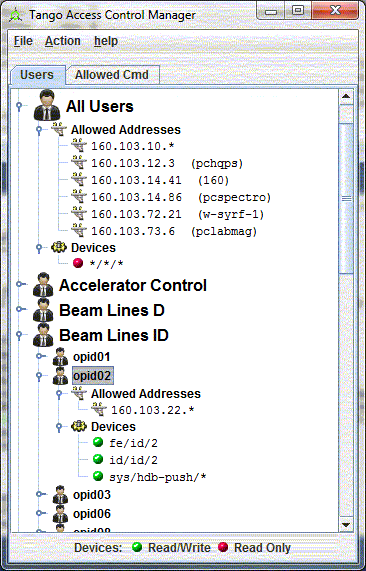

Tango Access Control (TAC) Configuration
----------------------------------------

| 
| TANGO provides an access control (see `kernel
  documentation <http://www.esrf.eu/computing/cs/tango/tango_doc/kernel_doc/ds_prog/index.html>`__
    chapter Advanced Features)

TAC Configuration Tool:
~~~~~~~~~~~~~~~~~~~~~~~

Configure TAC by IP address and user:
~~~~~~~~~~~~~~~~~~~~~~~~~~~~~~~~~~~~~

| User list is displyed in a tree under groups.
| To configure you can Add/Remove a user and its group.
| And define this user rights.

+--------------------------------------+--------------------------------------+
| |Tango Access Control users|         | **All Users:**                       |
|                                      |                                      |
|                                      | **User opid02**                      |
|                                      | Has write access only for devices    |
|                                      |                                      |
|                                      | -  fe/id/2                           |
|                                      | -  id/id/2                           |
|                                      | -  sys/hdb-push/\*                   |
|                                      |                                      |
|                                      | and only for clients running on      |
|                                      | machines                             |
|                                      | with IP address as xxx.yyy.22.\*     |
+--------------------------------------+--------------------------------------+

| 

Configure TAC for allowed commands:
~~~~~~~~~~~~~~~~~~~~~~~~~~~~~~~~~~~

+--------------------------------------+--------------------------------------+
| |Tango Access Control users|         | The access control allows **Write**  |
|                                      | access or **Read Only** access.      |
|                                      | The **Read Only** acces means:       |
|                                      |                                      |
|                                      | -  Read only device attributes.      |
|                                      | -  Cannot write device attributes.   |
|                                      | -  Cannot execute commands (a        |
|                                      |    command could be a write action). |
|                                      |                                      |
|                                      | Some commands could be a simple read |
|                                      | action.                              |
|                                      | For instance on **Dserver** class,   |
|                                      | the command **QueryDevice**          |
|                                      | does not write anything and returns  |
|                                      | the device list.                     |
|                                      | This class is needed to establish a  |
|                                      | connection between a client          |
|                                      | and a device, and it is useful even  |
|                                      | if user is in read only access.      |
|                                      | This tool provide a list of allowed  |
|                                      | commands for aspecified class.       |
|                                      | You can add or reove class by a      |
|                                      | right click menu.                    |
+--------------------------------------+--------------------------------------+

.. |Tango Access Control users| image:: img/TACcommands.jpg

