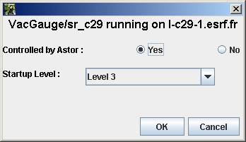

Start a new server with Astor
-----------------------------

| **If the server is already defined in database:**

-  Be sure that a **Starter** device server is running on the same host.
   If there is no **Starter** running, start it.
-  On Astor main window, click on the host to open `host
   window <host_window.html>`__.
   On this window, click on **Start New** button.
-  A window with a list of all servers defined in TANGO database will be
   displayed.
   |image0|
-  Select the expected server and click on **Start** button.
-  And define Astor control and statup level.
   |image1|

| 

| **If the server is NOT already defined in database:**

-  You can declare the server in database using
   `Jive <http://www.esrf.eu/computing/cs/tango/tango_doc/tools_doc/jive_doc/index.html>`__.
-  Or click on **Create New Server** button to start the
   `wizard <movies/wizard.html>`__.

| **If the server has been started from shell.**
| The default startup level is not set and the server is not controlled
  by Astor.
| That means that it does not appear in `host
  window <host_window.html>`__.
| To see it click open **Not Controlled** level. And change it startup
  level if needed.

.. |image0| image:: img/start_new_server.jpg

