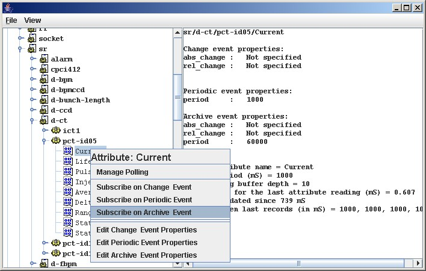

Event Manager
-------------

| 
| Astor proposes to browse by server, by device or by alias.
| It could be usefull for :

-  `to see information <event_tester.html#info>`__
-  `to configure events <event_tester.html#config>`__
-  `to manage polling <event_tester.html#polling>`__
-  `to check events <event_tester.html#events>`__

| 
| |image0|
|  **Server, Device or Alias information:**
| |image1|
|  **Configure the events for specified attribute.**
| |image2|
|  **Manage polling for Server, Device or Alias :**
| By a click on server or device menu, the `polling
  window <polling_window.html>`__ will be displayed.
|  **Configure and Test events:**
| By a click on attribute menu, the event tester window will be
  displayed with event information.
| |image3|
| |image4|

.. |image0| image:: img/start_event_manager.jpg
.. |image1| image:: img/dev_browser_1.jpg
.. |image2| image:: img/configure_event.jpg

.. |image4| image:: img/event_tester.jpg

