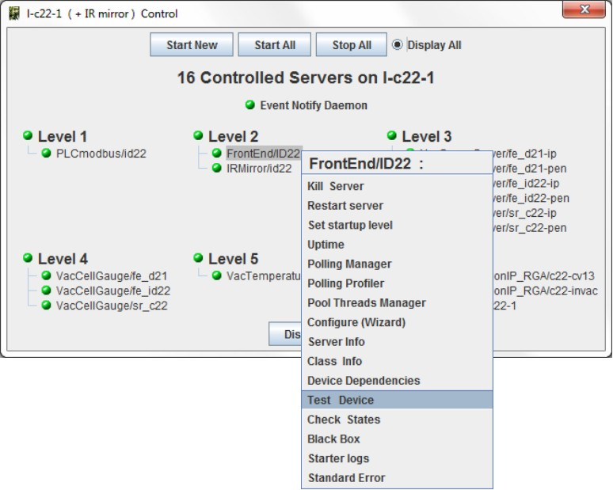

Host Status Window
------------------

-  When a host window has been opened, all servers controlled on this
   host are displayed.
-  The color of the srver define its state (**red**: not running,
   **green** running, **blue** running but not responding).
-  These servers are ordered by startup level.

|image0|

-  A popup menu will be displayed with a right click on a server to
   Start/stop/test... it.

|image1|

.. topic:: It is possible to display not controlled servers if any.

   These servers are not taken in account to compute host state.

.. |image0| image:: img/host_window.jpg

