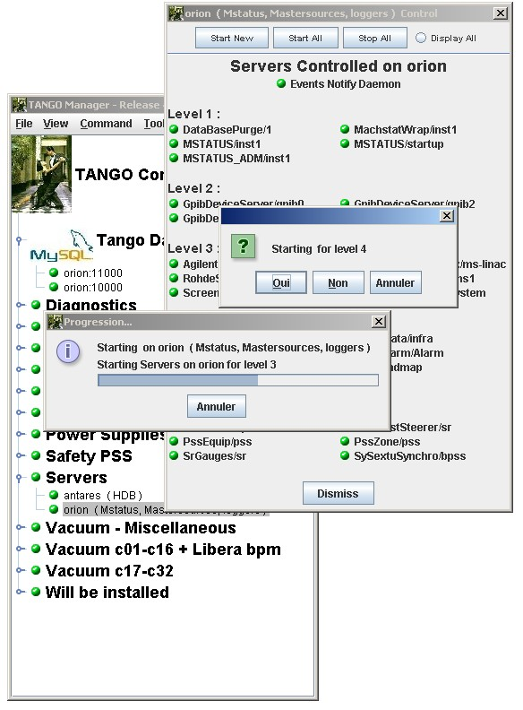

Multi Servers Start/Stop
------------------------

-  You can start or stop:

   -  All servers on a host by clicking on **Start All** or **Stop All**
      button on `host window <host_window.html>`__.
   -  All servers on all hosts of a hosts family by using popup menu on
      a hosts family.
   -  All servers on all hosts of the constrol system by using
      **Command** menu in main window.

   The servers will started in ascending order of startup level and
   stopped in descending order.
   For each level a confirm dialog will be popuped.
   |image0|

