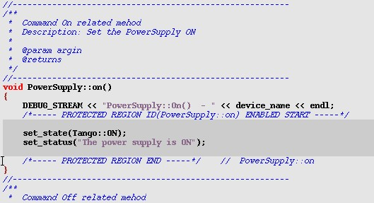

Generated Code
--------------

**The main differences with Pogo-6 code are:**

-  The source code will not be read when you re-open your project.
   Only the :ref:`.xmi <warnings>` will be re-loaded.
-  Your own code must be added only between specific tags:
   On following example, only the grey part will not be overwritten at
   next code generation.

|image0|

**Generated code:**

- :ref:`C++ code <c++>`

- :ref:`Python code <python>`

- :ref:`Java code <java>`

**Projects:**

-  :ref:`Eclipse project <eclipse>`
-  :ref:`IntelliJIDEA project <idea>`
-  :ref:`Windows projects <windows>`

.. _`c++`:

C++ Generated files
~~~~~~~~~~~~~~~~~~~

If no inheritance has been specified,
the generated classes will inherit from Device_4Impl (Tango-7.x.x or above).

The generated code structure will look like to the Pogo-6 code.

.. csv-table::

   " :file:`MyObject.h` ", "Containing created class data members and prototypes."
   " :file:`MyObject.cpp` ", "Containing created class methods for init, commands, read/write attributes, ....."
   " :file:`MyObjectClass.h` ", "Containing data members and prototypes for MyObjectClass.cpp.
   Containing also the Command and Attribute class definitions."
   " :file:`MyObjectClass.cpp` ", "A singleton  class derived from DeviceClass.
   It implements the command and attribute lists and all properties
   and methods required by the created class once per process."
   " :file:`MyObjectStateMachine.cpp` ", "Containing created class methods for the state machine."
   " :file:`ClassFactory.cpp` ", "Containing created class methods creating used class.
   In case of multi class server, add other class(es) in the factory."
   " :file:`main.cpp` ", "Start point of the device server. Most of the time, not touched by the programmer."

- A method called ``add_dynamic_attributes()`` has been added to the :file:`MyObject.cpp`.
  It will be called at startup to create dynamic attributes if any.
  .. warning::
     It is NOT generated if the class is abstract !

.. _`python`:

Python Generated files
~~~~~~~~~~~~~~~~~~~~~~

If no inheritance has been specified,
the generated classes will inherit from ``Device_4Impl`` (Tango-7.x.x or above).

The generated code structure will look like to the Pogo-6 code.

The python templates have been implemented by Sebastien Gara at `Nexeya <http://www.nexeya.com/>`_

+---------------------+---------------------------------------+
| :file:`MyObject.py` | Containing created class python code. |
+---------------------+---------------------------------------+

.. _`java`:

Java Generated files
~~~~~~~~~~~~~~~~~~~~

The generated Java classes are not compatible with the server API from TangORB.

They are compatible only with the new design from Gwenaelle Abeille at
`Soleil <http://www.synchrotron-soleil.fr/>`_.

See **Devices in Java** at: `http://www.tango-controls.org/download`_

This API is still under development.

Inheritance and event system are not available.

+----------------------------------------------------+--------------------------------------------+
| :file:`org.tango.myobject.MyObject.java`           | Containing created class java code.        |
+----------------------------------------------------+--------------------------------------------+
| :file:`org.tango.myobject.MyDynamicAttribute.java` |  Containing created java code for dynamic  |
|                                                    |  attribute class if any.                   |
+----------------------------------------------------+--------------------------------------------+

.. _`eclipes`:

Eclipse project files
~~~~~~~~~~~~~~~~~~~~~

To resolve Tango keywords, Eclipse needs Tango include files.

The include path depends on installation and platform.
Start Pogo with  :envvar:`TANGO_INCLUDE` environment variable.

Two files will be generated to be imported as Eclipse project.

+--------------------+---------------------------------------------+
| :file:`.project`   | Global eclipse project                      |
+--------------------+---------------------------------------------+
| :file:`.cproject`  | Tango class project for C++ class           |
+--------------------+---------------------------------------------+

.. _`idea`:

IntelliJIDEA project files
~~~~~~~~~~~~~~~~~~~~~~~~~~

IntelliJIDEA is an IDE for java project.

To resolve Tango keywords, IntelliJIDEA needs Tango server jar file.
The :file:`JTangoServer.jar` path depends on installation and platform.

Start Pogo with  :envvar:`JSERVER_JAR_FILE` environment variable.

+------------------------+----------------------------------------------------------+
| :file:`MyObject.iml`   | Global IntelliJIDEA project                              |
+------------------------+----------------------------------------------------------+
| :file:`.idea/`         | a sub-directory containing all information about project |
+------------------------+----------------------------------------------------------+

.. _`windows`:

Windows project files
~~~~~~~~~~~~~~~~~~~~~

Pogo supports **Visual C++** projects.

It will generate files in a directory name :file:`vcxx_proj` (where xx is the Visual C release. e.g. :file:`vc10_proj`)

Projects use the :envvar:`TANGO_ROOT` environment variable to find include and library files.

It provides 32/64 bits and debug/release modes for each solution.

In this directory 5 files are generated:

.. csv-table::

   " :file:`MyObject.sln` ", "Global solution project"
   " :file:`Class_lib.vcxproj` ", " Project to create a static library for the class"
   " :file:`Class_dll.vcxproj` ", "Project to create a dynamic-link library for the class"
   " :file:`Server_static.vcxproj` ", "Project to create a static server (using static library)"
   " :file:`Server_shared.vcxproj` ". "Project to create a dynamic server (using dll)"

