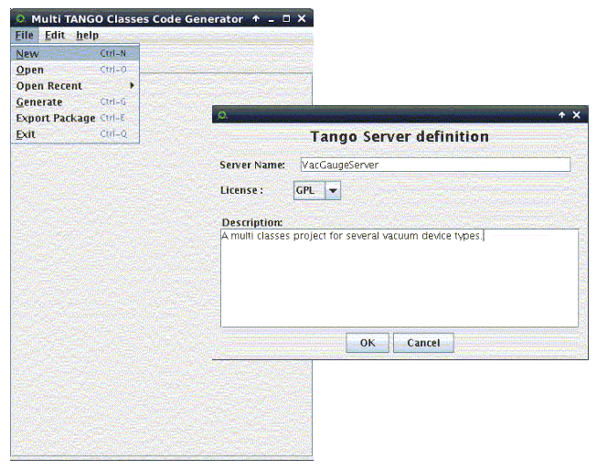
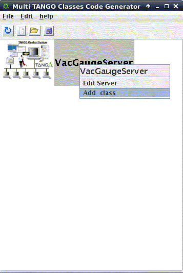
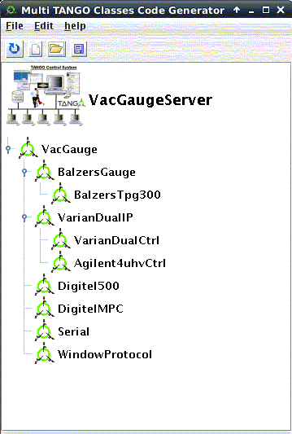

Multiple C++ Classes Manager
----------------------------

Since :program:`Pogo-7.2.0` on **Linux**, :program:`Pogo` allows you to create multiple
C++ classes server project.

Use the :guilabel:`tools` menu (or :command:`pogo -multi` shell command) to launch
the multiple classes GUI.

Then create a new server project.

The server name could have the same name of one class in project. But
it is not mandatory.

|MultiClassesCreation|

Then you can add several classes by selecting **xmi** files.

+------------------------+----+----------------------+
| |MultiClassesAdding|   |    | |MultiClassesTree|   |
+------------------------+----+----------------------+

Now, you can generate code.
You can generate it where a class is defined or in an independent one.

The 4 generated files are:

-  :file:`VacGaugeServer.multi.xmi`: Multiple classes project file
-  :file:`MultiClassesFactory.cpp`: Equivalent to the ClassFactory.cpp containing all specified class dependencies
-  :file:`main.cpp`: The same main.cpp as a single class project
-  :file:`Makefile.multi`: A Makefile containing all specified class dependencies

