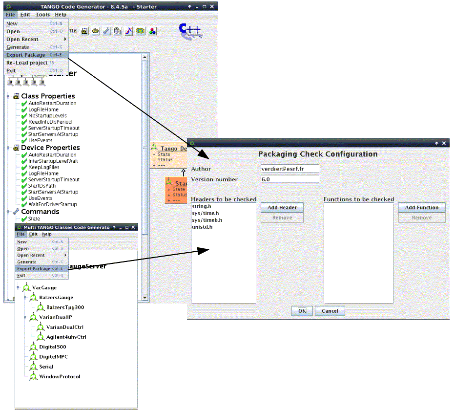
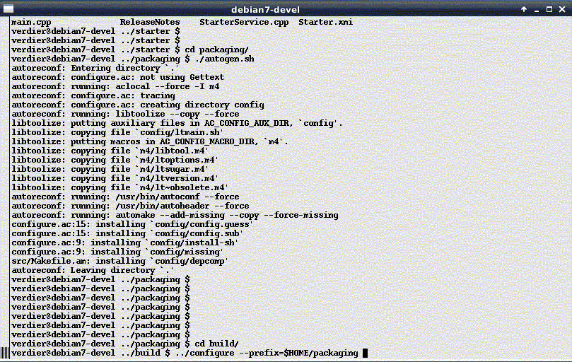
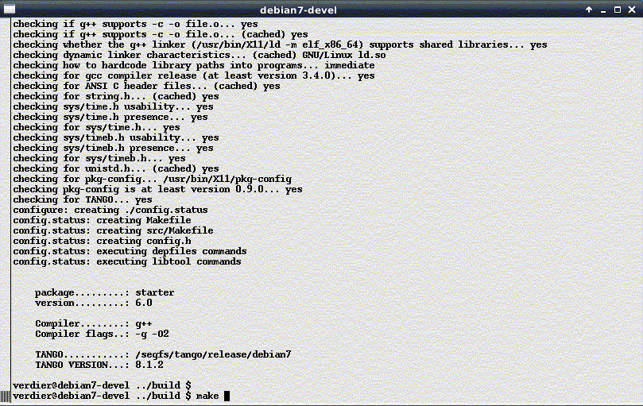

Tango Server Packaging
----------------------

| 

| Since **Pogo-8.3.0** on **Linux, Pogo** allows you to create packaging
  files to be used with autotools
| Set the environment variable **PKG\_CONFIG\_PATH**

-  e.g. for tango.pc file : export
   PKG\_CONFIG\_PATH=$TANGO\_LIBS/pkgconfig

| You can find many examples on the web on pkg\_config\_path management.
| In Pogo or Multi classes GUI, use *File* menu and *Export Package*
  item.
| A panel will be launched to define to configure packaging.
| |Packaging|
| After clicking on OK button, a new directory **packaging** will be
  created.
| You can use **autotools** commands (autogen, configure make, make
  install, make distcheck) to build a reliable packaging for your
  server.
| |configure|
| |configure|

