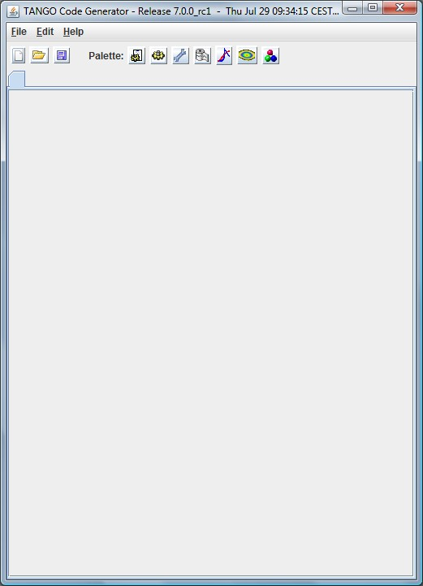
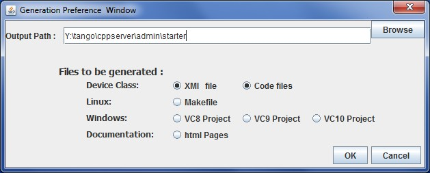

Pogo Startup
------------

| 

| Pogo will start as follow.
| Then, create a new class and add yours commands, attributes,
  properties,... as usual (with
  `Pogo-6 <http://www.esrf.eu/computing/cs/tango/tango_doc/tools_doc/pogo-6_doc/index.html>`__
  application).
| |image0|
| When your class is defined, you will generate code:
| |image1|
| Select what you want to generate:

-  xmi file : this file is the project itself, it will be loaded when
   you re-open your project with Pogo.

-  `Code files <GeneratedCode.html>`__
-  Linux Makefile
-  VC8, VC9 and VC10 project
-  html documentation

