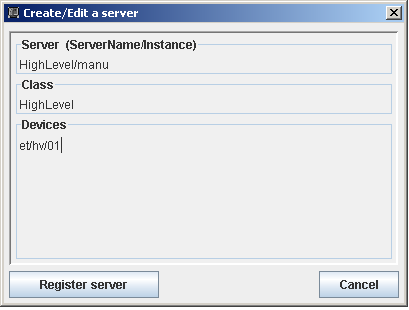
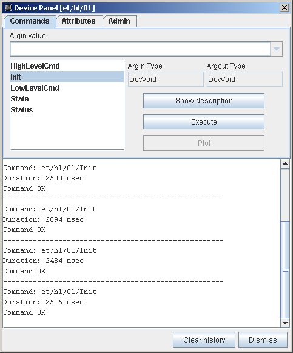
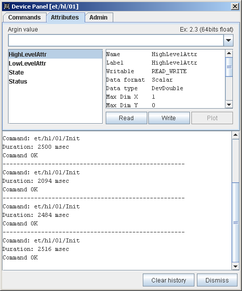

.. How-To try

How to create inheritance link between Tango classes (C++)
==========================================================

:audience:`developers`, :lang:`c++`

This HowTo explains how it is possible to create a new Tango class
which inherits from an already existing Tango class.

In Tango's vocabulary, a Tango class is not a computer language class. A
Tango class has at least 2 computer language classes and very often even
more than 2. This HowTo explains how you can create a new Tango class
which "inherits" from an already existing class.
In this case, inheritance means:

#. The high level class supports all the commands defined in the low level class on top of its own commands (if any),
#. The high  level class supports all the attributes defined by the low leval class on top of its own attributes (if any),
#. The device(s) available for the external world is(are) an instance(s) of the high level class.

.. warning::

   Once modified, Pogo will not be able to understand the high
   level Tango class and therefore can't be used for further changes
   in this class

The example case
----------------

Let's say that we already have a Tango class called **LowLevel** with
one command called *LowLevelCmd* and one attribute called
*LowLevelAttr*. We want to create a new Tango class called **HighLevel**
with its own command called *HighLevelCmd* and its own attribute called
*HighLevelAttr*. Both classes has been generated using Pogo. The
following is a description of what has to be modified in the code
generated by Pogo for the HighLevel Tango class in order to create this
"inheritance" link.

All modified code in the following code snippets is in bold font.
 

The HighLevelClass.h file
-------------------------

In this file, we will modify the HighLevelClass declaration in order to
inherit from the LowLevelClass class instead of inheriting from the
Tango::DeviceClass class but we first need to add an extra include file
at the file beginning:

.. code-block:: cpp
    :linenos:

    #ifndef _HIGHLEVELCLASS_H
    #define _HIGHLEVELCLASS_H

    #include <tango.h>
    #include <HighLevel.h>

    #include <LowLevelClass.h>

Then, we change the HighLevelClass inheritance declaration:

.. code-block:: none
   :linenos:

   //
   // The HighLevelClass singleton definition
   //

   class
   #ifdef WIN32
       __declspec(dllexport)
   #endif
   HighLevelClass : public LowLevel_ns::LowLevelClass
   {
   public:
   //  properties member data

   //  add your own data members here
   //------------------------------------
  
    

The HighLevelClass.cpp file
---------------------------

In this file, we have to modify:

#. The HighLevelClass definition (due to the change in its inheritance),
#. The HighLevelClass command_factory() method,
#. The HighLevelClass attribute_factory() method.

.. code-block:: cpp
    :linenos:

    //+----------------------------------------------------------------------------
    //
    // method :         HighLevelClass::HighLevelClass(string &s)
    // 
    // description :    constructor for the HighLevelClass
    //
    // in : - s : The class name
    //
    //-----------------------------------------------------------------------------
    HighLevelClass::HighLevelClass(string &s):LowLevel_ns::LowLevelClass(s)
    {

        cout2 << "Entering HighLevelClass constructor" << endl;
        set_default_property();
        get_class_property();
        write_class_property();
        
        cout2 << "Leaving HighLevelClass constructor" << endl;

    }

Then, the changes in the command_factory() method which needs to call the LowLevelClass command_factory() method:

.. code-block:: cpp
    :linenos:

    //+----------------------------------------------------------------------------
    //
    // method :         HighLevelClass::command_factory
    // 
    // description :    Create the command object(s) and store them in the 
    //          command list
    //
    //-----------------------------------------------------------------------------
    void HighLevelClass::command_factory()
    {
        LowLevel_ns::LowLevelClass::command_factory();

        command_list.push_back(new HighLevelCmdClass("HighLevelCmd",
            Tango::DEV_VOID, Tango::DEV_VOID,
            "",
            "",
            Tango::OPERATOR));

        //  add polling if any
        for (unsigned int i=0 ; i<command_list.size(); i++)
        {
        }
    }   

Finally, the changes in the attribute_factory() method which needs to
call the LowLevelClass attribute_factory() method:

.. code-block:: cpp
    :linenos:

    //+----------------------------------------------------------------------------
    //  Method: HighLevelClass::attribute_factory(vector<Tango::Attr *> &att_list)
    //-----------------------------------------------------------------------------
    void HighLevelClass::attribute_factory(vector<Tango::Attr *> &att_list)
    {
        LowLevel_ns::LowLevelClass::attribute_factory(att_list);

        //  Attribute : HighLevelAttr
        HighLevelAttrAttrib *high_level_attr = new HighLevelAttrAttrib();
        att_list.push_back(high_level_attr);

        //  End of Automatic code generation
        //-------------------------------------------------------------
    }   

The HighLevel.h file
--------------------

This file has to be modified in order to:

#. Change the HighLevel class inheritance from Tango::Device_3Impl to
    LowLevel_ns::LowLevel
#. Add a new data member in the HighLevel class in order to correctly
    implement the device Init command (a boolean is enough)
#. Modify the class destructor for a correct management of the device
    Init command

First, we have to add a new include file:

.. code-block:: cpp
    :linenos:

    #ifndef _HIGHLEVEL_H
    #define _HIGHLEVEL_H

    #include <tango.h>
    #include <LowLevel.h>

Then, the change in the HighLevel class inheritance:

.. code-block:: cpp
    :linenos:

    class HighLevel: public LowLevel_ns::LowLevel
    {
    public :
        //  Add your own data members here
        //-----------------------------------------

The addition of the new data member at the end of the HighLevel class declaration:

.. code-block:: cpp
    :linenos:

    protected :
        //  Add your own data members here
        //-----------------------------------------
        bool device_constructed;
    }

And finally, the change in the HighLevel class destructor:

.. code-block:: cpp
    :linenos:

    /**
     * The object desctructor.
     */ 
        ~HighLevel() {device_constructed=false;delete_device();}

The HighLevel.cpp file
----------------------

In this file, we have to modify

#. The HighLevel class constructors to reflect the change in its
   inheritance and to initialize the new data
   member (device_constructed)
#. The HighLevel class delete_device() and init_device() to correctly
   handle the device Init command
#. The HighLevel class always_executed_hook()
   and read_attr_hardware() methods in order that they call the
   corresponding LowLevel class method

Let's start with the changes in the HighLevel class constructors:

.. code-block:: cpp
    :linenos:

    //+----------------------------------------------------------------------------
    //
    // method :         HighLevel::HighLevel(string &s)
    // 
    // description :    constructor for simulated HighLevel
    //
    // in : - cl : Pointer to the DeviceClass object
    //      - s : Device name 
    //
    //-----------------------------------------------------------------------------
    HighLevel::HighLevel(Tango::DeviceClass *cl,string &s)
    :LowLevel_ns::LowLevel(cl,s.c_str()),device_constructed(false)
    {
        init_device();
        device_constructed = true;
    }

    HighLevel::HighLevel(Tango::DeviceClass *cl,const char *s)
    :LowLevel_ns::LowLevel(cl,s),device_constructed(false)
    {
        init_device();
        device_constructed = true;
    }

    HighLevel::HighLevel(Tango::DeviceClass *cl,const char *s,const char *d)
    :LowLevel_ns::LowLevel(cl,s,d),device_constructed(false)
    {
        init_device();
        device_constructed = true;
    }    

Now, the modified HighLevel class init_device() and delete_device() methods:

.. code-block:: cpp
    :linenos:

    //+----------------------------------------------------------------------------
    //
    // method :         HighLevel::delete_device()
    // 
    // description :    will be called at device destruction or at init command.
    //
    //-----------------------------------------------------------------------------
    void HighLevel::delete_device()
    {
        INFO_STREAM << "In HighLevel::delete_device()" << endl;

        //  Delete device's allocated object

    //    Your specific code (if any)
    if (device_constructed == true)
            LowLevel_ns::LowLevel::delete_device();
    }

    //+----------------------------------------------------------------------------
    //
    // method :         HighLevel::init_device()
    // 
    // description :    will be called at device initialization.
    //
    //-----------------------------------------------------------------------------
    void HighLevel::init_device()
    {
        if (device_constructed == true)
            LowLevel_ns::LowLevel::init_device();

        INFO_STREAM << "HighLevel::HighLevel() create device " << device_name << endl;

        // Initialise variables to default values
        //--------------------------------------------

And finally, the HighLevel class always_executed_hook() and read_attr_hardware() methods:

.. code-block:: cpp
    :linenos:

    //+----------------------------------------------------------------------------
    //
    // method :         HighLevel::always_executed_hook()
    // 
    // description :    method always executed before any command is executed
    //
    //-----------------------------------------------------------------------------
    void HighLevel::always_executed_hook()
    {
        LowLevel_ns::LowLevel::always_executed_hook();
        INFO_STREAM << "In HighLevel::always_executed_hook()" << endl;
    //     Your code here (if any)
    }

    //+----------------------------------------------------------------------------
    //
    // method :         HighLevel::read_attr_hardware
    // 
    // description :    Hardware acquisition for attributes.
    //
    //-----------------------------------------------------------------------------
    void HighLevel::read_attr_hardware(vector<long> &attr_list)
    {
        LowLevel_ns::LowLevel::read_attr_hardware(attr_list);
            DEBUG_STREAM << "HighLevel::read_attr_hardware(vector<long> &attr_list) entering... "<< endl;
        //  Add your own code here
    }

Don't forget to also modify the **Makefile** in order to link the three
LowLevel Tango class object files (Lowlevel.o, LowLevelClass.o and
LowLevelStateMachine.o) to your executable.

Defining the class in the Tango control system
----------------------------------------------

Once the executable is linked, the device server process instance has to
be created in the Tango database (using Jive for instance).

Running your class
------------------

Nothing special here. Simply start your device server as usual.
Connecting to the device using a "Test Panel" shows that the device now has:

* two commands (one from the LowLevel class and the other from the HighLevel class),
* two attributes (from LowLevel class and from HighLevel class).

Conclusion
----------

With these relatively simple changes in the HighLevel class, we now have
a device instance of a Tango class which "inherits" from another Tango
class. The drawback of this method is that once the file has been
modified, **Pogo will not be able to understand the HighLevel class**
any more and should not be used for further changes in this class!

With a couple of "virtual" methods, it is also possible in the HighLevel
class to overwrite a command or an attribute defined in the Lowlevel class.

