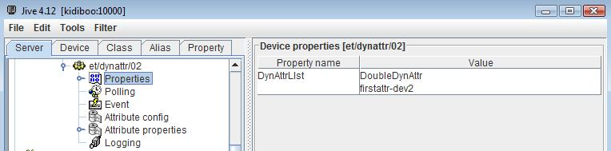

.. How-To try

How to add dynamic attributes to a device class
===============================================

:audience:`advanced developers`, :lang:`c++`

Creating new attributes at Startup
----------------------------------

by Sergi Rubio Manrique, srubio@cells.es, with help from R.Bourtembourg
and E.Taurel.

Do you need to create more or less Attributes depending on a certain
device property? Are you interested in changing the name/type/dimensions
of your attributes depending on different applications?

That is common while working with Input/Output devices with a variable
number of channels (PLCs, DaqBoards, Timers/Counters), when depending of
the operation mode more or less scalar or spectrum attributes could be
needed.

This brief **HowTo** implements this feature in a Tango class base on
code generated by **Pogo 8**.

Generating your class with Pogo
-------------------------------

**DynAttr**

with three types of attributes:

#. StaticAttr: A scalar, Tango::DevShort, READ attribute,
#. LongDynAttr: A scalar, Tango::DevLong, READ_WRITE attribute,
#. DoubleDynAttr: A scalar, Tango::DevDouble, READ_WRITE attribute.

Each device belonging to this class has one StaticAttr and a dynamic
list of LongDynAttr or DoubleDynAttr attributes. This list of dynamic
attributes is defined with a device property named **DynAttrList**

Therefore, using Pogo, we define a Tango class with three scalar
attributes with the definition given above. We also create the
DynAttrList property for defining dynamic attribute. This is a vector of
strings with a couple of strings for each attribute. The first string is
the dynamic attribute type (LongDynAttr or DoubleDynAttr) and the second
string is the attribute name.

.. note::

   The dynamic attributes have a light green background
   color on the main Pogo window.

Implementing the Dynamic Attributes
-----------------------------------

Pogo 8 has been modified to help user to create Tango class with dynamic
attribute(s).

Dynamic attribute registration
~~~~~~~~~~~~~~~~~~~~~~~~~~~~~~

To register device dynamic attribute, you need to:

#. call the Tango::DeviceImpl::add_attribute() method for each device dynamic attribute.
#. create the data used with the attribute (for the Attribute::set_value() method).

Pogo generates method(s) named **DynAttr::add_<Dyn attr class name>_dynamic_attribute(string att_name)**
which do this job for you. You have to call these methods
according to your needs in another Pogo generated method
named **DynAttr::add_dynamic_attributes()** which
is executed at device creation time.
In our example, in this method we have to:

-   analyze the content of the device DynAttrList property and create
    the necessary attributes using the helper method also generated by
    Pogo

The code of the DynAttr::add_dynamic_attributes() method looks like

.. code-block:: none
    :linenos:

    void DynAttr::add_dynamic_attributes()
    {
        //  Example to add dynamic attribute:
        //  add_LongDynAttr_dynamic_attribute("MyAttribute");
        //  add_DoubleDynAttr_dynamic_attribute("MyAttribute");

        /*----- PROTECTED REGION ID(DynAttr::add_dynamic_attributes) ENABLED START -----*/

        if (dynAttrList.empty() == false)
        {
        if ((dynAttrList.size() % 2) != 0)
        {
    // Throw exception
        }

        for (unsigned int i = 0;i < dynAttrList.size();i = i + 2)
        {
            if (dynAttrList[i] == "LongDynAttr")
            {
            add_LongDynAttr_dynamic_attribute(dynAttrList[i + 1]);
            }
            else if (dynAttrList[i] == "DoubleDynAttr")
            {
            add_DoubleDynamicAttr_dynamic_attribute(dynAttrList[i + 1]);
            }
            else
            {
    // Throw exception
            }
        }
        }

        /*----- PROTECTED REGION END -----*/    //  DynAttr::add_dynamic_attributes

The code to throw exception has been removed.

.. note::

   The data associated with all LongDynAttr dynamic attributes 
   are initialized to 0 and the data associated to all DoubleDynAttr
   dynamic attributes are initialized with 0.0

The definition of the DoubleDynAttr attribute is simply to return when
read, the last value which has been written. The code for the
DoubleDynAttr reading/writing is the following

.. code-block:: none
    :linenos:

    void DynAttr::read_DoubleDynAttr(Tango::Attribute &attr)
    {
        DEBUG_STREAM << "DynAttr::read_DoubleDynAttr(Tango::Attribute &attr) entering... " << endl;
        Tango::DevDouble *att_value = get_DoubleDynAttr_data_ptr(attr.get_name());

        /*----- PROTECTED REGION ID(DynAttr::read_DoubleDynAttr) ENABLED START -----*/

        //  Set the attribute value
        attr.set_value(att_value);

        /*----- PROTECTED REGION END -----*/    //  DynAttr::read_DoubleDynAttr
    }

    void DynAttr::write_DoubleDynAttr(Tango::WAttribute &attr)
    {
        DEBUG_STREAM << "DynAttr::write_DoubleDynAttr(Tango::Attribute &attr) entering... " << endl;

        //  Retrieve write value
        Tango::DevDouble    w_val;
        attr.get_write_value(w_val);

        /*----- PROTECTED REGION ID(DynAttr::write_DoubleDynAttr) ENABLED START -----*/

        Tango::DevDouble *att_value = get_DoubleDynAttr_data_ptr(attr.get_name());
        *att_value = w_val;

        /*----- PROTECTED REGION END -----*/    //  DynAttr::write_DoubleDynAttr
    }

The code of the read method in it's Pogo generated part retrieves a
pointer to the data associated with this attribute with the helper
method named **DynAttr::get_<Dyn attr class name>_data_ptr(sting att_name)**. The user code simply pass this
pointer  to the Tango Attribute::set_value() method.

The user code of the write method also uses the Pogo generated helper
method to get the attribute data pointer and set this data to the value
sent by the caller.

The definition of the LongDynAttr is a bit more sophisticated. For one
device of this Tango class, we have several dynamic attributes of this
LongDynAttr type. According to which attribute is read or written, we
have to call different method accessing the hardware.

The code for reading/writing the LongDynAttr attribute is given below:

.. code-block:: none
    :linenos:

    void DynAttr::read_LongDynAttr(Tango::Attribute &attr)
    {
        DEBUG_STREAM << "DynAttr::read_LongDynAttr(Tango::Attribute &attr) entering... " << endl;
        Tango::DevLong *att_value = get_LongDynAttr_data_ptr(attr.get_name());

        /*----- PROTECTED REGION ID(DynAttr::read_LongDynAttr) ENABLED START -----*/

        string &att_name = attr.get_name();
        if (att_name == dynAttrList[1])
        *att_value = read_hardware_channel1();  // Access hardware for channel 1 which is the first attribute in the list
        else if (att_name == dynAttrList[3])
        *att_value = read_hardware_channel2();  // Access hardware for channel 2 which is the second attribute in the list
        else
        {
    // Throw exception
        }
         
        //  Set the attribute value
        attr.set_value(att_value);

        /*----- PROTECTED REGION END -----*/    //  DynAttr::read_LongDynAttr
    }

    void DynAttr::write_LongDynAttr(Tango::WAttribute &attr)
    {
        DEBUG_STREAM << "DynAttr::write_LongDynAttr(Tango::Attribute &attr) entering... " << endl;

        //  Retrieve write value
        Tango::DevLong  w_val;
        attr.get_write_value(w_val);

        /*----- PROTECTED REGION ID(DynAttr::write_LongDynAttr) ENABLED START -----*/

        string &att_name = attr.get_name();
        if (att_name == dynAttrList[1])
        write_hardware_channel1(w_val); // Access hardware for channel 1 which is the first attribute in the list
        else if (att_name == dynAttrList[3])
        write_hardware_channel2(w_val); // Access hardware for channel 2 which is the second attribute in the list
        else
        {
    // Throw exception
        }

        /*----- PROTECTED REGION END -----*/    //  DynAttr::write_LongDynAttr
    }

Running the server
------------------

A Tango device server process hosting this DynAttr class has been
defined in the database with two device. The dynamic attributes for
these two devices are:

As shown by the Pogo screen-shot in the beginning of this HowTo, the
Tango class also defines a static attribute for each device named
StaticAttr. Running the device server and opening TestDevice panels on
each device displays device attribute list:

This method fully supports restarting device(s) or server using the
device server process admin device.

Conclusion
----------

Pogo 8 simplifies a lot the code needed to write Tango class with
dynamic attributes. Restarting device(s) from the admin device is fully
supported.
