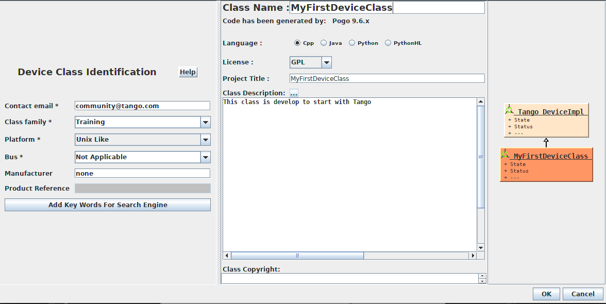
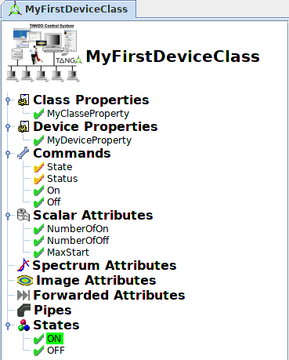
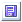
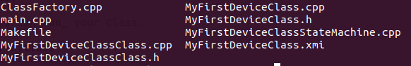

.. _how_to_write_first_device_class:

How to write your first Device Class
====================================

:audience:`developers`, :lang:`all`

This HowTo explains how to create your first Device Class regardless of the language used.

Prerequisite : Tango Environment.

Start :ref:`Pogo <pogo_manual>` Generator
-----------------------------------------
Now you can create a new Class. Click on |image| and New.

Fill in your Class
------------------
Fill in required informations.
The Device Class identification on the left part and the description on the right.

|image0|

You will see an empty Pogo interface.

|image1|

You can add some Properties, Commands and Attributes, by double-clicking on each one.
There are different possible configuraton.

|image2|

Generate
--------
Generate your files |image3|
Choose your folder's path and files you want to create. For example, on linux OS with Cpp language, the minimum is XMI File, Code files and Makefile like you can see behind.

|image4|

You can now see :program:`Pogo`'s files in your folder. :program:`Pogo` had create skeleton files with your Properties, Commands and Attributes.

|image5|

Now you have a basic server who's make nothing. You can provide contents or fill it with different needs.

You can have some informations about how to start :ref:`here <getting_started_as_developer>`

You can have more informations about device server usage :ref:`here <device_api>`.

How to fill your device in :ref:`Cpp <cpp_client_programmers_guide>`, :ref:`Java <getting_started_with_jtango_server>` and :ref:`Python <getting_started_pytango>`

Compile And Run 
---------------

Now you can compile and :ref:`Run <howto_start_device_server>` your Class.

.. definitions
   --------------

.. |image1| image:: how-to-first-device-class/PogoEmptyImage.png

.. |image4| image:: how-to-first-device-class/PogoGenerate.png

