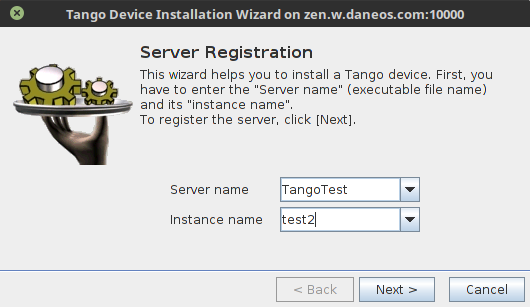
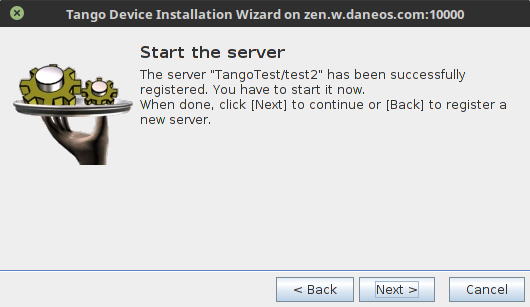
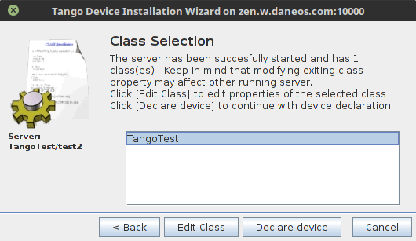
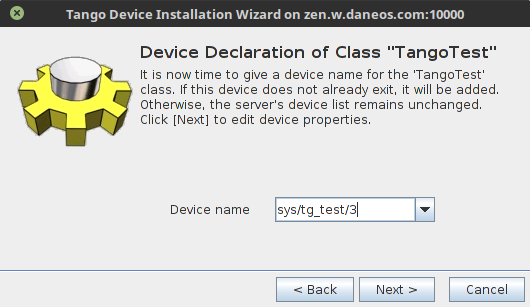
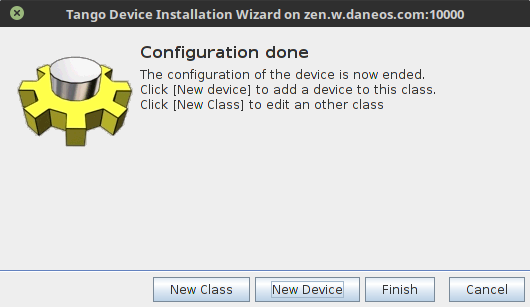
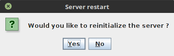
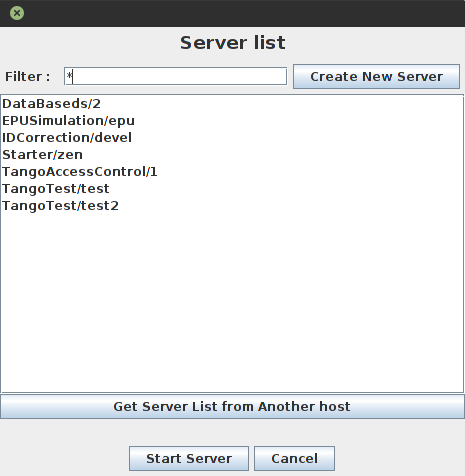
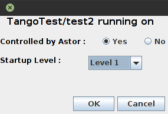

.. _howto_start_device_server:

****************************
How to start a device server
****************************

:audience:`all`

.. toctree::
   :maxdepth: 2

   how-to-start-device-server

While reading this how-to please refer to manuals of :ref:`Jive <jive_manual>` and :ref:`Astor <astro_manual>` tools. 

Starting device servers with Jive
=================================

In Jive select :guilabel:`Tools > Server Wizard` from the menu. In the wizard,
fill the server and the instance name and click :guilabel:`Next`. The server
name should be the same as the server executable name, and instance name can be
any name you provide.

   Wizard - step 1 - device server instance

The wizard will now wait until you start the device server. You can do this
from command line, device servers usually take the instance name as an
argument. For this example you can use ``TangoTest test2`` command. When done
click :guilabel:`Next`.

   Wizard - step 2 - starting the device server

In the next steps you will be asked to configure the devices that your device
server instance will host. For this you need to pick a class and name for your
device. A list of supported classes is provided by the device server, and the
name of the device can be any name unique in the system in the
``<domain>/<family>/<member>`` format.

   Wizard - step 3 - device class

   Wizard - step 4 - device name

Next, you can configure properties for the newly created devices.

.. figure:: how-to-start-device-server/wizard5.png
   :alt: Wizard - step 5

   Wizard - step 5 - device properties

After that you can create another device of the same class by clicking
:guilabel:`New Device` or pick another class by clicking :guilabel:`New Class`.
You can also finish the configuration and exit the wizard with the
:guilabel:`Finish` button.

   Wizard - step 6 - finish

After the configuration, the device server must be restarted to load and start
configured devices.

   Wizard - step 7 - device server restart

Starting device servers with Astor
==================================

.. note:: To configure device servers with Astor, you will need Starter
	installed and running on the host you want to start your device server on.
	Device server should be available in paths configured for the Starter. 

In Astor go to the host control panel and click :guilabel:`Start New` button in
the top left corner. If you want just to start an existing device server
instance, pick it from the list and click :guilabel:`Start Server`.

   Server list in Astor

If you want to add new server, click :guilabel:`Create New Server`. This will
open the device installation wizard from Jive. Astor will handle starting the
device server for you in step 2 of the wizard. After finishing the wizard, you
will be asked to select the startup level of the new server.

   Startup level configuration

Other options
=============

You can use the tango_admin_ utility to register server from scripts or
command line. There are also some device servers (e.g. Sardana) that can
register themselves upon starting.

.. _tango_admin: https://github.com/tango-controls/tango_admin
