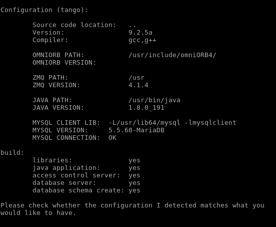
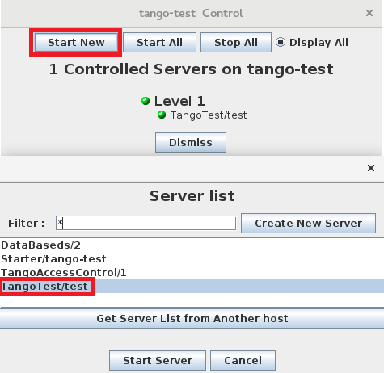
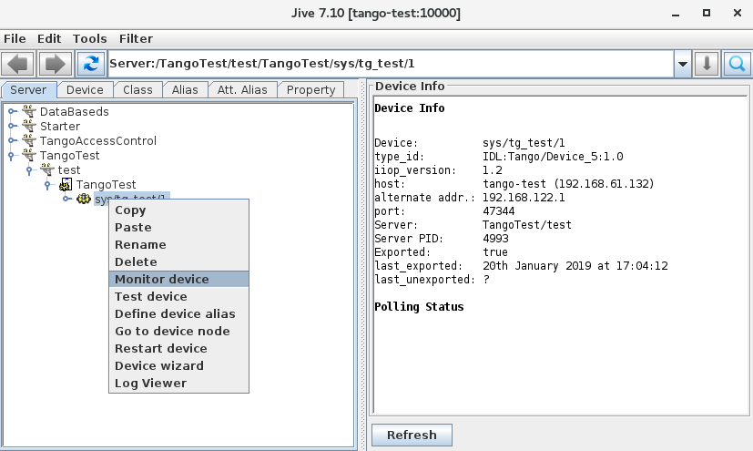
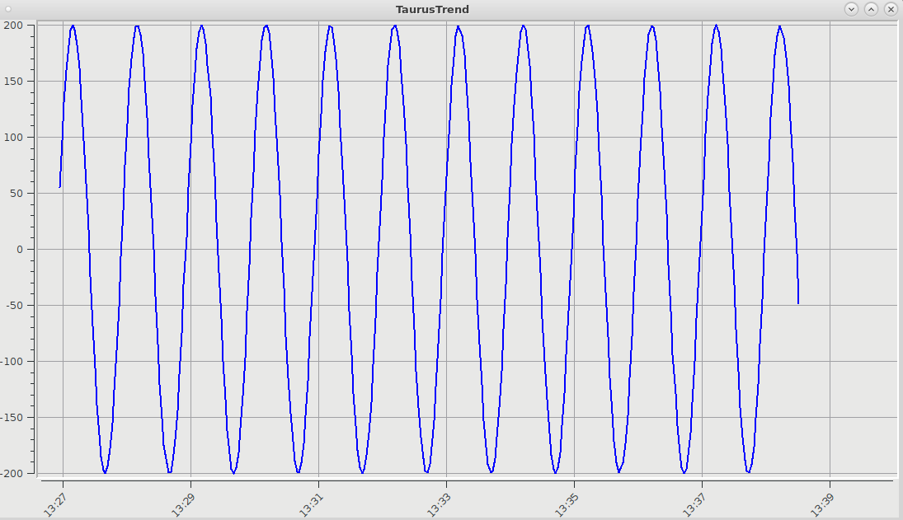

.. _howto_try_tango:

How to try Tango Controls
=========================
:audience:`all, developers`

There are several ways to try the Tango Controls System.

For the first quick look, you can download and run the :ref:`TangoBox Virtual Machine<vm>`.
Also, it is a possibility to build the system from :ref:`source code<source_code_install>`.

If you have installed and configured Tango, you can skip to: :ref:`using_tango`.

Installation notes on Linux base distribution OS
------------------------------------------------

SHORTCUTS
~~~~~~~~~

#. `Using Ansible <https://github.com/MaxIV-KitsControls/tangobox-ansible>`_
#. `Installation on Debian <https://marscity.readthedocs.io/en/latest/doc/setup.html>`_
#. :ref:`Installation on RedHat(CentOS)<installation_centos>`

If you want to use Debian/Ubuntu or Docker solution to try Tango you can skip
this article and go to:
    * :ref:`How to install Tango on Debian/Ubuntu<tango_on_linux>`
    * :ref:`Using Tango docker containers<tango_using_docker>`

Tango requires:
    * omniORB - CORBA implementation
    * zeroMQ - event system

You can install this library from source:
`omniORB <https://sourceforge.net/projects/omniorb/files/omniORB/omniORB-4.2.2/omniORB-4.2.2.tar.bz2/download>`_,
`zeroMQ <http://zeromq.org/intro:get-the-software>`_ or by you package-management tools like yum or apt-get.

.. note::

    Remember that Tango needs the header files (.h) in the compilation process so is a need
    to install developers version of these libraries.

Also, many elements of the Tango ecosystem and the Control System itself requires the **MariaDB**
or **MySQL** database. You can easily install it using yum or apt-get:

.. code-block:: console

    apt-get install mysql-server/mariadb-server
    or
    yum install mysql-server/mariadb-server

After downloading the source of Tango Control System
from `Sourceforge <https://sourceforge.net/projects/tango-cs/files/tango-9.2.5a.tar.gz/download>`_,
extract the archive file by the command:

.. code-block:: console

    tar -xvf tango-9.2.5a.tar.gz

In this directory, a good practice is to create the build folder, to don't mix
a configuration/compile file with the source.

.. code-block:: console

    cd tango-9.2.5a
    mkdir build

Compile and installation notes
~~~~~~~~~~~~~~~~~~~~~~~~~~~~~~
To fully configure TANGO installation you can tell where is the omniORB, ZMQ library and where you want to install
Tango Controls System. Also, you need to configure the connection with the database and
show where is the mysqlclient-lib.

.. code-block:: console

   ../configure
        --prefix=/usr/install_dir_linux \
        --with-omni=/usr/update \
        --with-zmq=/usr/update \
        --with-mysqlclient-lib=/usr/lib64/mysql

If the configuration of the system ends successfully, you should see this output:

If the value of the **database server** and **database schema create** is **no**, this means that during the
configuration process the connection with the database can't be established. In this case, check if the path
to the mysqlclient-lib is correct. The second reason can be the database credentials. Because the default value for the
mysql-user and mysql-password is blank. For setup the proper database configuration can be used
the **--with-mysql-admin** and **--with-mysql-admin-pass** flag adding to the configure command.
Also is a possibility to add the **--with-mysql-ho** flag to set up the different host with the database to connect.

Now compile and install TANGO by the command:

.. code-block:: console

    make all
    make install

Running the Tango System
------------------------

It is essential to correctly run the Tango elements, to better maintain and automate the process starting
the necessary part of the Tango Control System. For this purpose, it is recommended to create the system services.

In the case when the system is installed from a .deb package or is running in a docker container the package or the image provides services.
However, in the approach described in the above paragraph creating the services and daemon have to be done manually.

So the process of starting the two main server-side elements of the tango environment
(:term:`Tango Database` and Tango Starter) can be optimized.

For creating the **Tango DB services** make in your `/lib/systemd/system directory`, file named tango-db.service,
containing :ref:`tango_db.service<tango_db_service>`.

In this service system start the mariadb database process, so for the mysql database this requirement must be changed:

.. code-block:: console

    Requires=mysqld.service
    After=mysqld.service

There are two main environment files used in this service. One containing the :term:`Tango Host`
address in file `/etc/tangorc`:

.. code-block:: console

    TANGO_HOST=address:port

The second file is providing the database credentials. Tango automatically creates it in the `/etc/sysconfig/tango-db`.
This file contains the database setting e.q:

.. code-block:: console

    MYSQL_USER=tango
    MYSQL_PASSWORD=tango

To proper setup the **Tango Starter daemon**, create the file in the `/etc/init.d/tango-starter`,
containing :ref:`tango_starter<tango_starter_daemon>`. Starter daemon similar like the Tango DB service
uses the TANGO_HOST variables to create a connection with a database. The second setting equals the system user,
used to start the daemon. The variables informing about this user are configured in the `/etc/sysconfig/tango-starter` file:

.. code-block:: console

    TANGO_USER=tangosys

When all configuration is done, finally system is ready to start the Tango Control System main elements:

.. code-block:: console

    systemctl start tango-db
    systemctl start tango-starter

The :command:`systemctl start` command run the process once. If these services should automatically start
on the boot of the machine, it needs to run the enable command for these processes:

.. code-block:: console

    systemctl enable tango-db
    systemctl enable tango-starter

See more: :ref:`systemd_integration`

.. _installation_centos:

Installation on CentOS
----------------------

CentOS base on RPM Package Manager and used YUM as the primary tool to packages management and update the libraries by the
system command line interfaces.  Thanks **MAX IV Laboratory** that provides the public RPM repository
with Tango packages now process of installation the Tango Control System can also be simplified.
It is enough that it is added to the system as a new repository:

.. code-block:: console

    yum-config-manager --add-repo http://pubrepo.maxiv.lu.se/rpm/el7/x86_64/

This command creates a new repository and file in /etc/yum.repos.d containing all necessary information about it.
Now you can install Tango Starter or Tango Database by the command:

.. code-block:: console

    yum install tango-starter/tango-db

.. _using_tango:

Play with Tango Controls
------------------------

Tango eco-system provides a lot of management application and framework to visualization the data.
This chapter provides a quick overview of a basic use case for Tango Control.

The new host is adding automatically by tango-starter daemon, but we can do this manually using the **Astor**.
This application is used to configuring the Control System and its components. Moreover,
it provides a quick view of the statuses of all :term:`device servers<device server>` in the Tango.
If you want to add the new host manually see: :ref:`astor_new_host`.
For more information about Astor application see: :ref:`astor_manual`.

TangoTest this is a :term:`device class` provides all types of attribute available in Tango Devices
which can be used for the testing process. In help with Astor the process of starting this device server is simplified.
After opening the control panel for specific hosts (in Astor application), we can start a new device server
which will be automatically run. Like in this screenshot:

See more: :ref:`astor_new_server`.

When the TangoTest device is working, we can run the :ref:`atkpanel in jive <atkpanel_manual>` application
and see the attribute, properties, all configuration of the selected device. For this purpose,
we can run the jive application (by typing the command :command:`jive`) and chose in the GUI
options :guilabel:`Monitor Device` on the :term:`Tango Device <device>`, like in this screenshot:

In atkpanel users can :ref:`execute the command <device_testing>`  directly to the selected TangoTest device.
List of useful command for this device:

    * :command:`SwitchStates` - changes states of the device (form RUN states to FAULT or FAULT to RUN)
    * :command:`DevType` - this is a DevType command example
    * :command:`State` - return the states of the device
    * :command:`CrashFromX` - simulate the crash of the device

Jive is an application design to browse and edit the static TANGO database, configure event and test devices.
Full documentation for this application you can see here: :ref:`jive_manual`

In the atkpanel the attribute shows mainly the real-time values.
So to better visualization of changes the selected values, the user can use :ref:`Taurus framework <taurus>` widgets.

TangoTest attribute is generate using trigonometric functions, so it is easy to check if the device works correctly.
The TaurusTrend for TangoTest attribute should look like in the screen below:

To run TaurusTrend uses a command:

.. code-block:: console

    taurustrend sys/tg_test/1/double_scalar_rww

To see custom Taurus device panel (similar like atkpanel) run the different command:

.. code-block:: console

    taurusdevicepanel sys/tg_test/1/double_scalar_rww

To storage the longtime history of changes of the attributes,
you can use the :ref:`Tango Archiving System <hdbpp_manual>`.
